# Bathroom — Player Flow

## Room Overview

The Bathroom is a multi-step puzzle room. The player must **pick up soap, take the correct pill, manage the bathtub water temperature, bathe, dry off safely, and drain the tub to find a key** — while avoiding electrical and slip hazards.

- **Entry:** Bedroom (ประตูห้องน้ำ)
- **Exit:** Bedroom (กลับเข้าห้องนอน)

---

## Flags

| Flag | Default | Description |
|------|---------|-------------|
| `bathroom_soapPicked` | `false` | Player picked up the fallen soap bottle |
| `bathroom_pillTaken` | `false` | Player took the correct pill (stops flickering & panic) |
| `bathroom_dryerUnplugged` | `false` | Hair dryer unplugged |
| `bathroom_dryerStored` | `false` | Hair dryer put away |
| `bathroom_waterFilled` | `false` | Bathtub is full of water |
| `bathroom_bathed` | `false` | Player has bathed |
| `bathroom_dried` | `false` | Player dried off with towel |
| `bathroom_waterDrained` | `false` | Bathtub drained, key found |
| `bathroom_gotKey` | `false` | Player obtained the bedroom key |
| `bathroom_doorUnlocked` | `false` | Hallway door unlocked |
| `bathroom_timer` | `0` | Seconds elapsed (panic escalation) |
| `bathroom_soapTimer` | `0` | Seconds soap has been on floor |
| `bathroom_bathtubActive` | `false` | Faucet UI is in use |
| `bathroom_bathtubVolume` | `0` | Water volume percentage |
| `bathroom_bathtubHotAmt` | `0` | Hot water amount |
| `bathroom_bathtubColdAmt` | `0` | Cold water amount |
| `bathroom_bathtubMode` | `'close'` | Current faucet mode: `hot`, `cold`, `close` |

---

## Room Entry (setupUI)

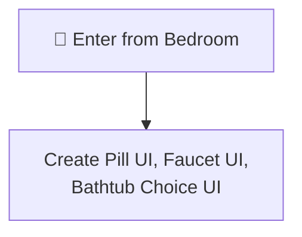

> [!NOTE]
> `setupUI` creates three overlay UIs: pill selection, faucet controls (with water gauge), and bathtub choice (bathe/drain).

---

## All Interactable Objects

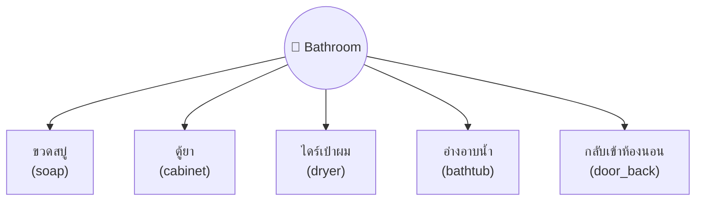

---

## Interactable Details

### 1. ขวดสบู่ (soap)

Pick up the fallen soap to prevent slipping death later.

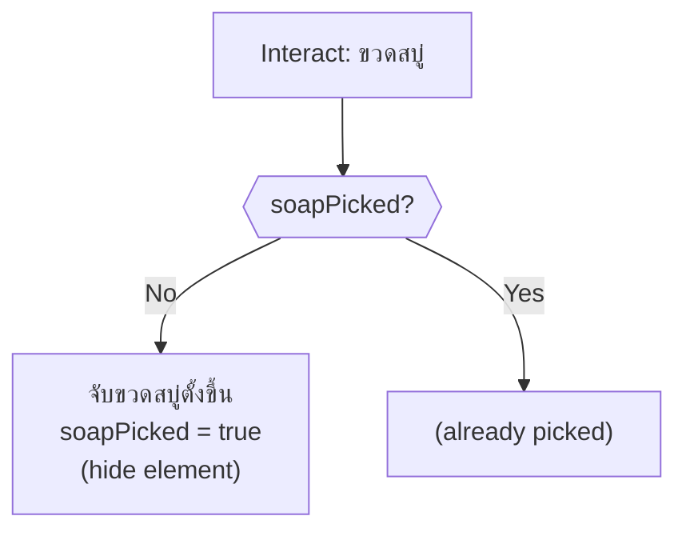

> [!WARNING]
> If soap is not picked up within 25 seconds, the soap spill covers the entire floor. Trying to exit (`door_back`) after this causes instant death from slipping.

---

### 2. ตู้ยา (cabinet)

Choose the correct pill. Presents UI with 6 pill choices.

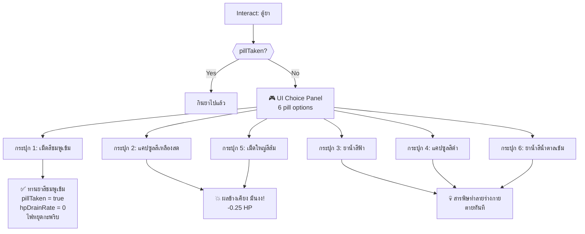

> [!TIP]
> The alarm clock note says "ยาเม็ดสีชมพูเข้ม" — Pill 1 is the correct choice. Pills 3, 4, 6 are instantly lethal. Pills 2, 5 deal 0.25 HP damage.

---

### 3. ไดร์เป่าผม (dryer)

Unplug and store the hair dryer to prevent electrocution.

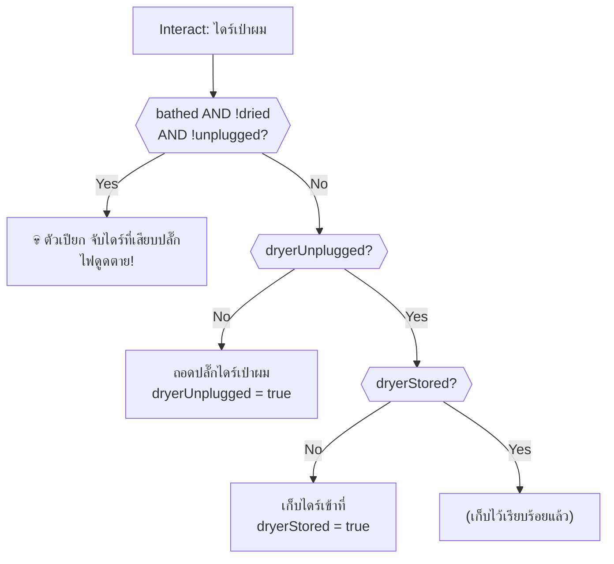

> [!CAUTION]
> If the player bathes and touches the dryer while still wet and it's plugged in → instant death.

---

### 4. อ่างอาบน้ำ (bathtub)

Multi-phase interaction: fill water → bathe/drain → dry off → drain for key.

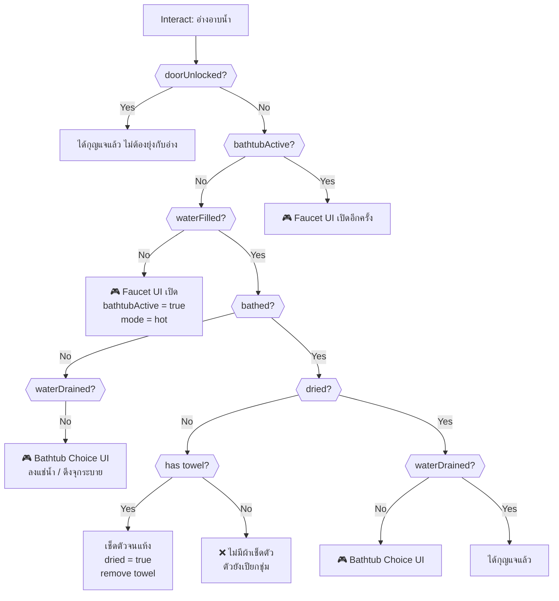

#### Bathtub Choice — Bathe or Drain

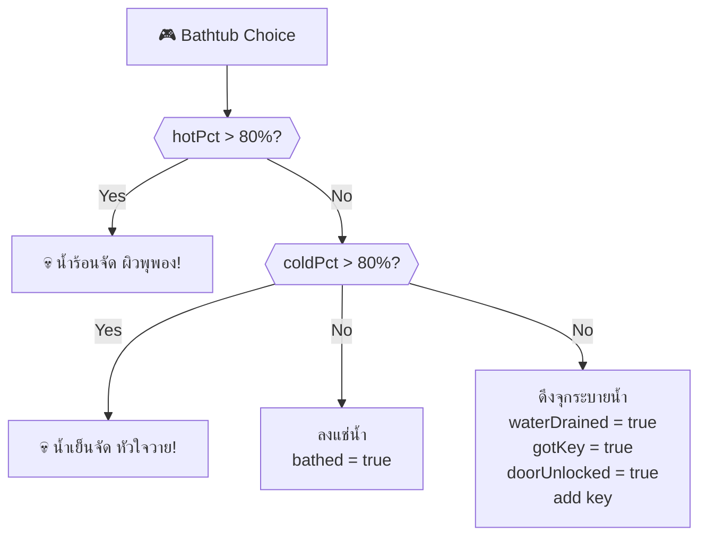

> [!IMPORTANT]
> Water temperature must be balanced — neither too hot (>80%) nor too cold (>80%). The safe ratio is a mix of both.

---

### 5. กลับเข้าห้องนอน (door_back)

Room exit → `bedroom`. Soap hazard check.

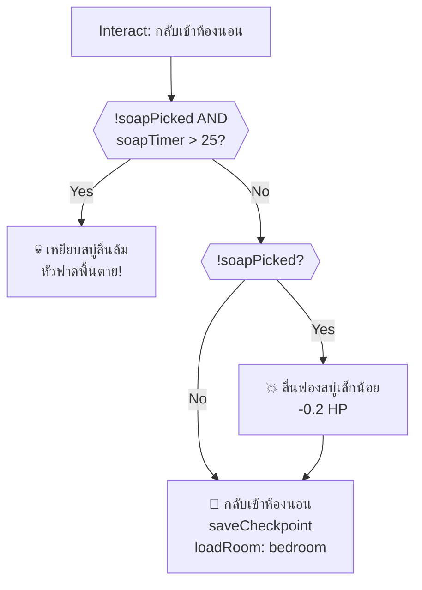

---

## Timed Events (onSecondTimer)

### Bathtub Fill System

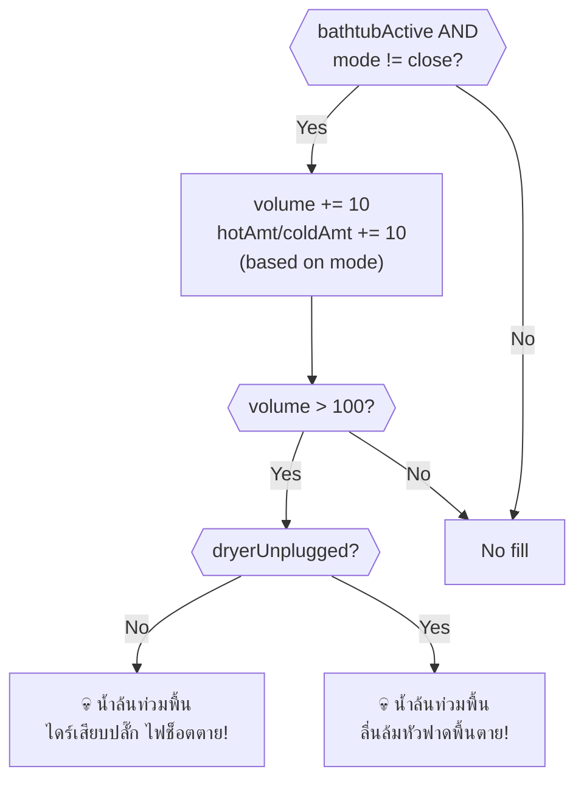

### Panic Escalation (No Pill)

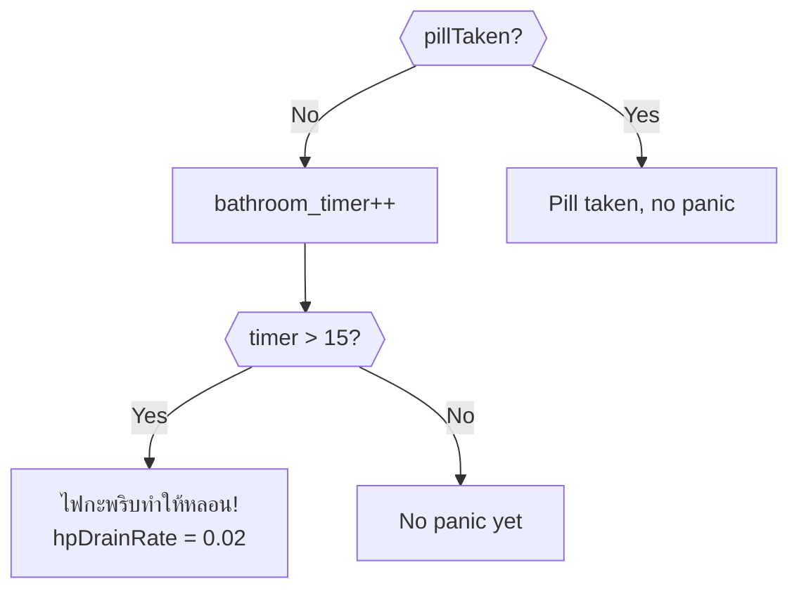

### Soap Spill Escalation

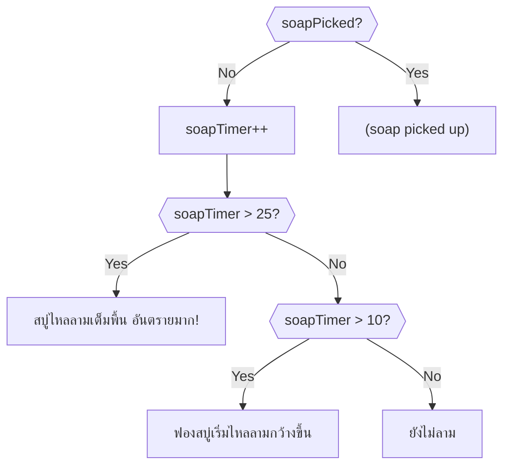

---

## Critical Path (Optimal Solution)

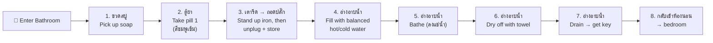

> [!IMPORTANT]
> **Required item from other rooms:** `towel` — must be obtained from the Bedroom wardrobe.

---

## Death Summary

| # | Source | Trigger | Death Message |
|---|--------|---------|---------------|
| 1 | ตู้ยา → pill 3, 4, 6 | Wrong pill choice | สารเคมีพิษทำลายร่างกาย ตายทันที |
| 2 | ไดร์เป่าผม | Bathed + wet + plugged in | ไฟดูดตาย |
| 3 | อ่างอาบน้ำ | hotPct > 80% | น้ำร้อนจัด ผิวพุพอง |
| 4 | อ่างอาบน้ำ | coldPct > 80% | หัวใจวายจากน้ำเย็นจัด |
| 5 | onSecondTimer | Water overflow + dryer plugged | น้ำล้นท่วม ไดร์เสียบปลั๊ก ไฟช็อตตาย |
| 6 | onSecondTimer | Water overflow + dryer unplugged | น้ำล้นท่วม ลื่นล้มหัวฟาดพื้นตาย |
| 7 | กลับห้องนอน | !soapPicked && soapTimer > 25 | เหยียบสบู่ลื่นล้ม หัวฟาดพื้นตาย |

---

## Damage Sources

| Source | HP Loss | Condition |
|--------|---------|-----------|
| ตู้ยา → pill 2, 5 | -0.25 | Wrong but non-lethal pill |
| กลับห้องนอน (early soap) | -0.2 | Soap not picked up (< 25s) |
| Panic (no pill) | +0.02/s drain | After 15s without taking pill |

---

## Item Inventory

### Required from Other Rooms

| Item | Usage in This Room |
|------|---------------------|
| `towel` | Dry off after bathing (consumed) |

### Obtainable in This Room

| Item | Source | Usage |
|------|--------|-------|
| `key` | อ่างอาบน้ำ (drain) | ✅ Unlock bedroom hallway door |
