# Bedroom — Player Flow

## Room Overview

The Bedroom is the game's starting room. The player must **wake up, stabilize hazards (alarm, window, wardrobe, fan), obtain a towel, and exit** — all within a timed window before the ceiling fan breaks loose.

- **Entry:** Game start (wake up in bed)
- **Exit:** Bathroom (ประตูห้องน้ำ), Hallway F2 (ประตูออกโถง)

---

## Flags

| Flag | Default | Description |
|------|---------|-------------|
| `bedroom_stoodUp` | `false` | Player has gotten out of bed |
| `bedroom_alarmOff` | `false` | Alarm clock has been turned off |
| `bedroom_windowClosed` | `false` | Window has been closed successfully |
| `bedroom_wardrobeClosed` | `false` | Wardrobe has been closed (towel obtained) |
| `bedroom_gotTowel` | `false` | Player has the towel |
| `bedroom_doorUnlocked` | `false` | Bathroom door is unlocked |
| `bedroom_windowClosingState` | `false` | Timing toggle for window QTE |
| `bedroom_timer` | `0` | Seconds elapsed (fan danger escalation) |
| `bedroom_windowTick` | `0` | Tick counter for window swing cycle |
| `hallway_f2_unlocked` | `false` | Hallway F2 door unlocked with key |

---

## Room Entry (setupUI)

> [!NOTE]
> `setupUI` is empty — no dynamically injected UI is required for this room.

---

## All Interactable Objects

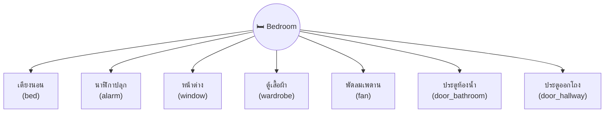

---

## Interactable Details

### 1. เตียงนอน (bed)

Wake up / get out of bed. First interaction required before anything else.

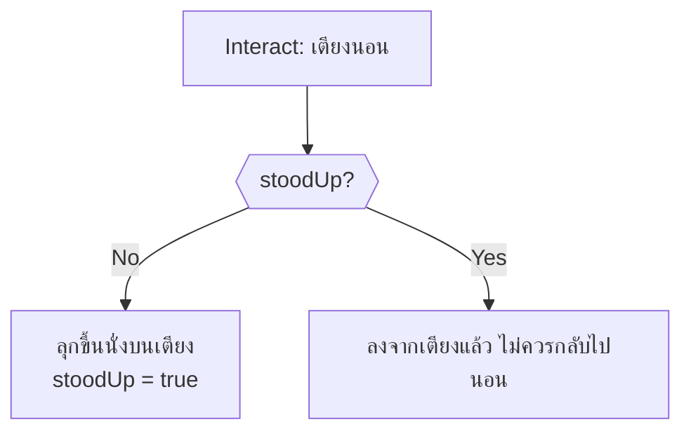

---

### 2. นาฬิกาปลุก (alarm)

Turn off alarm and find the medicine hint note.

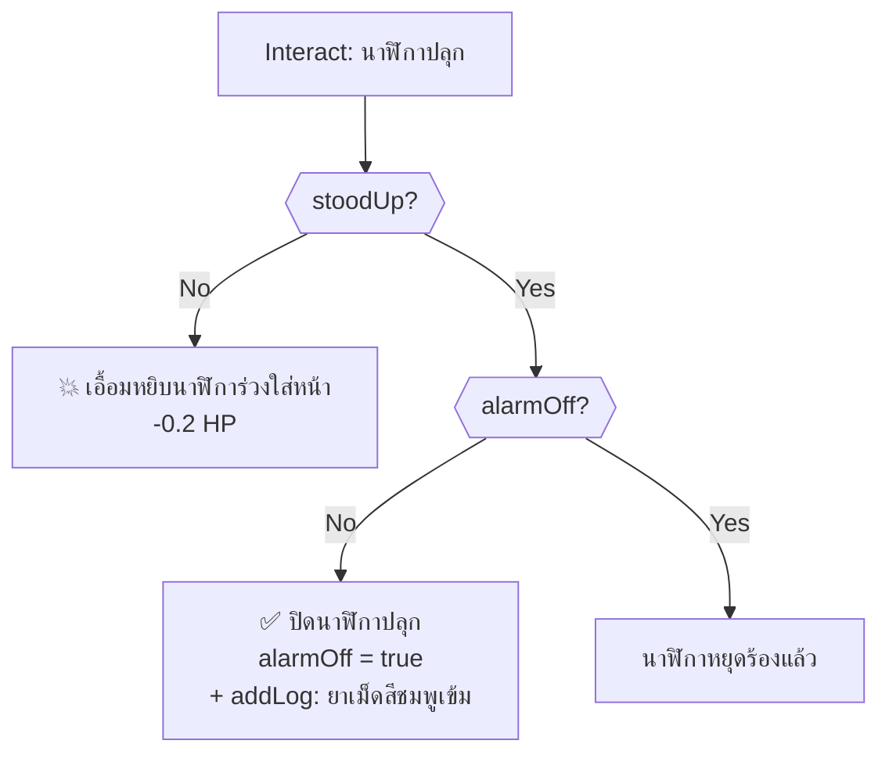

---

### 3. หน้าต่าง (window)

Close the swinging window with correct timing (QTE). Toggles every 2 seconds.

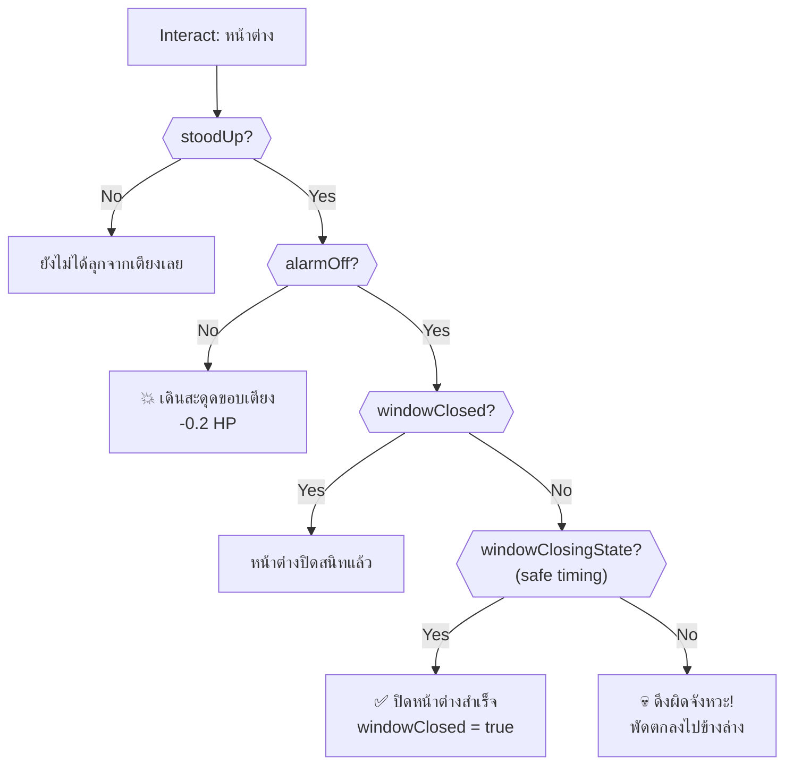

> [!WARNING]
> The window swings on a 2-second cycle. `windowClosingState` toggles every 2 ticks. The player must click during the "safe" phase to close it. Clicking during the "unsafe" phase causes instant death.

---

### 4. ตู้เสื้อผ้า (wardrobe)

Close the shaking wardrobe and obtain a towel. Requires window closed first.

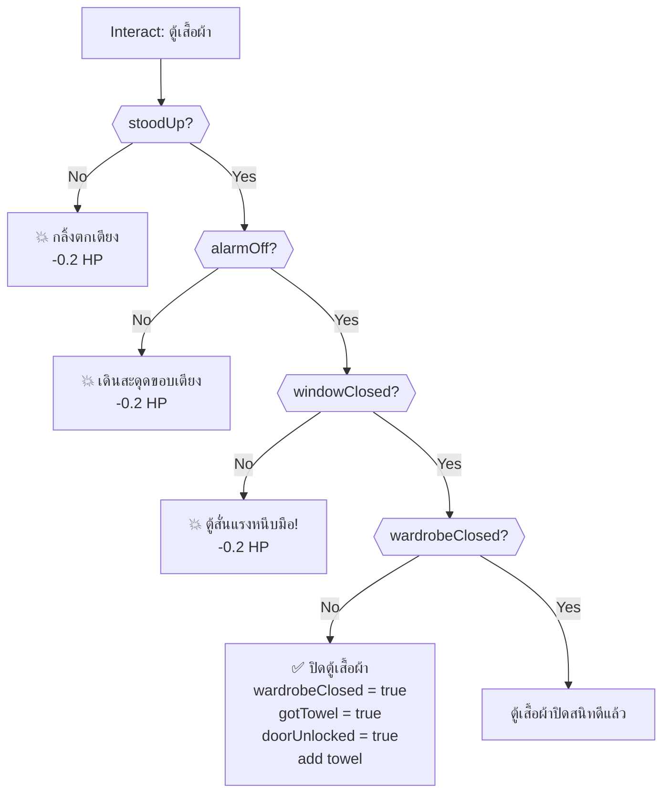

---

### 5. พัดลมเพดาน (fan)

Environmental hazard — lethal when window is open.

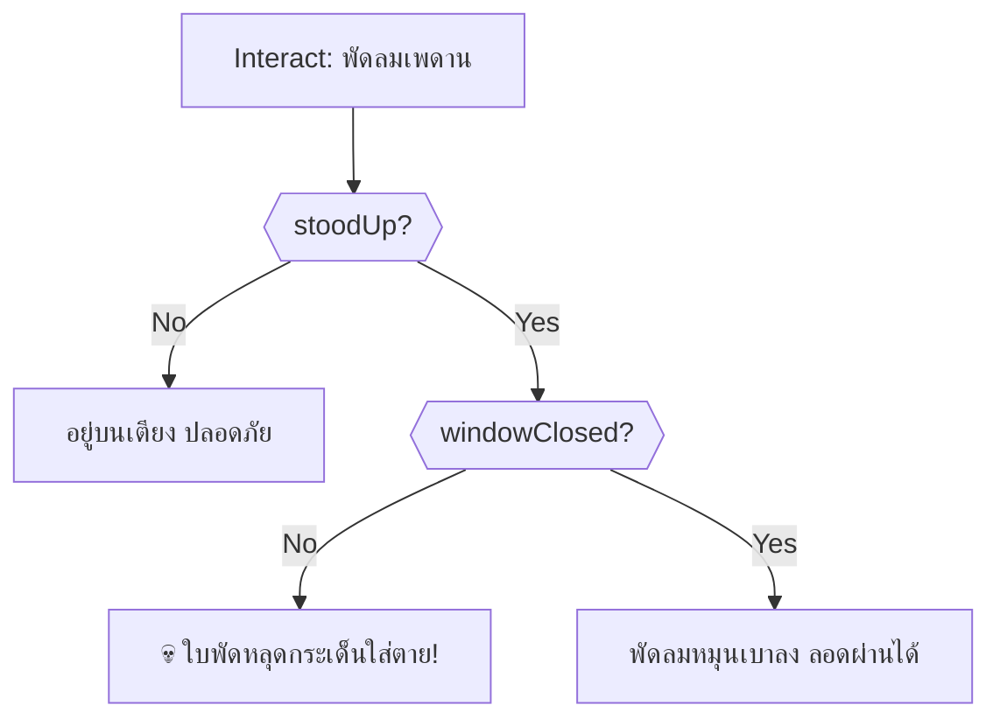

---

### 6. ประตูห้องน้ำ (door_bathroom)

Room exit → `bathroom`. Requires towel (doorUnlocked).

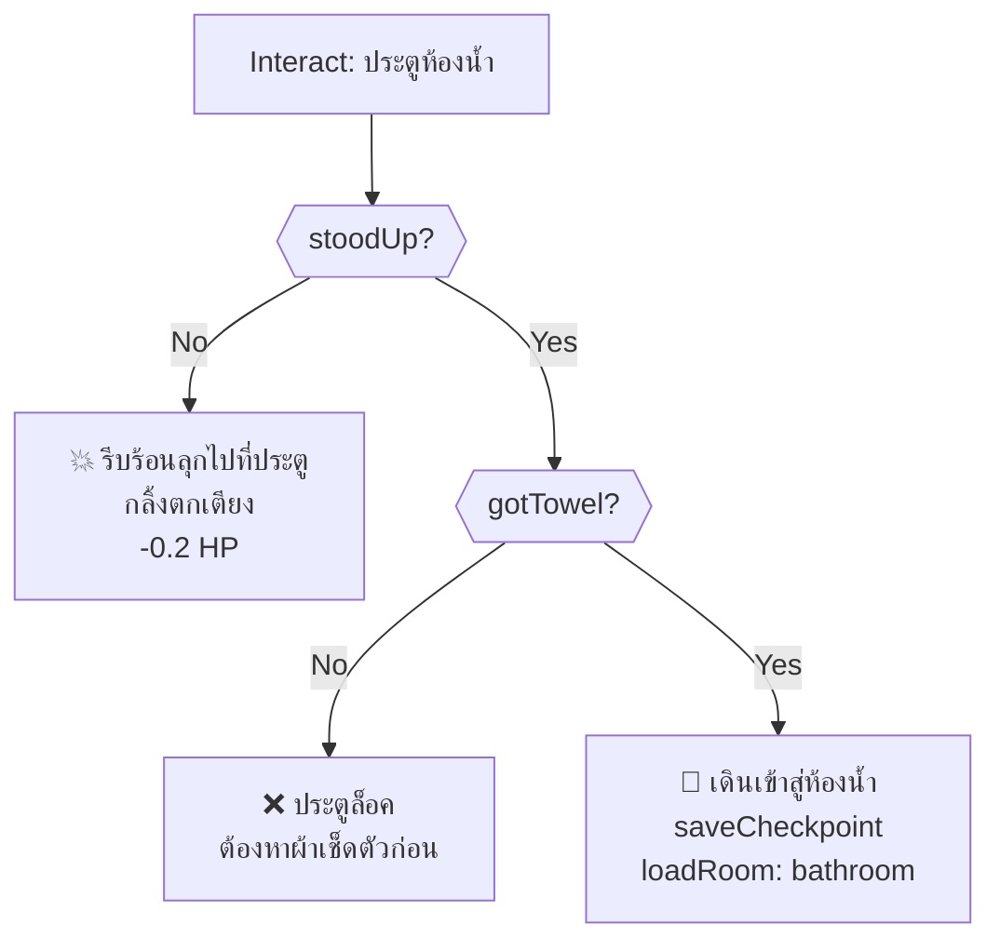

---

### 7. ประตูออกโถง (door_hallway)

Room exit → `hallway_f2`. Requires `key` item (from bathroom).

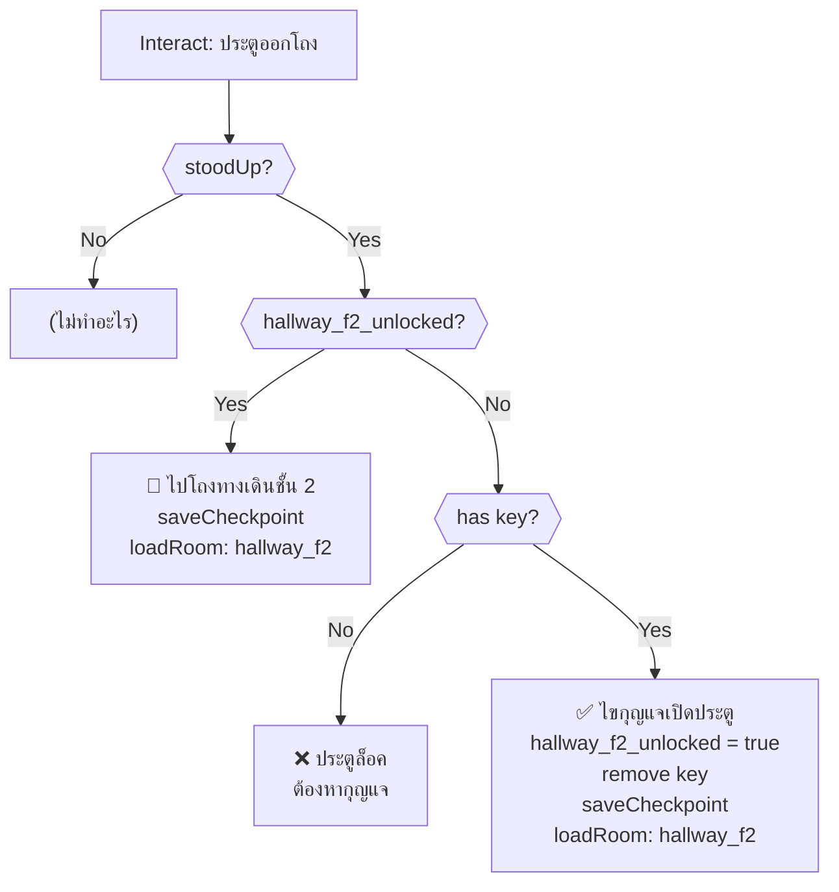

> [!IMPORTANT]
> The `key` item is obtained from the Bathroom (by draining the bathtub). The player must complete the Bathroom puzzle first to unlock this exit.

---

## Timed Events (onSecondTimer)

### Window Swing Cycle

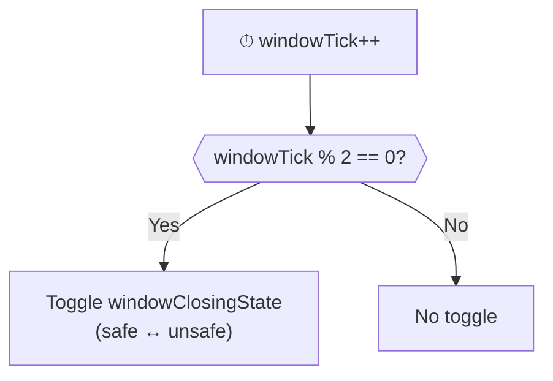

### Fan Escalation

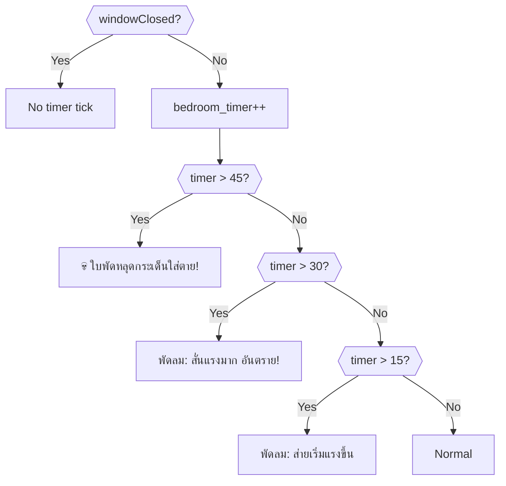

> [!WARNING]
> At 45 seconds without closing the window, the fan kills the player. The visual warnings begin at 15s and escalate at 30s.

---

## Critical Path (Optimal Solution)

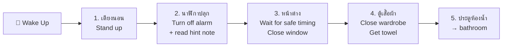

> [!IMPORTANT]
> After completing the Bathroom, return here and use the `key` to exit through ประตูออกโถง → `hallway_f2`.

---

## Death Summary

| # | Source | Trigger | Death Message |
|---|--------|---------|---------------|
| 1 | หน้าต่าง | Click during unsafe timing | ดึงผิดจังหวะ! บานหน้าต่างอ้าออก พัดตกลงไปข้างล่าง |
| 2 | พัดลมเพดาน | Interact while window open | ใบพัดหลุดกระเด็นใส่ตาย |
| 3 | onSecondTimer | `bedroom_timer > 45` | พัดลมเพดานหมุนส่ายรุนแรงจนใบพัดหลุดกระเด็นใส่ตาย |

---

## Damage Sources

| Source | HP Loss | Condition |
|--------|---------|-----------|
| นาฬิกาปลุก (not stood up) | -0.2 | Interact before standing |
| หน้าต่าง (alarm not off) | -0.2 | Interact before alarm off |
| ตู้เสื้อผ้า (not stood up) | -0.2 | Interact before standing |
| ตู้เสื้อผ้า (alarm not off) | -0.2 | Interact before alarm off |
| ตู้เสื้อผ้า (window open) | -0.2 | Wardrobe shaking from wind |
| ประตูห้องน้ำ (not stood up) | -0.2 | Interact before standing |

---

## Item Inventory

### Required from Other Rooms

| Item | Usage in This Room |
|------|---------------------|
| `key` | Unlock hallway F2 door (obtained from Bathroom) |

### Obtainable in This Room

| Item | Source | Usage |
|------|--------|-------|
| `towel` | ตู้เสื้อผ้า | ✅ Dry off after bathing in Bathroom (consumed) |
