# Dining Room — Player Flow

## Room Overview

The Dining Room is a puzzle room with a light-switching mechanic and multiple hazards. The player must **fix the flickering light, drink tea to calm down, climb the table to reach the ceiling lamp for a key, read the newspaper for a fence code clue, and move a pendulum clock** — all while managing a coffee-induced panic timer.

- **Entry:** Kitchen (ทางไปห้องทานข้าว)
- **Exit:** Living Room (ประตูห้องนั่งเล่น), Kitchen (กลับห้องครัว)

---

## Flags

| Flag | Default | Description |
|------|---------|-------------|
| `dining_room_lightSwitchState` | `1` | Light state: 1=flickering, 0=off, 2=on |
| `dining_room_teaDrank` | `false` | Player drank mint tea (calming) |
| `dining_room_coffeeDrank` | `false` | Player drank coffee (panic trigger) |
| `dining_room_waterDrank` | `false` | Player drank water (neutralizes coffee) |
| `dining_room_newspaperRead` | `false` | Newspaper read for fence code |
| `dining_room_keyAcquired` | `false` | Storage key obtained from lamp |
| `dining_room_wheelsChecked` | `false` | Clock wheels inspected |
| `dining_room_clockMoved` | `false` | Clock moved out of doorway |
| `dining_room_drinksAppeared` | `false` | Drinks visible (set by Kitchen) |
| `dining_room_clockTimer` | `0` | Coffee panic countdown timer |

---

## Room Entry (setupUI)

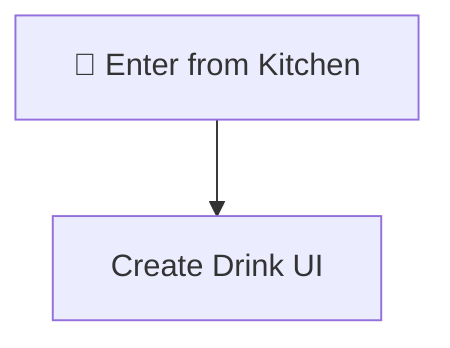

---

## All Interactable Objects

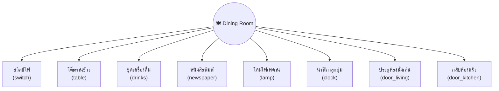

---

## Interactable Details

### 1. สวิตช์ไฟ (switch)

Three-state light switch: flickering → off → on.

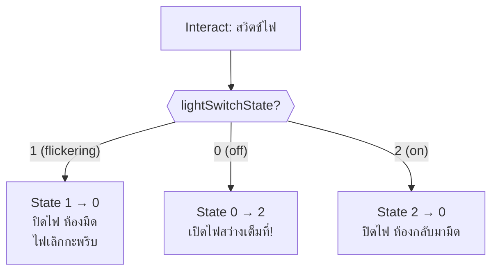

---

### 2. โต๊ะทานข้าว (table)

Climb up/down the dining table. Requires tea drank first.

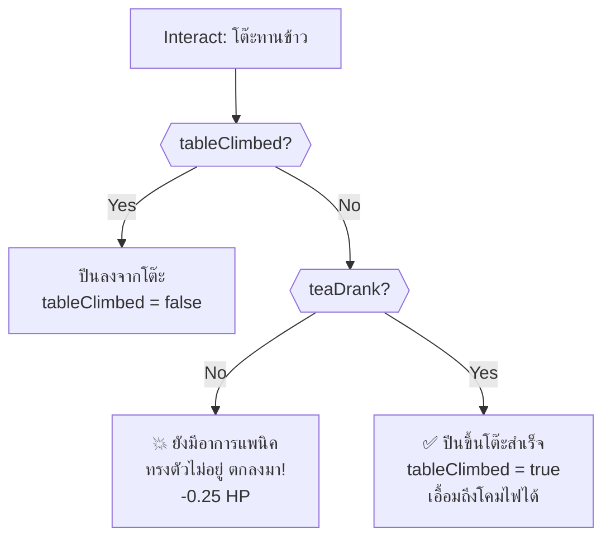

---

### 3. ชุดเครื่องดื่ม (drinks)

Choose a drink. Hidden until `dining_room_drinksAppeared` is true (set by Kitchen cooking).

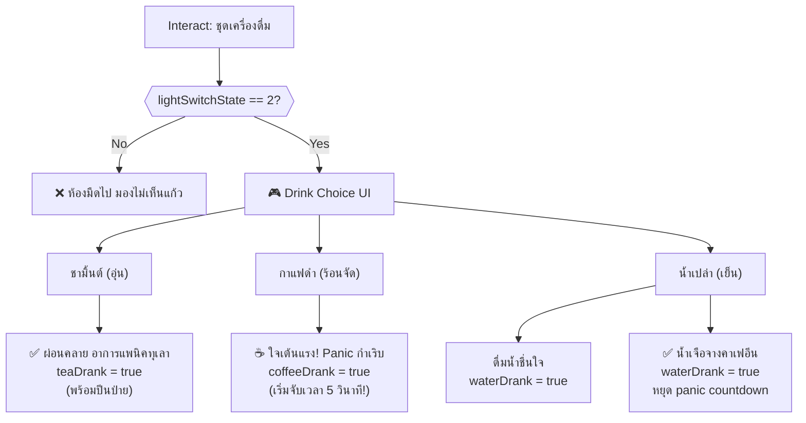

> [!TIP]
> Drink tea first to prepare for climbing the table. If coffee is drunk by mistake, drink water within 5 seconds to avoid death.

> [!WARNING]
> Coffee starts a 5-second countdown. If water is not drunk in time, the player dies from panic-induced cardiac arrest.

---

### 4. หนังสือพิมพ์ (newspaper)

Read for fence code clue. Requires light on.

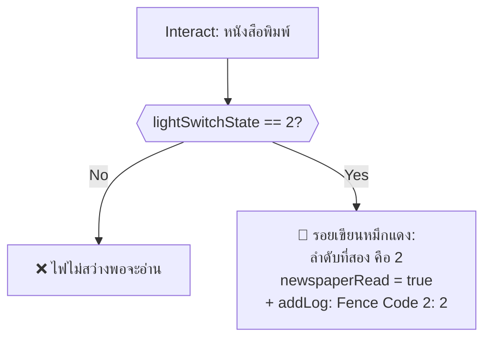

---

### 5. โคมไฟเพดาน (lamp)

Reach the ceiling lamp to find a key. Requires climbing table + light OFF.

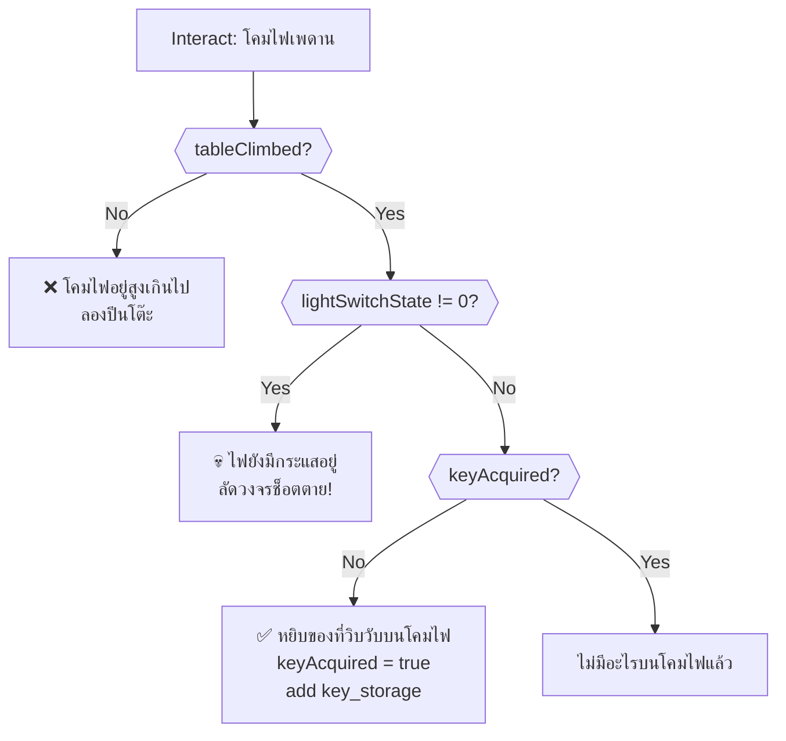

> [!IMPORTANT]
> The light must be OFF (state 0) when touching the lamp. If light is flickering (1) or on (2), the player is electrocuted.

---

### 6. นาฬิกาลูกตุ้ม (clock)

Move the pendulum clock to unblock the door to Living Room.

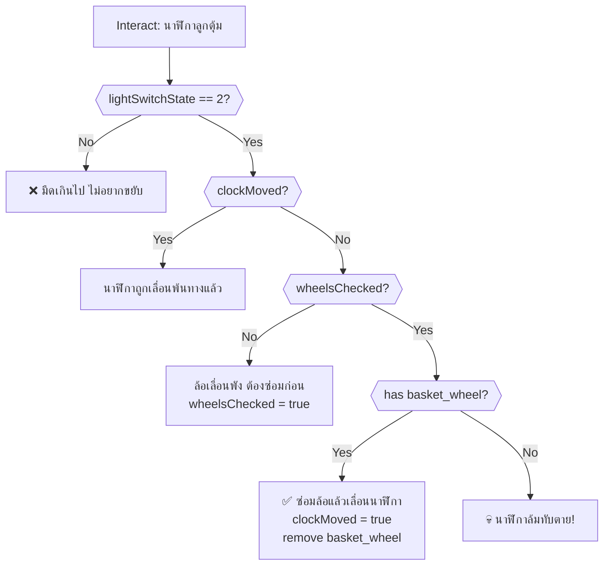

> [!IMPORTANT]
> `basket_wheel` is obtained from the Laundry room (ตะกร้าผ้า, 2nd search).

---

### 7. ประตูห้องนั่งเล่น (door_living)

Room exit → `living_room`. Blocked by the pendulum clock.

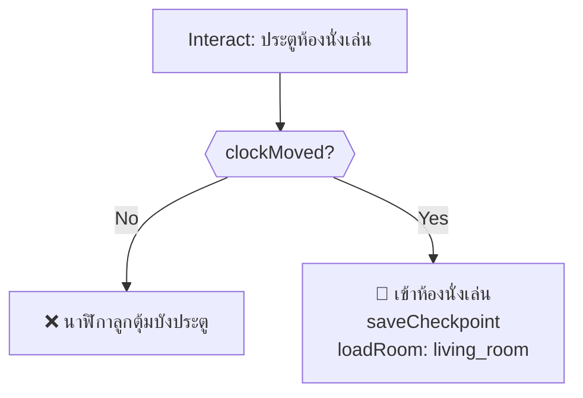

---

### 8. กลับห้องครัว (door_kitchen)

Room exit → `kitchen`. Always accessible.

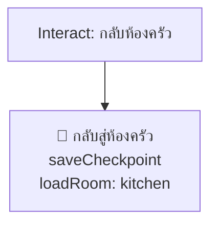

---

## Timed Events (onSecondTimer)

### Coffee Panic Countdown

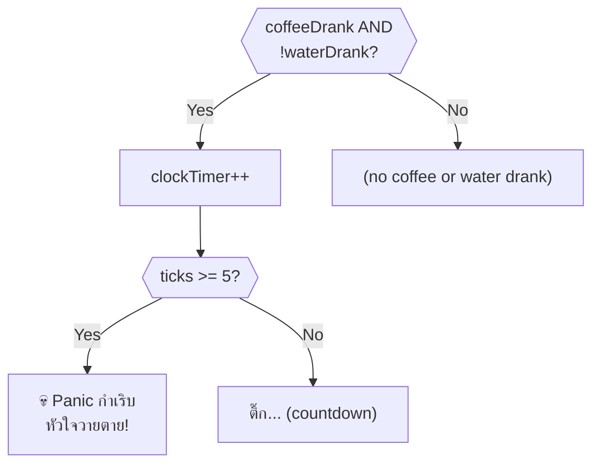

> [!CAUTION]
> After drinking coffee, the player has exactly 5 seconds to drink water. Each second announces "ติ๊ก..." in the action log.

---

## Critical Path (Optimal Solution)

```mermaid
flowchart LR
    S["🚪 Enter Dining Room"]
    S1["1. สวิตช์ไฟ (×2)<br/>flickering→off→on"]
    S2["2. ชุดเครื่องดื่ม<br/>Drink tea (ชามิ้นต์)"]
    S3["3. หนังสือพิมพ์<br/>Read fence code #2"]
    S4["4. โต๊ะทานข้าว<br/>Climb up"]
    S5["5. สวิตช์ไฟ<br/>Turn off (on→off)"]
    S6["6. โคมไฟเพดาน<br/>Get key_storage"]
    S7["7. สวิตช์ไฟ<br/>Turn on (off→on)"]
    S8["8. นาฬิกาลูกตุ้ม<br/>Move with basket_wheel"]
    S9["9. ประตูห้องนั่งเล่น<br/>→ living_room"]

    S --> S1 --> S2 --> S3 --> S4 --> S5 --> S6 --> S7 --> S8 --> S9
```

> [!IMPORTANT]
> **Required items from other rooms:**
> - `basket_wheel` — from Laundry room (ตะกร้าผ้า)
> - Drinks only appear after cooking food in the Kitchen (`dining_room_drinksAppeared`)

---

## Death Summary

| # | Source | Trigger | Death Message |
|---|--------|---------|---------------|
| 1 | โคมไฟเพดาน | Light state != 0 while touching | ไฟลัดวงจรช็อตตาย |
| 2 | นาฬิกาลูกตุ้ม | Try to move without basket_wheel | นาฬิกาล้มทับตาย |
| 3 | onSecondTimer | Coffee panic >= 5 ticks | Panic หัวใจวายตาย |

---

## Damage Sources

| Source | HP Loss | Condition |
|--------|---------|-----------|
| โต๊ะทานข้าว (no tea) | -0.25 | Climb without drinking tea |

---

## Item Inventory

### Required from Other Rooms

| Item | Usage in This Room |
|------|---------------------|
| `basket_wheel` | Fix clock wheels to move it (from Laundry) |

### Obtainable in This Room

| Item | Source | Usage |
|------|--------|-------|
| `key_storage` | โคมไฟเพดาน (light off + climbed) | ✅ Unlock storage room in Hallway F1 |
