# Fence Gate — Player Flow

## Room Overview

The Fence Gate is an outdoor puzzle area near the house entrance. The player must **find the 4-digit gate code from clues scattered across the house, unlock the mailbox, retrieve a key from the fountain, arm themselves, confront the entity at the house door, and input the code to escape** — all while checking that the dog is properly caged.

- **Entry:** Front Garden (ทางไปรั้วหน้าบ้าน)
- **Exit:** Road (ประตูรั้วออกสู่ถนน), Front Garden (กลับเข้าสวน)

---

## Flags

| Flag | Default | Description |
|------|---------|-------------|
| `fence_mailbox_unlocked` | `false` | Mailbox opened with key |
| `fence_net_taken` | `false` | Leaf net picked up |
| `fence_fountain_key_taken` | `false` | House key retrieved from fountain |
| `fence_left_bin_opened` | `false` | Left trash bin opened |
| `fence_right_bin_opened` | `false` | Right trash bin opened |
| `fence_house_door_opened` | `false` | House front door opened |
| `fence_gate_open` | `false` | Gate code entered correctly |
| `fence_code_attempts` | `0` | Failed code attempts counter |
| `fence_code_lock_timer` | `0` | Lockout countdown (seconds) |

---

## Room Entry (setupUI)

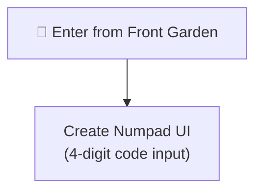

---

## All Interactable Objects

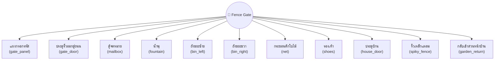

---

## Interactable Details

### 1. แผงกรอกรหัส (gate_panel)

Enter the 4-digit gate code. Requires dog caged.

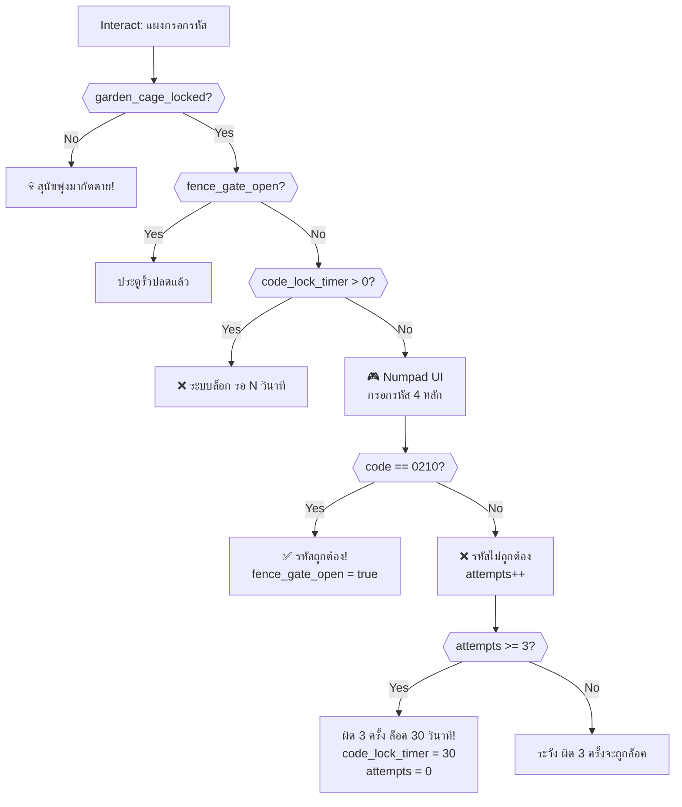

> [!IMPORTANT]
> The correct code is **0210**. Clues are scattered across rooms:
> - Digit 1 (= 0): Hallway F1 backpack (บอดี้พาสพนักงาน)
> - Digit 2 (= 2): Dining Room newspaper
> - Digit 3 (= 1): Living Room dog bed
> - Digit 4 (= 0): Fence Gate mailbox

---

### 2. ประตูรั้วออกสู่ถนน (gate_door)

Room exit → `road`. Requires gate code entered.

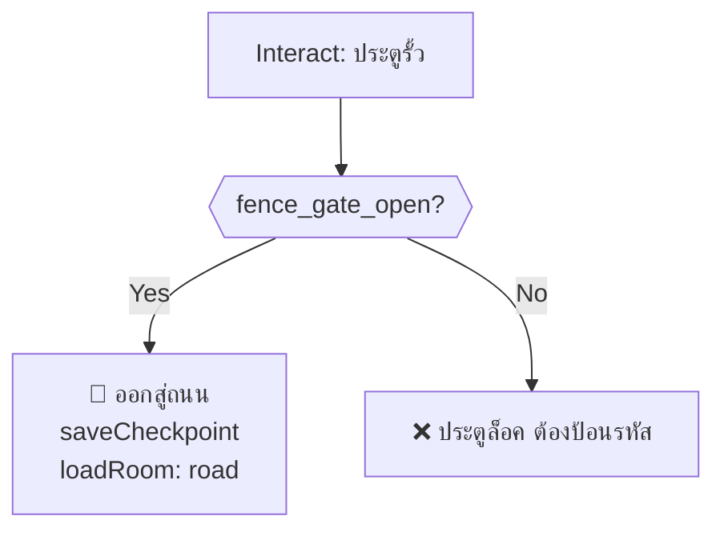

---

### 3. ตู้จดหมาย (mailbox)

Unlock with key for fence code digit #4.

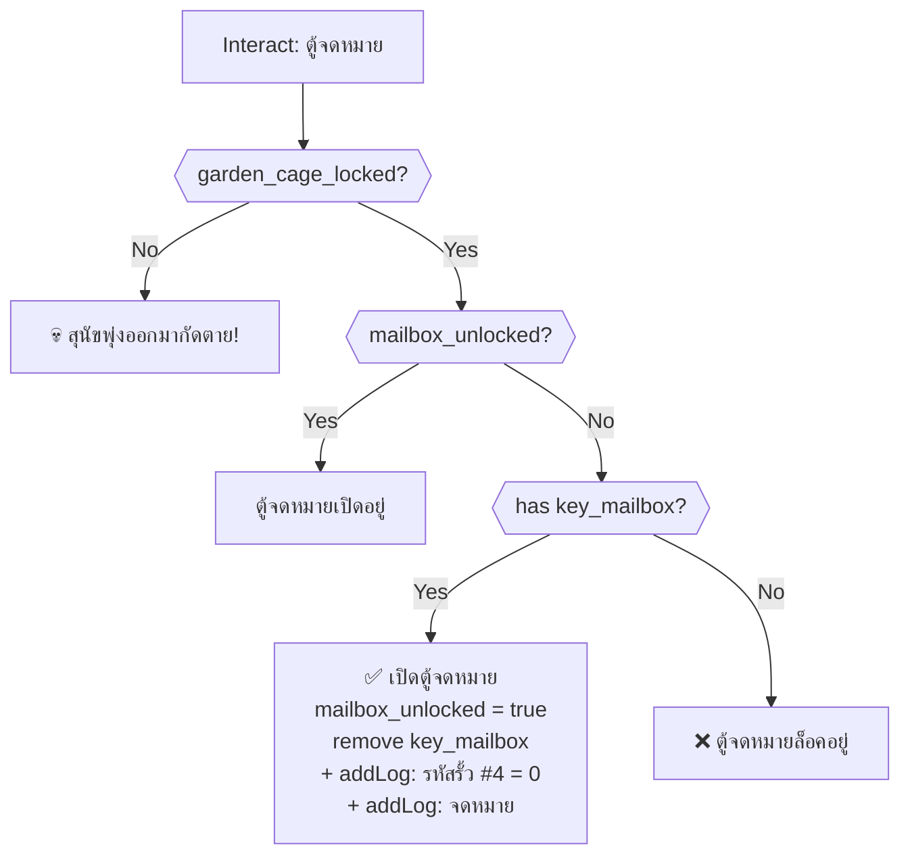

---

### 4. น้ำพุ (fountain)

Retrieve the house key using the net. Without net = UI choice death trap.

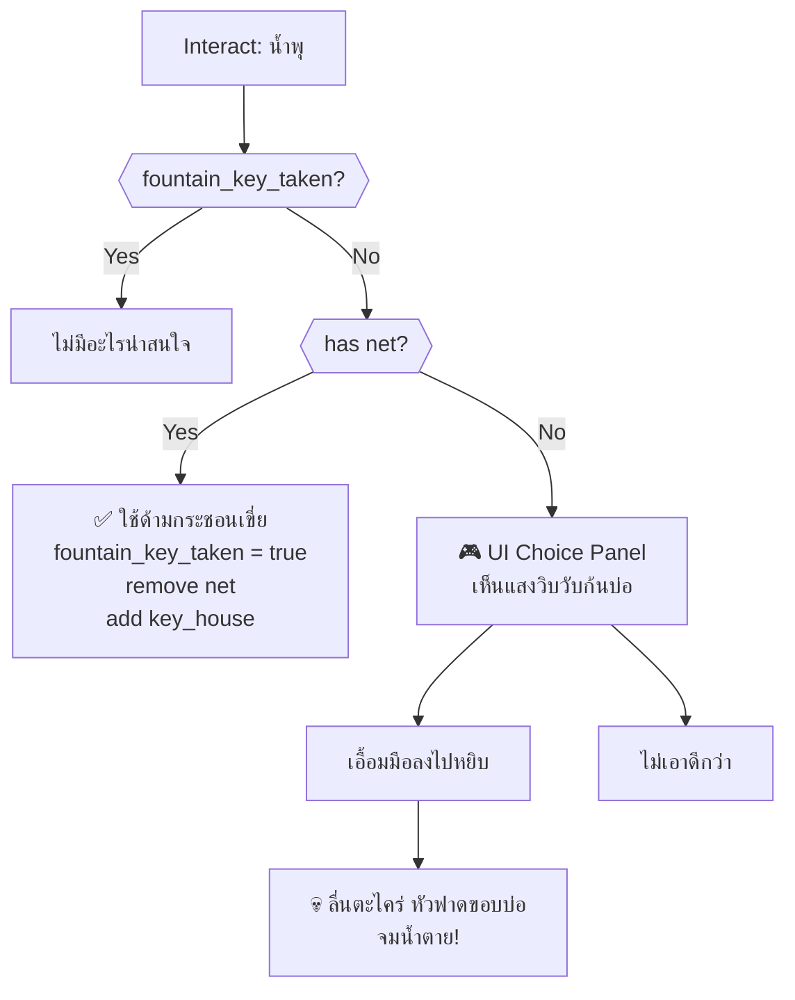

---

### 5. ถังขยะซ้าย (bin_left)

Disturbing discovery with heavy damage.

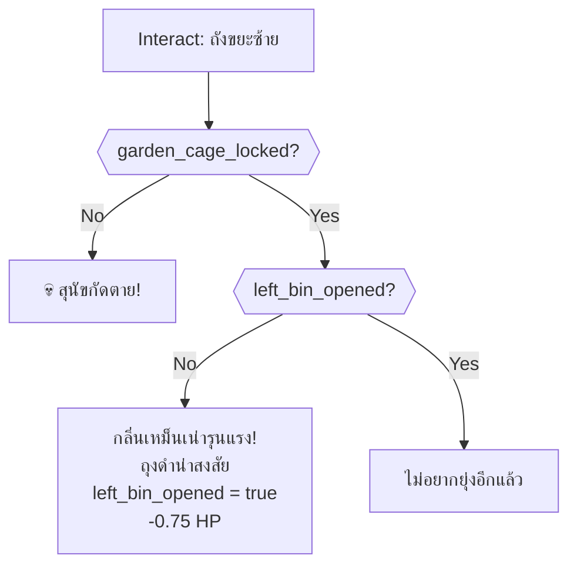

---

### 6. ถังขยะขวา (bin_right)

Find the fish knife.

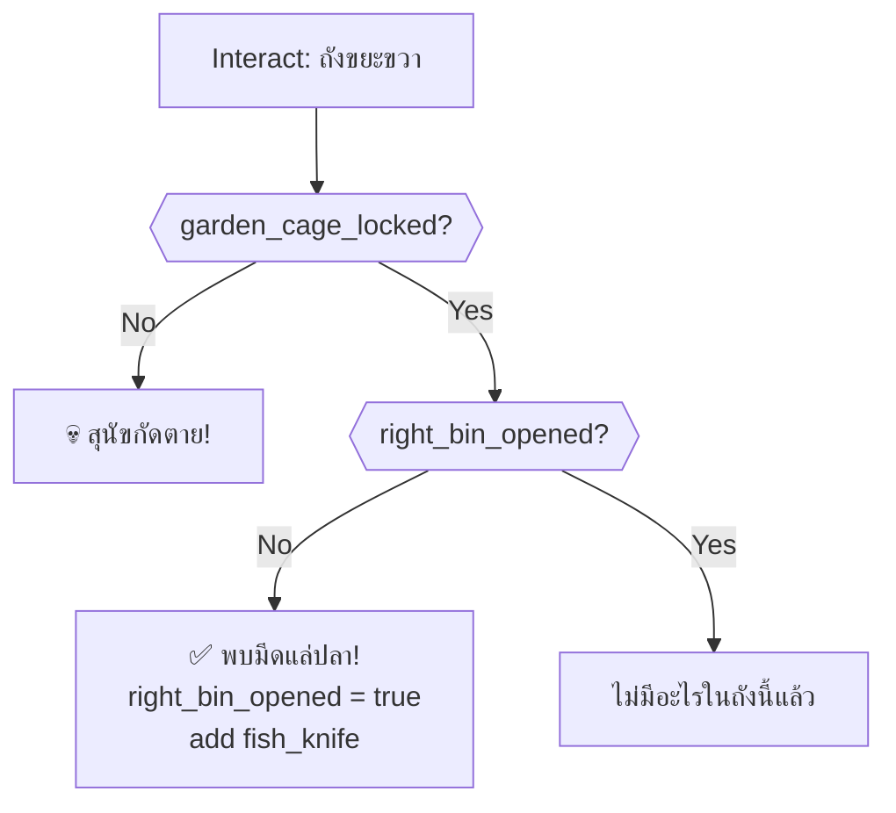

---

### 7. กระชอนตักใบไม้ (net)

Pick up the leaf net tool.

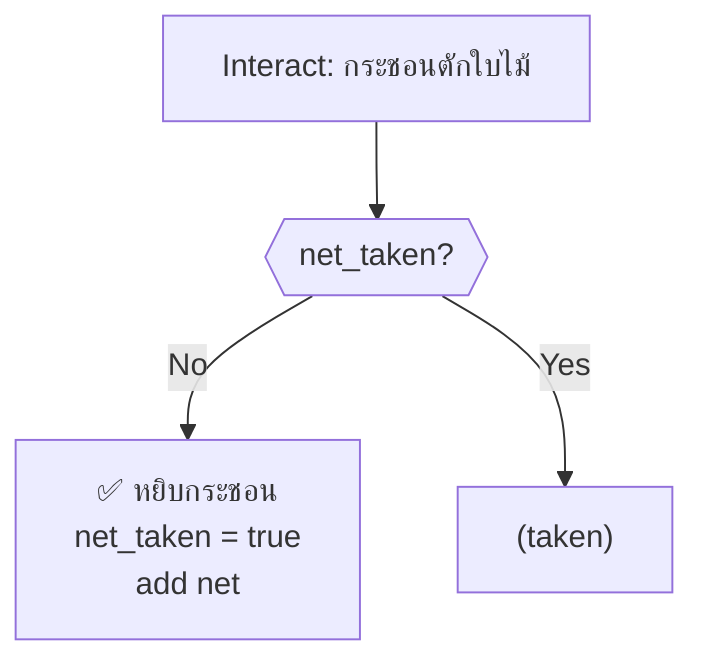

---

### 8. รองเท้า (shoes)

Lore hint object.

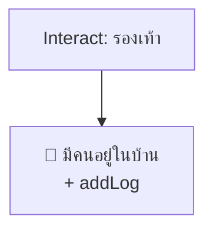

---

### 9. ประตูบ้าน (house_door)

Unlock and confront entity. Requires key + fish knife.

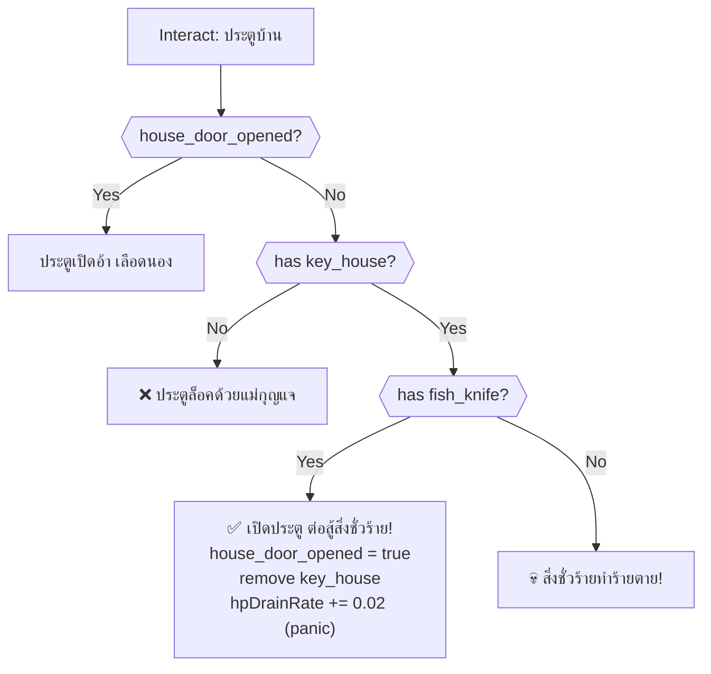

> [!CAUTION]
> Opening the door without the fish knife is instant death. Always get the knife from the right trash bin first.

---

### 10. รั้วเหล็กแหลม (spiky_fence)

Death trap — always lethal.

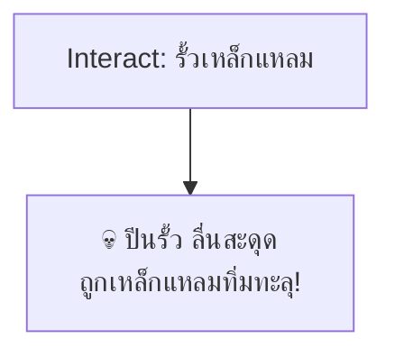

---

### 11. กลับเข้าสวนหน้าบ้าน (garden_return)

Room exit → `front_garden`. Requires dog caged.

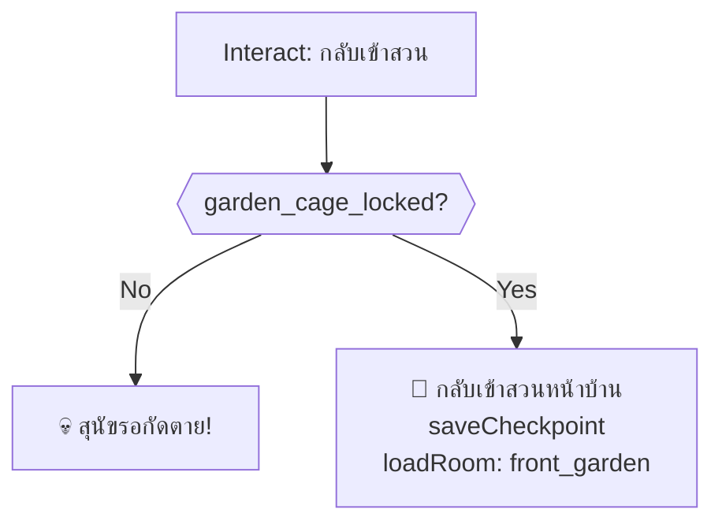

---

## Timed Events (onSecondTimer)

### Code Lock Countdown

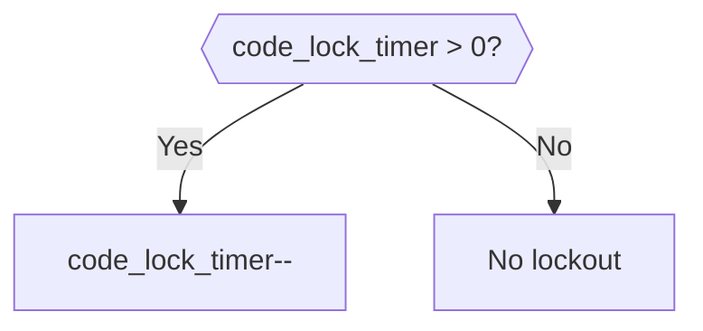

---

## Critical Path (Optimal Solution)

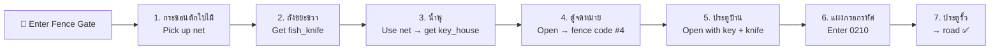

> [!IMPORTANT]
> **Required items from other rooms:**
> - `key_mailbox` — from Living Room (จานชาม)
> - Dog must be caged (`garden_cage_locked`) from Front Garden
> - All 4 fence code digits collected from various rooms

---

## Death Summary

| # | Source | Trigger | Death Message |
|---|--------|---------|---------------|
| 1 | แผงกรอกรหัส | !garden_cage_locked | สุนัขพุ่งมากัดตาย |
| 2 | ตู้จดหมาย | !garden_cage_locked | สุนัขพุ่งออกมากัดตาย |
| 3 | ถังขยะซ้าย | !garden_cage_locked | สุนัขกัดตาย |
| 4 | ถังขยะขวา | !garden_cage_locked | สุนัขกัดตาย |
| 5 | น้ำพุ → เอื้อมมือ | Player choice (UI) | ลื่นตะไคร่ จมน้ำตาย |
| 6 | ประตูบ้าน | has key but no fish_knife | สิ่งชั่วร้ายทำร้ายตาย |
| 7 | รั้วเหล็กแหลม | Always on interact | ถูกเหล็กแหลมทิ่มทะลุ |
| 8 | กลับเข้าสวน | !garden_cage_locked | สุนัขรอกัดตาย |

---

## Damage Sources

| Source | HP Loss | Condition |
|--------|---------|-----------|
| ถังขยะซ้าย (first open) | -0.75 | First time opening |
| ประตูบ้าน (opened with knife) | +0.02/s drain | Panic from confrontation |

---

## Item Inventory

### Required from Other Rooms

| Item | Usage in This Room |
|------|---------------------|
| `key_mailbox` | Unlock mailbox (from Living Room) |

### Obtainable in This Room

| Item | Source | Usage |
|------|--------|-------|
| `net` | กระชอนตักใบไม้ | ✅ Retrieve key from fountain (consumed) |
| `fish_knife` | ถังขยะขวา | ✅ Defend against entity at house door / Road encounters |
| `key_house` | น้ำพุ (via net) | ✅ Unlock house front door (consumed) |
