# Front Garden — Player Flow

## Room Overview

The Front Garden is a high-tension outdoor puzzle area. The player must **lure a guard dog into a cage, lock it, and escape to the fence gate** — all while managing timed hazards (wind/branch collapse, dog patrol cycle).

- **Entry:** Laundry Room (via broken window)
- **Exit:** Fence Gate (ทางไปรั้วหน้าบ้าน)

---

## Flags

| Flag | Default | Description |
|------|---------|-------------|
| `garden_in_cage` | `false` | Player is inside the dog cage |
| `garden_on_cage` | `false` | Player is on top of the cage roof |
| `garden_cage_closed` | `false` | Cage door is closed |
| `garden_cage_locked` | `false` | Cage door is permanently locked with rope |
| `garden_bowl_full` | `false` | Dog food bowl has been filled |
| `garden_pots_checked_count` | `0` | Number of times player checked pots |
| `garden_hole_right_checked` | `false` | Player has looked into the right hole |
| `garden_dog_timer` | `0` | Seconds until dog appears naturally |
| `garden_dog_state` | `'absent'` | Dog state: `absent`, `eating`, `sleeping`, `furious`, `caged` |
| `garden_dog_action_timer` | `0` | Timer for current dog action phase |
| `garden_wind_timer` | `0` | Seconds of wind accumulation |

---

## Room Entry (setupUI)

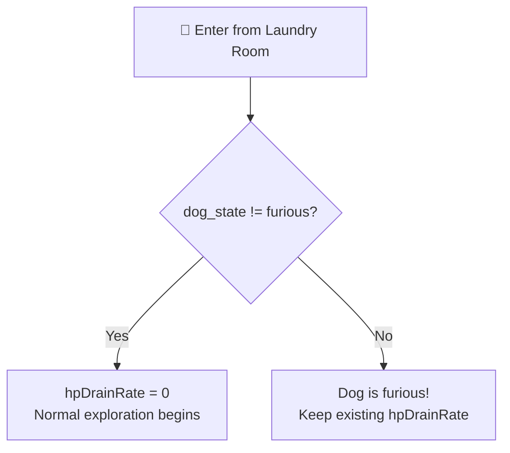
```mermaid
flowchart TD
    ENTRY["🚪 Enter from Laundry Room"]
    CHK{"dog_state != furious?"}
    SAFE["hpDrainRate = 0<br/>Normal exploration begins"]
    DANGER["Dog is furious!<br/>Keep existing hpDrainRate"]

    ENTRY --> CHK
    CHK -- Yes --> SAFE
    CHK -- No --> DANGER
```

> [!NOTE]
> `setupUI` simply resets `hpDrainRate` to 0 if the dog is not furious. There is no dog-breakout logic on re-entry.

---

## All Interactable Objects

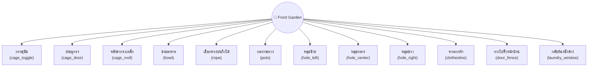
```mermaid
flowchart TD
    START(("🌿 Front Garden"))

    CAGE["กรงสุนัข<br/>(cage_toggle)"]
    CAGE_DOOR["ประตูกรง<br/>(cage_door)"]
    CAGE_ROOF["หลังคากรงเหล็ก<br/>(cage_roof)"]
    BOWL["ชามอาหาร<br/>(bowl)"]
    ROPE["เชือกห่วงบนกิ่งไม้<br/>(rope)"]
    POTS["กองกระถาง<br/>(pots)"]
    HOLE_L["หลุมซ้าย<br/>(hole_left)"]
    HOLE_C["หลุมกลาง<br/>(hole_center)"]
    HOLE_R["หลุมขวา<br/>(hole_right)"]
    CLOTHESLINE["ราวตากผ้า<br/>(clothesline)"]
    DOOR_FENCE["ทางไปรั้วหน้าบ้าน<br/>(door_fence)"]
    LAUNDRY["กลับห้องซักล้าง<br/>(laundry_window)"]

    START --> CAGE & CAGE_DOOR & CAGE_ROOF & BOWL & ROPE & POTS & HOLE_L & HOLE_C & HOLE_R & CLOTHESLINE & DOOR_FENCE & LAUNDRY
```

---

## Interactable Details

### 1. กรงสุนัข (cage_toggle)

Toggle enter/exit the dog cage.

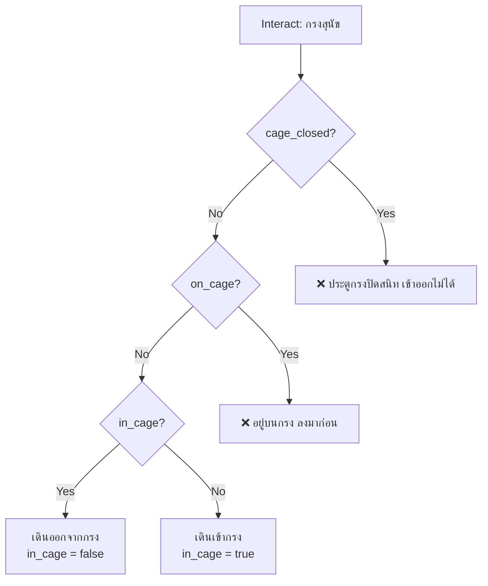
```mermaid
flowchart TD
    A["Interact: กรงสุนัข"]
    CHK_CLOSED{"cage_closed?"}
    CHK_ON{"on_cage?"}
    CHK_IN{"in_cage?"}
    EXIT_CAGE["เดินออกจากกรง<br/>in_cage = false"]
    ENTER_CAGE["เดินเข้ากรง<br/>in_cage = true"]
    BLOCK1["❌ ประตูกรงปิดสนิท เข้าออกไม่ได้"]
    BLOCK2["❌ อยู่บนกรง ลงมาก่อน"]

    A --> CHK_CLOSED
    CHK_CLOSED -- Yes --> BLOCK1
    CHK_CLOSED -- No --> CHK_ON
    CHK_ON -- Yes --> BLOCK2
    CHK_ON -- No --> CHK_IN
    CHK_IN -- Yes --> EXIT_CAGE
    CHK_IN -- No --> ENTER_CAGE
```

---

### 2. ประตูกรง (cage_door)

Close the cage door, then lock it with rope.

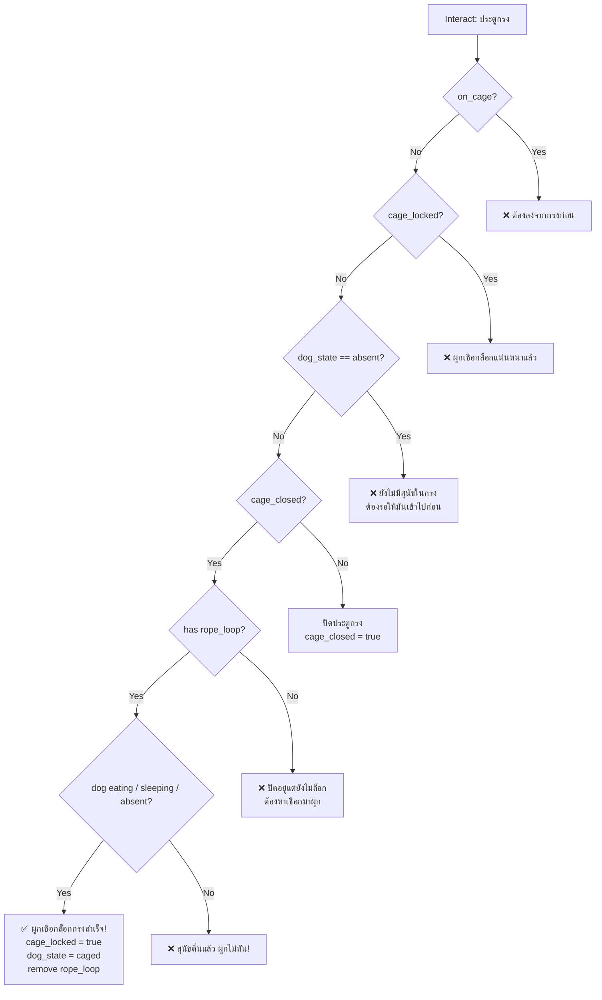
```mermaid
flowchart TD
    A["Interact: ประตูกรง"]
    CHK_ON{"on_cage?"}
    CHK_LOCKED{"cage_locked?"}
    CHK_DOG{"dog_state == absent?"}
    CHK_CLOSED{"cage_closed?"}
    HAS_ROPE{"has rope_loop?"}
    DOG_CALM{"dog eating / sleeping / absent?"}

    BLOCK_ON["❌ ต้องลงจากกรงก่อน"]
    BLOCK_LOCKED["❌ ผูกเชือกล็อกแน่นหนาแล้ว"]
    NO_DOG["❌ ยังไม่มีสุนัขในกรง<br/>ต้องรอให้มันเข้าไปก่อน"]
    CLOSE_DOOR["ปิดประตูกรง<br/>cage_closed = true"]
    NEED_ROPE["❌ ปิดอยู่แต่ยังไม่ล็อก<br/>ต้องหาเชือกมาผูก"]
    LOCK_FAIL["❌ สุนัขตื่นแล้ว ผูกไม่ทัน!"]
    LOCK_OK["✅ ผูกเชือกล็อกกรงสำเร็จ!<br/>cage_locked = true<br/>dog_state = caged<br/>remove rope_loop"]

    A --> CHK_ON
    CHK_ON -- Yes --> BLOCK_ON
    CHK_ON -- No --> CHK_LOCKED
    CHK_LOCKED -- Yes --> BLOCK_LOCKED
    CHK_LOCKED -- No --> CHK_DOG
    CHK_DOG -- Yes --> NO_DOG
    CHK_DOG -- No --> CHK_CLOSED
    CHK_CLOSED -- No --> CLOSE_DOOR
    CHK_CLOSED -- Yes --> HAS_ROPE
    HAS_ROPE -- No --> NEED_ROPE
    HAS_ROPE -- Yes --> DOG_CALM
    DOG_CALM -- Yes --> LOCK_OK
    DOG_CALM -- No --> LOCK_FAIL
```

> [!IMPORTANT]
> The `dog_state == 'absent'` check at line 51 blocks closing when no dog is present. But the lock check at line 57 **also** accepts `absent` as a calm state. This means the lock path can only be reached when `dog_state` is `eating`, `sleeping`, or `furious` (since `absent` is blocked earlier). The `furious` case hits the `else` branch → "ผูกไม่ทัน!".

---

### 3. หลังคากรงเหล็ก (cage_roof)

Climb up/down the cage roof. Requires pot_b as a step.

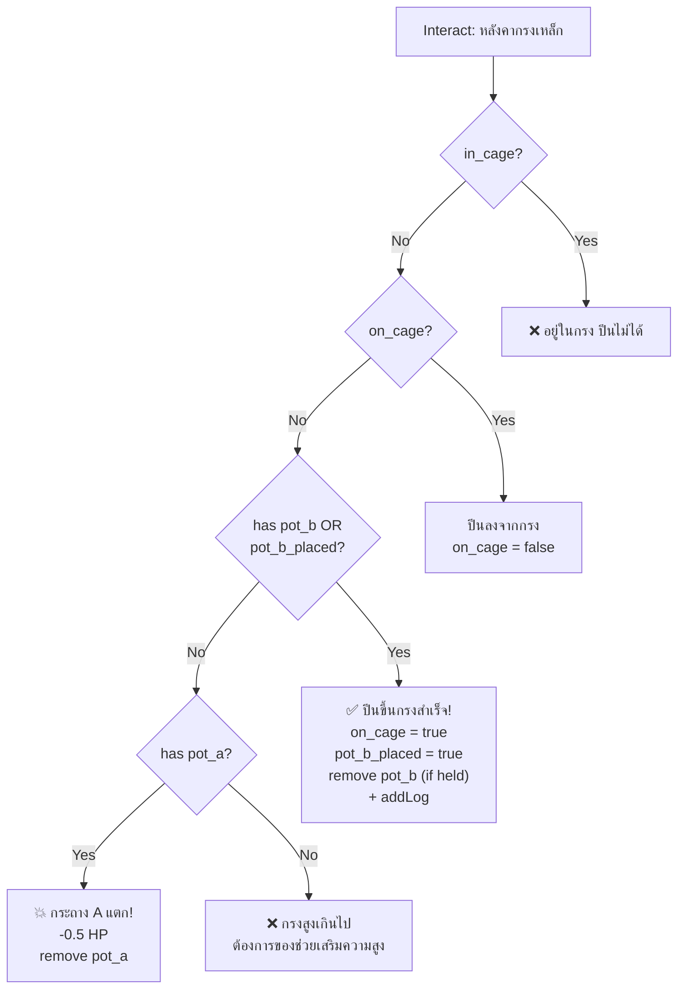
```mermaid
flowchart TD
    A["Interact: หลังคากรงเหล็ก"]
    CHK_IN{"in_cage?"}
    CHK_ON{"on_cage?"}
    HAS_B{"has pot_b OR<br/>pot_b_placed?"}
    HAS_A{"has pot_a?"}

    BLOCK_IN["❌ อยู่ในกรง ปีนไม่ได้"]
    CLIMB_DOWN["ปีนลงจากกรง<br/>on_cage = false"]
    CLIMB_UP["✅ ปีนขึ้นกรงสำเร็จ!<br/>on_cage = true<br/>pot_b_placed = true<br/>remove pot_b (if held)<br/>+ addLog"]
    POT_BREAK["💥 กระถาง A แตก!<br/>-0.5 HP<br/>remove pot_a"]
    TOO_HIGH["❌ กรงสูงเกินไป<br/>ต้องการของช่วยเสริมความสูง"]

    A --> CHK_IN
    CHK_IN -- Yes --> BLOCK_IN
    CHK_IN -- No --> CHK_ON
    CHK_ON -- Yes --> CLIMB_DOWN
    CHK_ON -- No --> HAS_B
    HAS_B -- Yes --> CLIMB_UP
    HAS_B -- No --> HAS_A
    HAS_A -- Yes --> POT_BREAK
    HAS_A -- No --> TOO_HIGH
```

> [!TIP]
> Once `pot_b_placed` is set, the player can climb up/down indefinitely without needing the item again.

---

### 4. ชามอาหาร (bowl)

Fill the dog food bowl. Must be inside the cage.

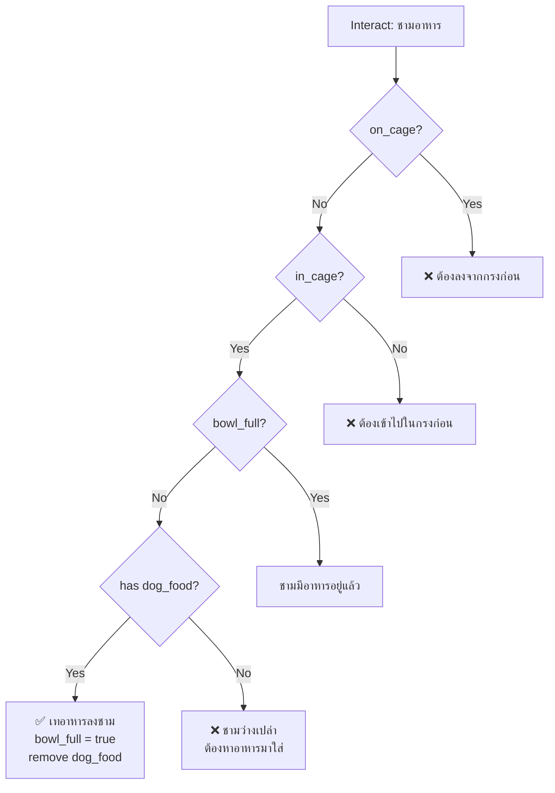
```mermaid
flowchart TD
    A["Interact: ชามอาหาร"]
    CHK_ON{"on_cage?"}
    CHK_IN{"in_cage?"}
    CHK_FULL{"bowl_full?"}
    HAS_FOOD{"has dog_food?"}

    BLOCK_ON["❌ ต้องลงจากกรงก่อน"]
    BLOCK_OUT["❌ ต้องเข้าไปในกรงก่อน"]
    ALREADY["ชามมีอาหารอยู่แล้ว"]
    FILL["✅ เทอาหารลงชาม<br/>bowl_full = true<br/>remove dog_food"]
    EMPTY["❌ ชามว่างเปล่า<br/>ต้องหาอาหารมาใส่"]

    A --> CHK_ON
    CHK_ON -- Yes --> BLOCK_ON
    CHK_ON -- No --> CHK_IN
    CHK_IN -- No --> BLOCK_OUT
    CHK_IN -- Yes --> CHK_FULL
    CHK_FULL -- Yes --> ALREADY
    CHK_FULL -- No --> HAS_FOOD
    HAS_FOOD -- Yes --> FILL
    HAS_FOOD -- No --> EMPTY
```

---

### 5. เชือกห่วงบนกิ่งไม้ (rope)

Get rope from tree branch. Requires being on cage roof. Presents UI choice.

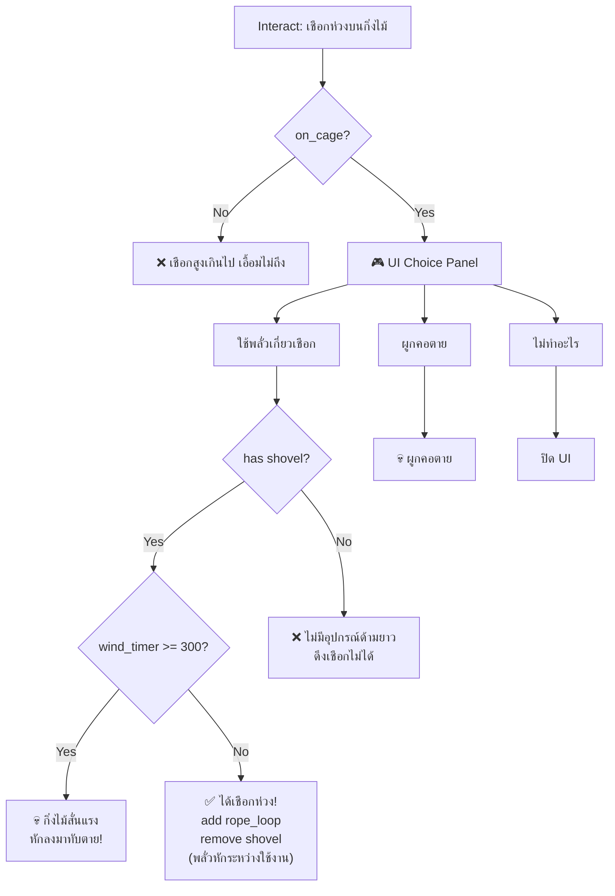
```mermaid
flowchart TD
    A["Interact: เชือกห่วงบนกิ่งไม้"]
    CHK_ON{"on_cage?"}
    BLOCK["❌ เชือกสูงเกินไป เอื้อมไม่ถึง"]
    UI["🎮 UI Choice Panel"]

    BTN_TAKE["ใช้พลั่วเกี่ยวเชือก"]
    BTN_HANG["ผูกคอตาย"]
    BTN_CANCEL["ไม่ทำอะไร"]

    HAS_SHOVEL{"has shovel?"}
    WIND_CHK{"wind_timer >= 300?"}
    GET_ROPE["✅ ได้เชือกห่วง!<br/>add rope_loop<br/>remove shovel<br/>(พลั่วหักระหว่างใช้งาน)"]
    DEATH_BRANCH["💀 กิ่งไม้สั่นแรง<br/>หักลงมาทับตาย!"]
    NO_TOOL["❌ ไม่มีอุปกรณ์ด้ามยาว<br/>ดึงเชือกไม่ได้"]
    DEATH_HANG["💀 ผูกคอตาย"]
    DISMISS["ปิด UI"]

    A --> CHK_ON
    CHK_ON -- No --> BLOCK
    CHK_ON -- Yes --> UI
    UI --> BTN_TAKE & BTN_HANG & BTN_CANCEL
    BTN_TAKE --> HAS_SHOVEL
    HAS_SHOVEL -- No --> NO_TOOL
    HAS_SHOVEL -- Yes --> WIND_CHK
    WIND_CHK -- Yes --> DEATH_BRANCH
    WIND_CHK -- No --> GET_ROPE
    BTN_HANG --> DEATH_HANG
    BTN_CANCEL --> DISMISS
```

> [!WARNING]
> If `wind_timer >= 300` (5 minutes), using the shovel to pull the rope causes instant death from the branch collapsing. The player must get the rope **before** the 5-minute mark.

---

### 6. กองกระถาง (pots)

Pick up a pot. First interaction triggers a scare jump. Second interaction presents a choice.

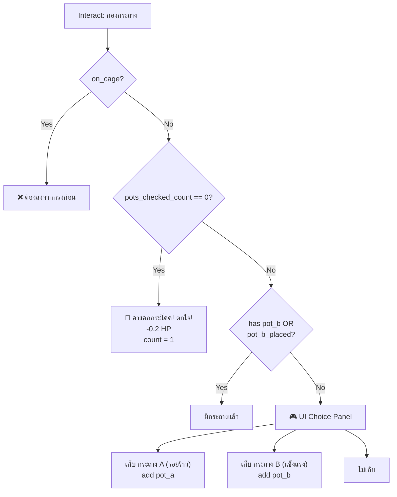
```mermaid
flowchart TD
    A["Interact: กองกระถาง"]
    CHK_ON{"on_cage?"}
    BLOCK_ON["❌ ต้องลงจากกรงก่อน"]
    FIRST{"pots_checked_count == 0?"}
    TOAD["🐸 คางคกกระโดด! ตกใจ!<br/>-0.2 HP<br/>count = 1"]
    HAS_POT{"has pot_b OR<br/>pot_b_placed?"}
    ALREADY["มีกระถางแล้ว"]
    UI["🎮 UI Choice Panel"]

    PICK_A["เก็บ กระถาง A (รอยร้าว)<br/>add pot_a"]
    PICK_B["เก็บ กระถาง B (แข็งแรง)<br/>add pot_b"]
    SKIP["ไม่เก็บ"]

    A --> CHK_ON
    CHK_ON -- Yes --> BLOCK_ON
    CHK_ON -- No --> FIRST
    FIRST -- Yes --> TOAD
    FIRST -- No --> HAS_POT
    HAS_POT -- Yes --> ALREADY
    HAS_POT -- No --> UI
    UI --> PICK_A & PICK_B & SKIP
```

> [!TIP]
> Pot A is a trap — it breaks when used to climb, dealing 0.5 HP damage. Always pick Pot B.

---

### 7. หลุมซ้าย (hole_left)

Find the shovel.

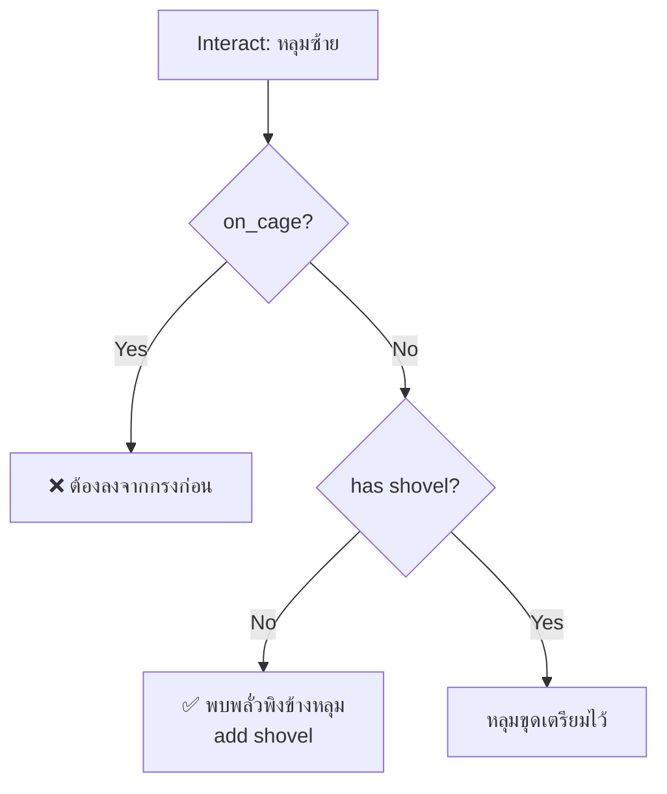
```mermaid
flowchart TD
    A["Interact: หลุมซ้าย"]
    CHK_ON{"on_cage?"}
    BLOCK["❌ ต้องลงจากกรงก่อน"]
    HAS{"has shovel?"}
    GET["✅ พบพลั่วพิงข้างหลุม<br/>add shovel"]
    DONE["หลุมขุดเตรียมไว้"]

    A --> CHK_ON
    CHK_ON -- Yes --> BLOCK
    CHK_ON -- No --> HAS
    HAS -- No --> GET
    HAS -- Yes --> DONE
```

---

### 8. หลุมกลาง (hole_center)

Instant death trap.

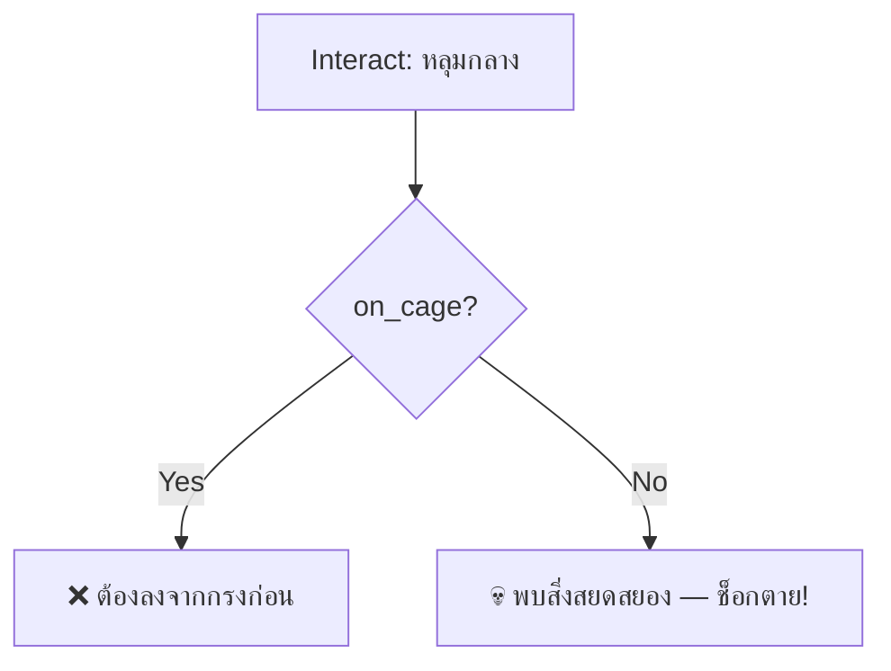
```mermaid
flowchart TD
    A["Interact: หลุมกลาง"]
    CHK_ON{"on_cage?"}
    BLOCK["❌ ต้องลงจากกรงก่อน"]
    DEATH["💀 พบสิ่งสยดสยอง — ช็อกตาย!"]

    A --> CHK_ON
    CHK_ON -- Yes --> BLOCK
    CHK_ON -- No --> DEATH
```

> [!CAUTION]
> Always-lethal instant death. No way to survive interacting with this hole.

---

### 9. หลุมขวา (hole_right)

Scare event with minor damage on first check.

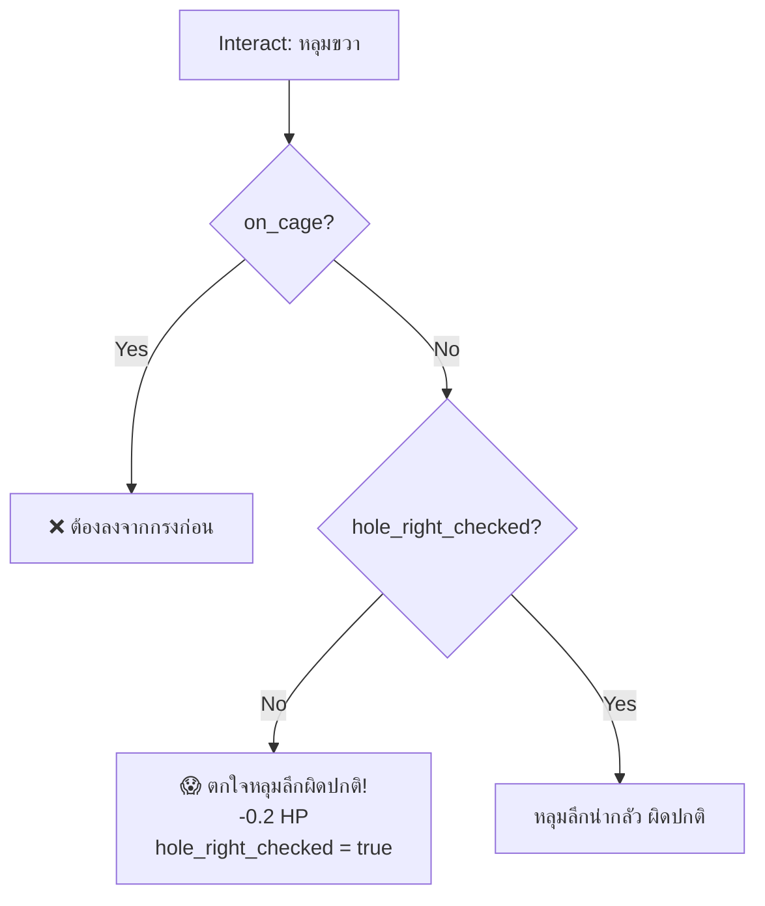
```mermaid
flowchart TD
    A["Interact: หลุมขวา"]
    CHK_ON{"on_cage?"}
    BLOCK["❌ ต้องลงจากกรงก่อน"]
    FIRST{"hole_right_checked?"}
    SCARE["😱 ตกใจหลุมลึกผิดปกติ!<br/>-0.2 HP<br/>hole_right_checked = true"]
    REPEAT["หลุมลึกน่ากลัว ผิดปกติ"]

    A --> CHK_ON
    CHK_ON -- Yes --> BLOCK
    CHK_ON -- No --> FIRST
    FIRST -- No --> SCARE
    FIRST -- Yes --> REPEAT
```

---

### 10. ราวตากผ้า (clothesline)

Hint object — gives the player a clue about the puzzle solution.

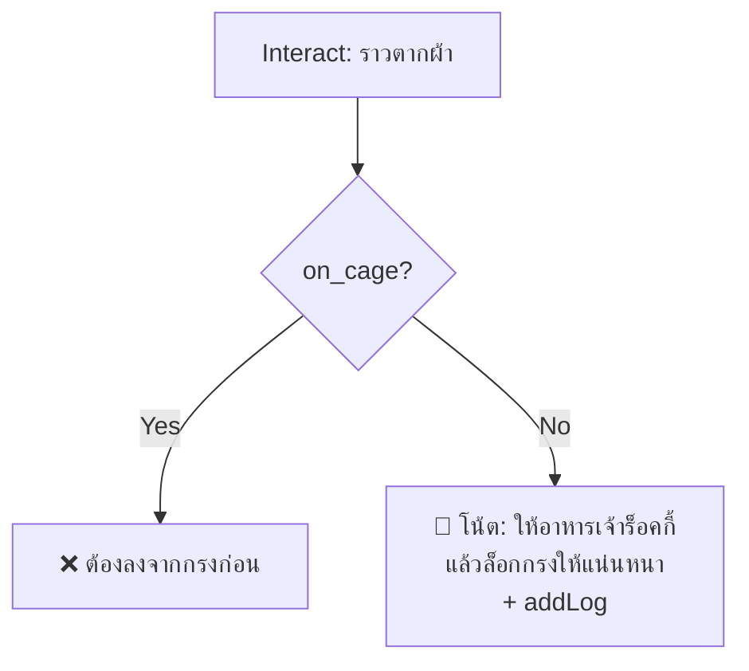
```mermaid
flowchart TD
    A["Interact: ราวตากผ้า"]
    CHK_ON{"on_cage?"}
    BLOCK["❌ ต้องลงจากกรงก่อน"]
    HINT["📝 โน้ต: ให้อาหารเจ้าร็อคกี้<br/>แล้วล็อกกรงให้แน่นหนา<br/>+ addLog"]

    A --> CHK_ON
    CHK_ON -- Yes --> BLOCK
    CHK_ON -- No --> HINT
```

---

### 11. ทางไปรั้วหน้าบ้าน (door_fence)

Room exit → `fence_gate`. Requires dog to be caged or cage closed.

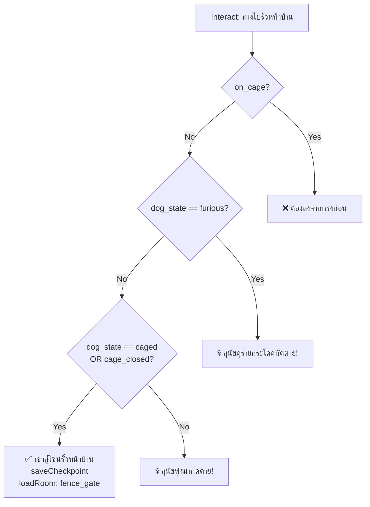
```mermaid
flowchart TD
    A["Interact: ทางไปรั้วหน้าบ้าน"]
    CHK_ON{"on_cage?"}
    DOG_F{"dog_state == furious?"}
    DOG_SAFE{"dog_state == caged<br/>OR cage_closed?"}

    BLOCK["❌ ต้องลงจากกรงก่อน"]
    DEATH1["💀 สุนัขดุร้ายกระโดดกัดตาย!"]
    DEATH2["💀 สุนัขพุ่งมากัดตาย!"]
    EXIT["✅ เข้าสู่โซนรั้วหน้าบ้าน<br/>saveCheckpoint<br/>loadRoom: fence_gate"]

    A --> CHK_ON
    CHK_ON -- Yes --> BLOCK
    CHK_ON -- No --> DOG_F
    DOG_F -- Yes --> DEATH1
    DOG_F -- No --> DOG_SAFE
    DOG_SAFE -- Yes --> EXIT
    DOG_SAFE -- No --> DEATH2
```

> [!IMPORTANT]
> The condition `dog_state !== 'caged' && !cage_closed` means the player dies if the dog is **not** caged **and** the cage is **not** closed. In practice, the safe states are: dog is `caged`, or `cage_closed` is true (even with dog eating/sleeping inside).

---

### 12. กลับห้องซักล้าง (laundry_window)

Room exit → `laundry`. Always takes 0.2 HP damage from broken glass.

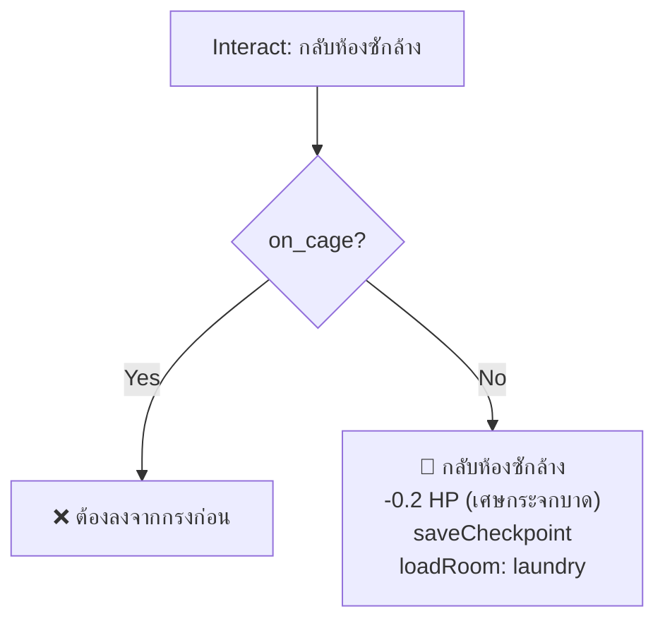
```mermaid
flowchart TD
    A["Interact: กลับห้องซักล้าง"]
    CHK_ON{"on_cage?"}
    BLOCK["❌ ต้องลงจากกรงก่อน"]
    GO["🚪 กลับห้องซักล้าง<br/>-0.2 HP (เศษกระจกบาด)<br/>saveCheckpoint<br/>loadRoom: laundry"]

    A --> CHK_ON
    CHK_ON -- Yes --> BLOCK
    CHK_ON -- No --> GO
```

---

## Timed Events (onSecondTimer)

Every second, the following logic runs:

### Wind System

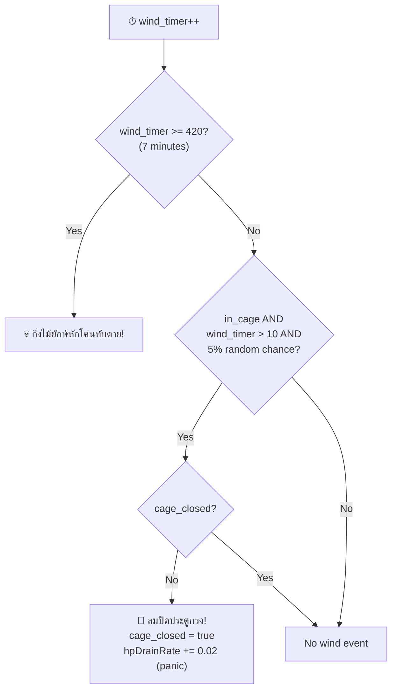
```mermaid
flowchart TD
    TICK["⏱ wind_timer++"]
    CHK_420{"wind_timer >= 420?<br/>(7 minutes)"}
    DEATH["💀 กิ่งไม้ยักษ์หักโค่นทับตาย!"]
    CHK_WIND{"in_cage AND<br/>wind_timer > 10 AND<br/>5% random chance?"}
    CHK_DOOR{"cage_closed?"}
    SLAM["💨 ลมปิดประตูกรง!<br/>cage_closed = true<br/>hpDrainRate += 0.02 (panic)"]
    SKIP["No wind event"]

    TICK --> CHK_420
    CHK_420 -- Yes --> DEATH
    CHK_420 -- No --> CHK_WIND
    CHK_WIND -- Yes --> CHK_DOOR
    CHK_DOOR -- No --> SLAM
    CHK_DOOR -- Yes --> SKIP
    CHK_WIND -- No --> SKIP
```

> [!WARNING]
> If the player is inside the cage and the door isn't closed, the wind can randomly slam it shut, trapping the player and adding panic drain. At 420 seconds (7 minutes), the branch collapses and kills the player regardless.

### Dog State Machine

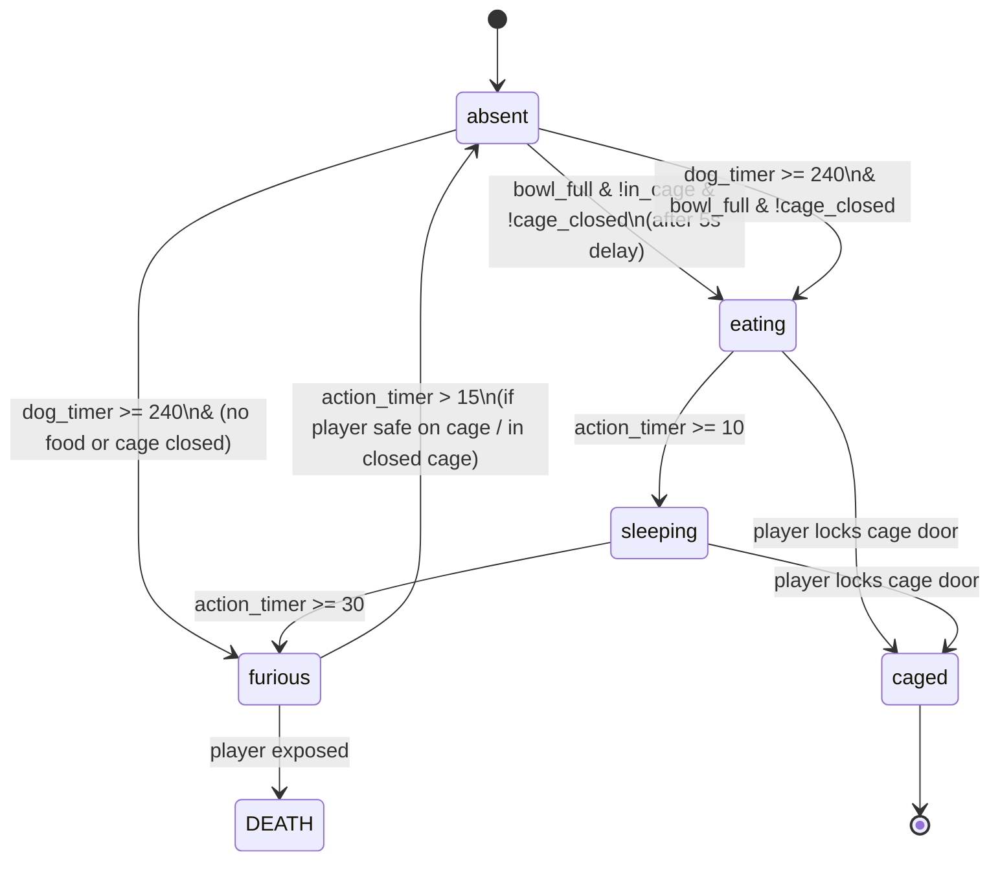
```mermaid
stateDiagram-v2
    [*] --> absent
    absent --> eating : bowl_full & !in_cage & !cage_closed\n(after 5s delay)
    absent --> eating : dog_timer >= 240\n& bowl_full & !cage_closed
    absent --> furious : dog_timer >= 240\n& (no food or cage closed)
    eating --> sleeping : action_timer >= 10
    sleeping --> furious : action_timer >= 30
    furious --> absent : action_timer > 15\n(if player safe on cage / in closed cage)
    furious --> DEATH : player exposed
    eating --> caged : player locks cage door
    sleeping --> caged : player locks cage door
    caged --> [*]
```

### Dog Timer — Detailed Flow

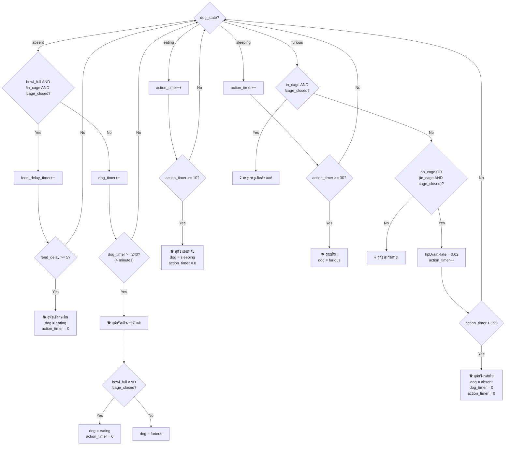
```mermaid
flowchart TD
    DOG_ABS{"dog_state?"}

    %% ABSENT branch
    ABS_LURE{"bowl_full AND<br/>!in_cage AND !cage_closed?"}
    DELAY["feed_delay_timer++"]
    DELAY_CHK{"feed_delay >= 5?"}
    DOG_LURED["🐕 สุนัขเข้ากรงกิน<br/>dog = eating<br/>action_timer = 0"]
    NATURAL["dog_timer++"]
    NAT_CHK{"dog_timer >= 240?<br/>(4 minutes)"}
    ARRIVE["🐕 สุนัขร็อตไวเลอร์โผล่!"]
    ARR_FOOD{"bowl_full AND<br/>!cage_closed?"}
    DOG_EAT["dog = eating<br/>action_timer = 0"]
    DOG_MAD["dog = furious"]

    %% EATING branch
    EAT["action_timer++"]
    EAT_CHK{"action_timer >= 10?"}
    DOG_SLEEP["🐕 สุนัขนอนหลับ<br/>dog = sleeping<br/>action_timer = 0"]

    %% SLEEPING branch
    SLP["action_timer++"]
    SLP_CHK{"action_timer >= 30?"}
    DOG_WAKE["🐕 สุนัขตื่น!<br/>dog = furious"]

    %% FURIOUS branch
    FUR_SAFE{"on_cage OR<br/>(in_cage AND cage_closed)?"}
    FUR_EXPOSED_1["💀 สุนัขพุ่งกัดตาย!"]
    FUR_EXPOSED_2["💀 ทะลุประตูเปิดกัดตาย!"]
    FUR_IN_OPEN{"in_cage AND<br/>!cage_closed?"}
    FUR_WAIT["hpDrainRate = 0.02<br/>action_timer++"]
    FUR_15{"action_timer > 15?"}
    DOG_LEAVE["🐕 สุนัขวิ่งกลับไป<br/>dog = absent<br/>dog_timer = 0<br/>action_timer = 0"]

    DOG_ABS -- absent --> ABS_LURE
    ABS_LURE -- Yes --> DELAY --> DELAY_CHK
    DELAY_CHK -- Yes --> DOG_LURED
    DELAY_CHK -- No --> DOG_ABS
    ABS_LURE -- No --> NATURAL --> NAT_CHK
    NAT_CHK -- No --> DOG_ABS
    NAT_CHK -- Yes --> ARRIVE --> ARR_FOOD
    ARR_FOOD -- Yes --> DOG_EAT
    ARR_FOOD -- No --> DOG_MAD

    DOG_ABS -- eating --> EAT --> EAT_CHK
    EAT_CHK -- Yes --> DOG_SLEEP
    EAT_CHK -- No --> DOG_ABS

    DOG_ABS -- sleeping --> SLP --> SLP_CHK
    SLP_CHK -- Yes --> DOG_WAKE
    SLP_CHK -- No --> DOG_ABS

    DOG_ABS -- furious --> FUR_IN_OPEN
    FUR_IN_OPEN -- Yes --> FUR_EXPOSED_2
    FUR_IN_OPEN -- No --> FUR_SAFE
    FUR_SAFE -- No --> FUR_EXPOSED_1
    FUR_SAFE -- Yes --> FUR_WAIT --> FUR_15
    FUR_15 -- Yes --> DOG_LEAVE
    FUR_15 -- No --> DOG_ABS
```

> [!NOTE]
> **Lure path** (optimal): If `bowl_full`, player not in cage, and cage not closed → dog enters cage to eat after 5 seconds. This bypasses the 240-second natural timer.
>
> **Natural path** (timeout): After 240 seconds (4 min), dog appears. If food is ready and cage is open, it eats. Otherwise, it's furious.
>
> **Furious recovery**: If the player survives 15 seconds on the cage roof or inside a closed cage, the dog leaves and the cycle resets.

---

## Critical Path (Optimal Solution)

```mermaid
flowchart LR
    S["🚪 Enter Garden"]
    S1["1. ราวตากผ้า<br/>Read hint"]
    S2["2. หลุมซ้าย<br/>Get shovel"]
    S3["3. กองกระถาง (×2)<br/>1st: toad scare<br/>2nd: pick pot_b"]
    S4["4. หลังคากรง<br/>Climb up with pot_b"]
    S5["5. เชือกห่วงบนกิ่งไม้<br/>Use shovel → get rope_loop<br/>(shovel breaks)"]
    S6["6. หลังคากรง<br/>Climb down"]
    S7["7. กรงสุนัข<br/>Enter cage"]
    S8["8. ชามอาหาร<br/>Fill bowl with dog_food"]
    S9["9. กรงสุนัข<br/>Exit cage"]
    S10["10. ⏱ Wait 5s<br/>Dog enters cage to eat"]
    S11["11. ประตูกรง<br/>Close door"]
    S12["12. ⏱ Wait for dog<br/>to eat then sleep"]
    S13["13. ประตูกรง<br/>Lock with rope_loop"]
    S14["14. ทางไปรั้วหน้าบ้าน<br/>→ fence_gate ✅"]

    S --> S1 --> S2 --> S3 --> S4 --> S5 --> S6 --> S7 --> S8 --> S9 --> S10 --> S11 --> S12 --> S13 --> S14
```

> [!IMPORTANT]
> **Required item from other rooms:** `dog_food` — must be obtained before entering this room.
>
> The player can also exit at step 11 (after closing the cage door, before locking) since `cage_closed` is sufficient to pass `door_fence`. However this is not permanent — the dog may break free if the player returns.

---

## Death Summary

| # | Source | Trigger | Death Message |
|---|--------|---------|---------------|
| 1 | หลุมกลาง | Always on interact | ช็อกตาย |
| 2 | เชือกห่วง → ผูกคอตาย | Player choice (UI) | ผูกคอตาย |
| 3 | เชือกห่วง → ใช้พลั่ว | `wind_timer >= 300` | กิ่งไม้หักทับตาย |
| 4 | onSecondTimer | `wind_timer >= 420` | กิ่งไม้ยักษ์โค่นทับตาย |
| 5 | ทางไปรั้วหน้าบ้าน | `dog_state == furious` | สุนัขดุร้ายกัดตาย |
| 6 | ทางไปรั้วหน้าบ้าน | `dog != caged && !cage_closed` | สุนัขพุ่งมากัดตาย |
| 7 | onSecondTimer (furious) | Player not on cage and not in cage | สุนัขพุ่งกัดตาย |
| 8 | onSecondTimer (furious) | Player in cage but door open | สุนัขทะลุประตูกัดตาย |

---

## Damage Sources

| Source | HP Loss | Condition |
|--------|---------|-----------|
| กองกระถาง (first check) | -0.2 | Always on first interact |
| กระถาง A → ปีนกรง | -0.5 | Using pot_a to climb |
| หลุมขวา (first check) | -0.2 | First time only |
| กลับห้องซักล้าง | -0.2 | Always on exit |
| ลมปิดประตูกรง | +0.02/s drain | Wind traps player in cage |
| Dog furious (survived) | 0.02/s drain | Dog barking while player safe |

---

## Item Inventory

### Required from Other Rooms

| Item | Usage in This Room |
|------|--------------------|
| `dog_food` | Fill bowl → lure dog into cage |

### Obtainable in This Room

| Item | Source | Usage |
|------|--------|-------|
| `shovel` | หลุมซ้าย | Pull rope from tree (consumed) |
| `pot_a` | กองกระถาง (choice) | ❌ Trap — breaks on use, -0.5 HP |
| `pot_b` | กองกระถาง (choice) | ✅ Step to climb cage roof (consumed/placed) |
| `rope_loop` | เชือกห่วงบนกิ่งไม้ | Lock cage door permanently (consumed) |
