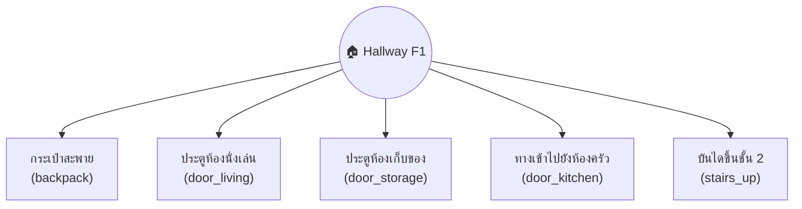
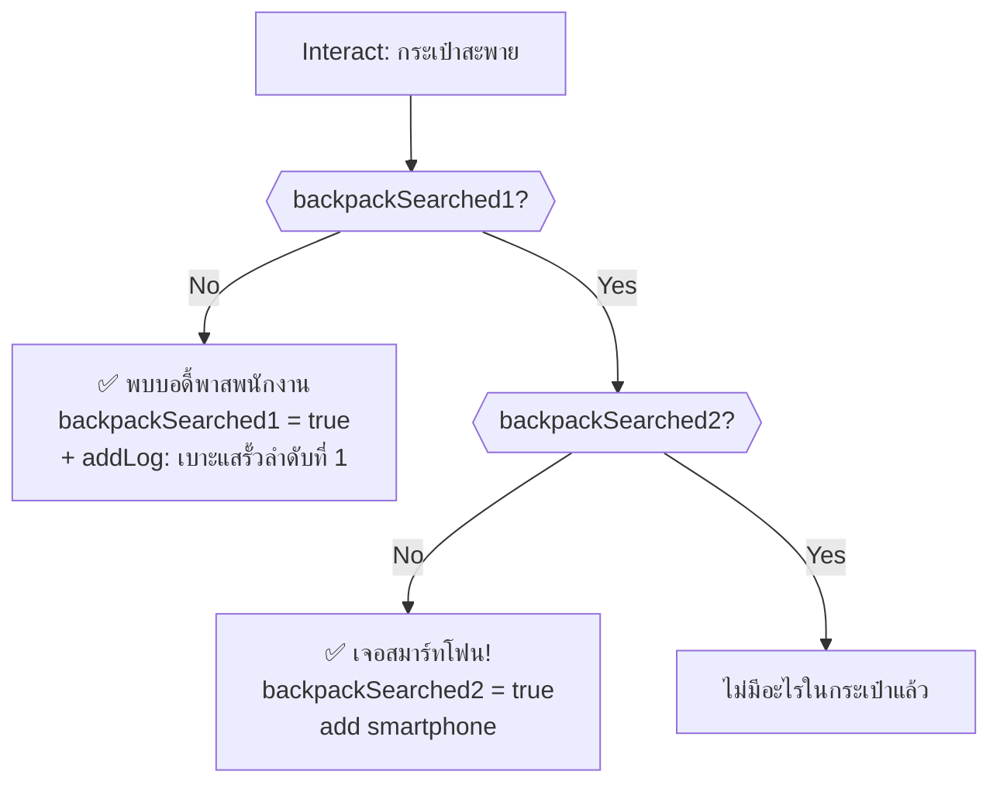
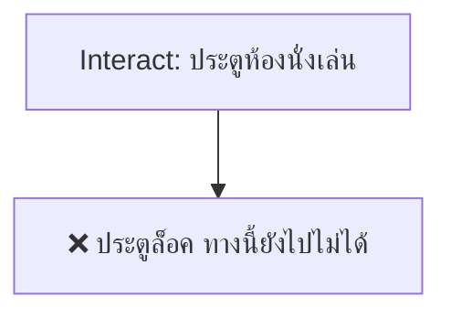
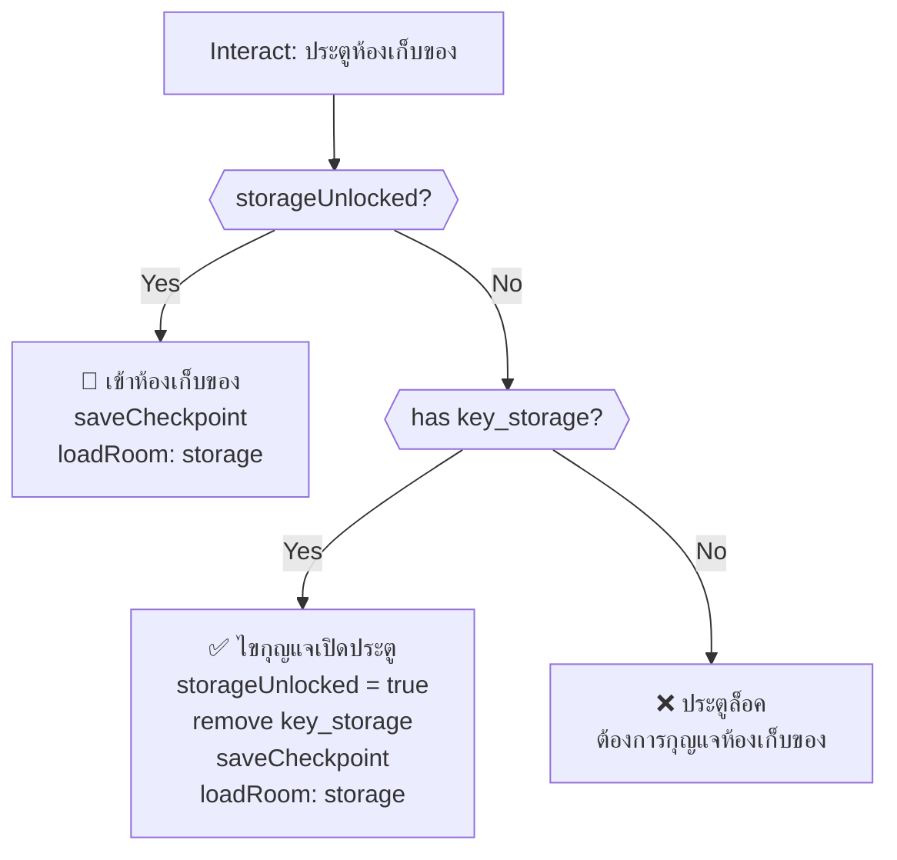
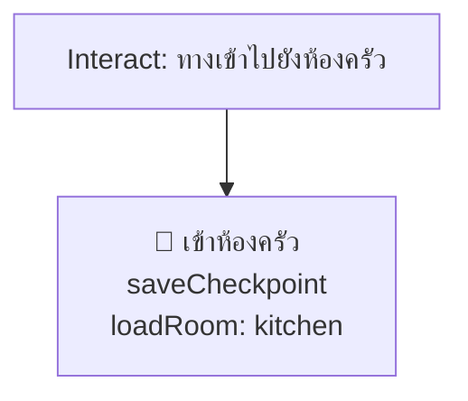
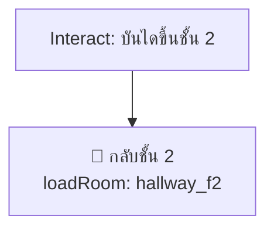
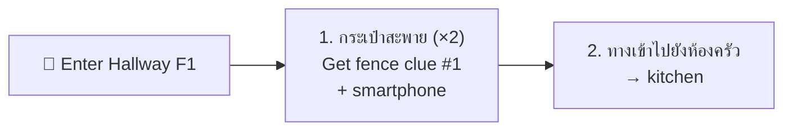

# Hallway F1 — Player Flow

## Room Overview

The first-floor hallway is a calm hub connecting multiple rooms. The player **searches a backpack for a clue and smartphone**, and uses keys to unlock the storage room. No timed hazards exist in this room.

- **Entry:** Hallway F2 (บันไดลงไปชั้นล่าง)
- **Exit:** Kitchen (ทางเข้าไปยังห้องครัว), Storage (ประตูห้องเก็บของ), Hallway F2 (บันไดขึ้นชั้น 2)

---

## Flags

| Flag | Default | Description |
|------|---------|-------------|
| `hallway_f1_backpackSearched1` | `false` | First backpack search done |
| `hallway_f1_backpackSearched2` | `false` | Second backpack search done (smartphone) |
| `hallway_f1_storageUnlocked` | `false` | Storage room door unlocked |

---

## Room Entry (setupUI)

> [!NOTE]
> `setupUI` is empty. No dynamic UI, no timers, no HP drain in this room.

---

## All Interactable Objects

---

## Interactable Details

### 1. กระเป๋าสะพาย (backpack)

Two-stage search yielding a clue and a smartphone.

---

### 2. ประตูห้องนั่งเล่น (door_living)

Currently locked / inaccessible from this side.

---

### 3. ประตูห้องเก็บของ (door_storage)

Room exit → `storage`. Requires `key_storage`.

> [!IMPORTANT]
> `key_storage` is obtained from the Dining Room (โคมไฟเพดาน).

---

### 4. ทางเข้าไปยังห้องครัว (door_kitchen)

Room exit → `kitchen`. Always accessible.

---

### 5. บันไดขึ้นชั้น 2 (stairs_up)

Room exit → `hallway_f2`. Always accessible.

---

## Timed Events (onSecondTimer)

> [!NOTE]
> No timed events in this room. `onSecondTimer` is empty.

---

## Critical Path (Optimal Solution)

> [!IMPORTANT]
> Return here later with `key_storage` (from Dining Room) to unlock the Storage room.

---

## Death Summary

*No deaths possible in this room.*

---

## Damage Sources

*No damage sources in this room.*

---

## Item Inventory

### Required from Other Rooms

| Item | Usage in This Room |
|------|---------------------|
| `key_storage` | Unlock storage room door (obtained from Dining Room) |

### Obtainable in This Room

| Item | Source | Usage |
|------|--------|-------|
| `smartphone` | กระเป๋าสะพาย (2nd search) | ✅ Flashlight in Storage room |
