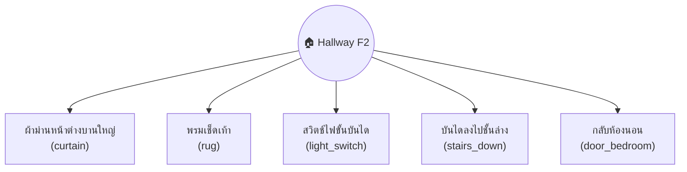
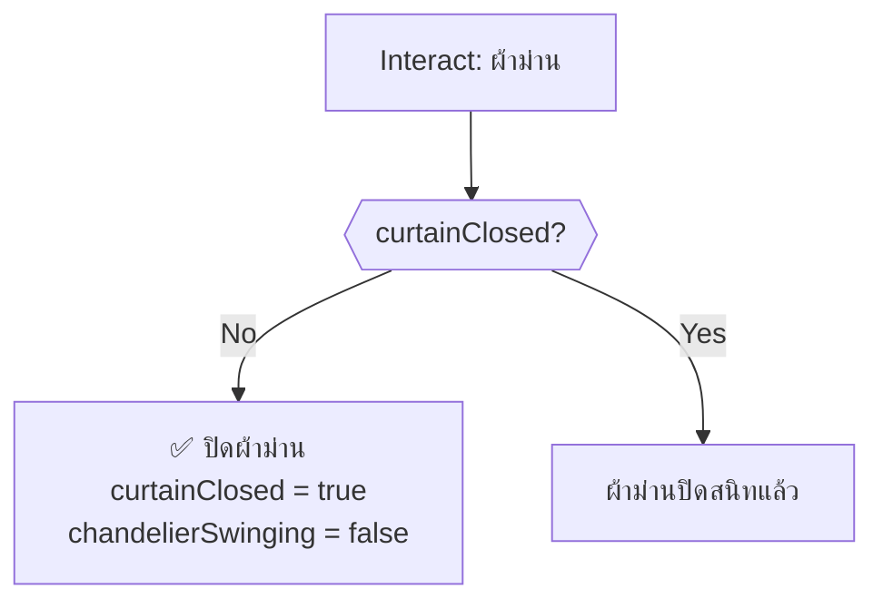
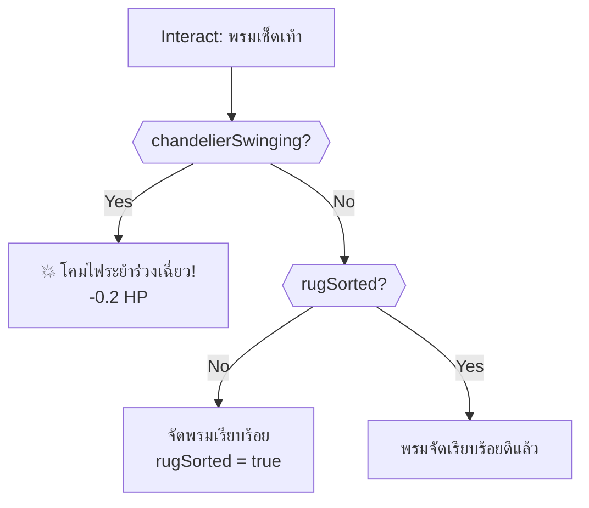
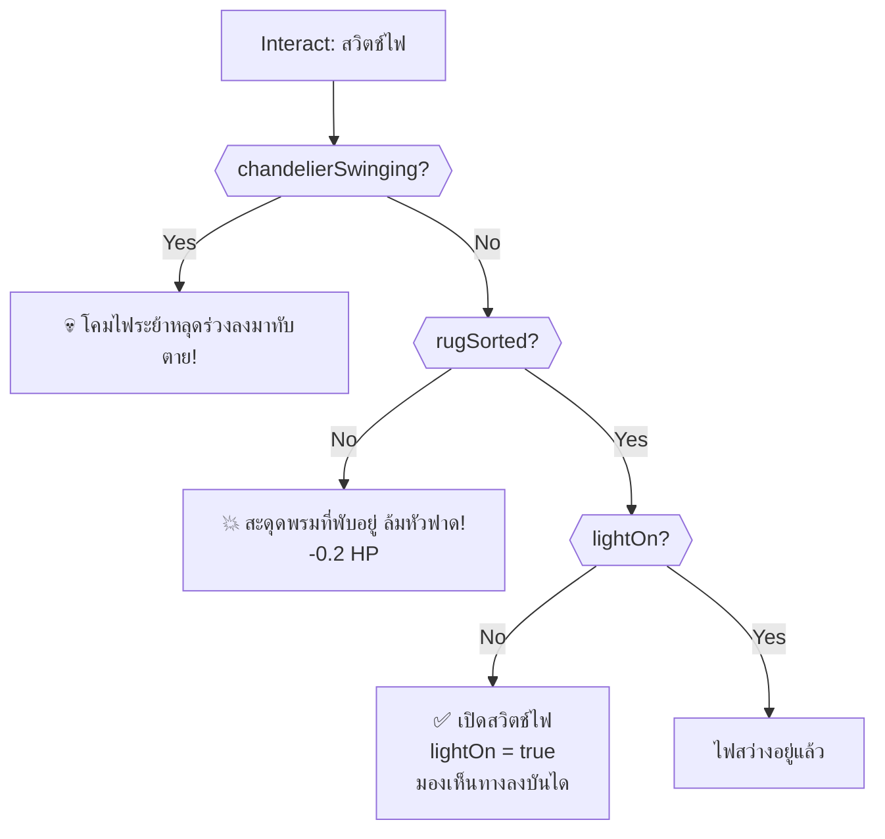
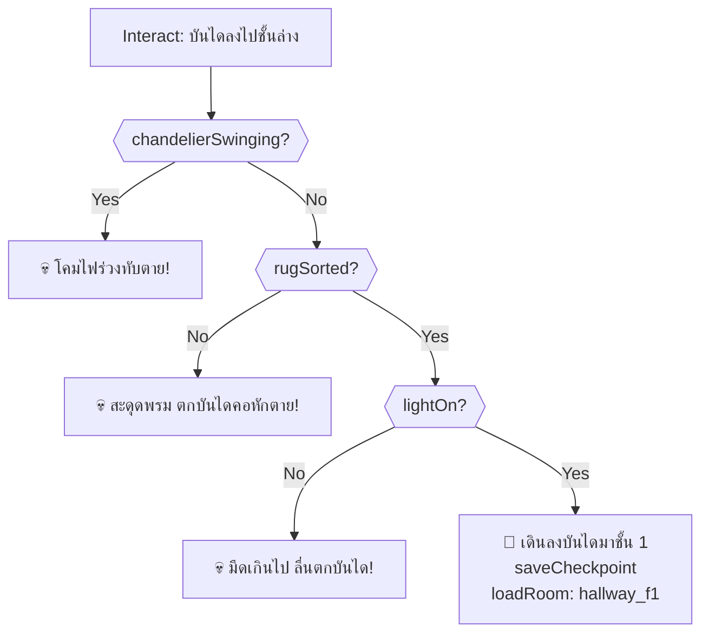
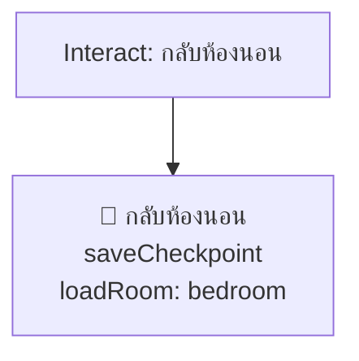
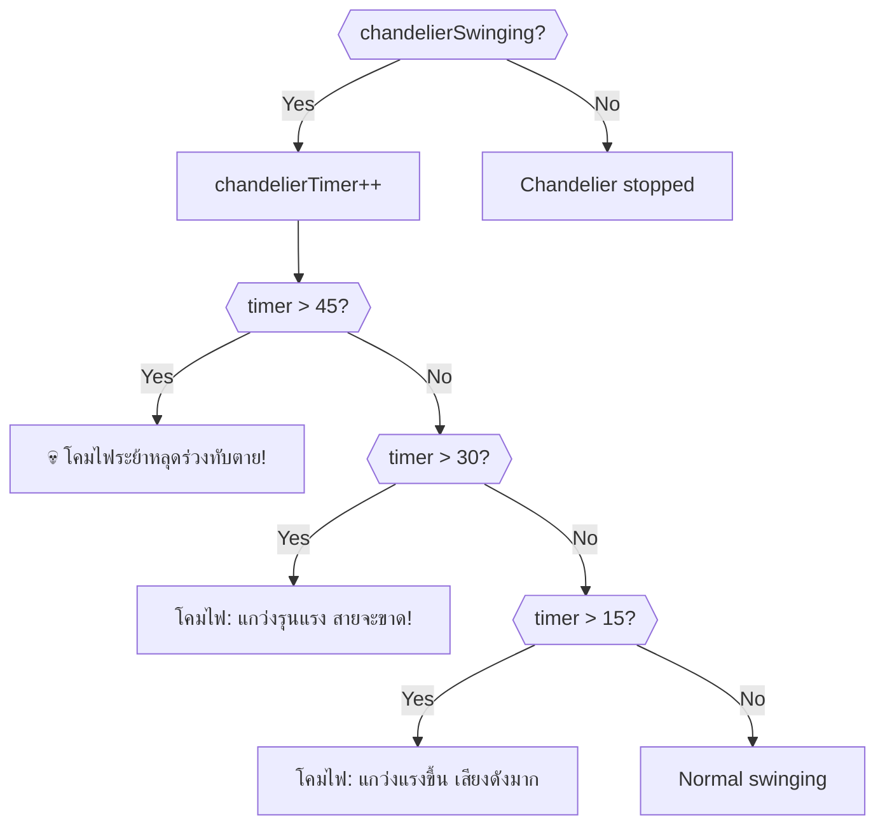
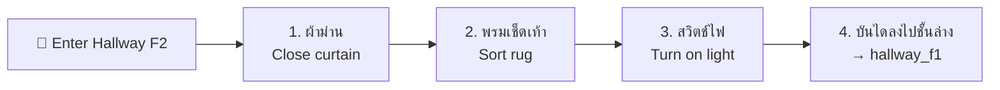

# Hallway F2 — Player Flow

## Room Overview

The second-floor hallway is a short transitional hazard area. The player must **close the curtain to stop the chandelier swinging, sort the rug, and turn on the stairway light** — in strict order — before safely descending to Floor 1.

- **Entry:** Bedroom (ประตูออกโถง)
- **Exit:** Hallway F1 (บันไดลงไปชั้นล่าง), Bedroom (กลับห้องนอน)

---

## Flags

| Flag | Default | Description |
|------|---------|-------------|
| `hallway_f2_curtainClosed` | `false` | Curtain closed, chandelier stopped |
| `hallway_f2_rugSorted` | `false` | Rug straightened out |
| `hallway_f2_lightOn` | `false` | Stairway light turned on |
| `hallway_f2_chandelierSwinging` | `true` | Chandelier is currently swinging |
| `hallway_f2_chandelierTimer` | `0` | Seconds of chandelier swinging |

---

## Room Entry (setupUI)

> [!NOTE]
> `setupUI` is empty. Scene brightness is set to 0.3 (dark) until the light switch is turned on.

---

## All Interactable Objects

---

## Interactable Details

### 1. ผ้าม่านหน้าต่างบานใหญ่ (curtain)

Close curtain to stop chandelier and wind.

---

### 2. พรมเช็ดเท้า (rug)

Straighten the rug. Must be done after chandelier stops.

---

### 3. สวิตช์ไฟขั้นบันได (light_switch)

Turn on the stairway light. Requires chandelier stopped + rug sorted.

---

### 4. บันไดลงไปชั้นล่าง (stairs_down)

Room exit → `hallway_f1`. All three prerequisites must be met.

> [!CAUTION]
> All three conditions (curtain closed, rug sorted, light on) must be satisfied. Failure at any step is instant death.

---

### 5. กลับห้องนอน (door_bedroom)

Room exit → `bedroom`. Always safe.

---

## Timed Events (onSecondTimer)

### Chandelier Escalation

> [!WARNING]
> At 45 seconds, the chandelier falls and kills the player. Close the curtain quickly!

---

## Critical Path (Optimal Solution)

---

## Death Summary

| # | Source | Trigger | Death Message |
|---|--------|---------|---------------|
| 1 | สวิตช์ไฟ | chandelierSwinging | โคมไฟระย้าหลุดร่วงลงมาทับตาย |
| 2 | บันไดลงชั้นล่าง | chandelierSwinging | โคมไฟร่วงทับตาย |
| 3 | บันไดลงชั้นล่าง | !rugSorted | สะดุดพรม ตกบันไดคอหักตาย |
| 4 | บันไดลงชั้นล่าง | !lightOn | มืดเกินไป ลื่นตกบันไดหัวฟาดพื้นตาย |
| 5 | onSecondTimer | chandelierTimer > 45 | โคมไฟระย้าหลุดร่วงทับตาย |

---

## Damage Sources

| Source | HP Loss | Condition |
|--------|---------|-----------|
| พรมเช็ดเท้า | -0.2 | Interact while chandelier swinging |
| สวิตช์ไฟ | -0.2 | Interact before rug sorted |

---

## Item Inventory

### Required from Other Rooms

*None*

### Obtainable in This Room

*None*
