# Kitchen — Player Flow

## Room Overview

The Kitchen is a hazard-dense puzzle room. The player must **shut off the sink, kettle, and cabinet, turn off the gas stove with a 4-step directional sequence, season food correctly, and unlock the laundry room** — all while managing escalating timed dangers.

- **Entry:** Hallway F1 (ทางเข้าไปยังห้องครัว)
- **Exit:** Dining Room (ทางไปห้องทานข้าว), Laundry (ประตูห้องซักล้าง), Hallway F1 (กลับโถงทางเดิน)

---

## Flags

| Flag | Default | Description |
|------|---------|-------------|
| `kitchen_sinkOff` | `false` | Sink faucet turned off |
| `kitchen_kettleOff` | `false` | Kettle removed from stove |
| `kitchen_cabinetClosed` | `false` | Wall cabinet closed |
| `kitchen_gasNotesFound` | `false` | Found gas valve sequence note |
| `kitchen_gasStep` | `0` | (unused in code) |
| `kitchen_gasOff` | `false` | Gas stove turned off |
| `kitchen_tastedFirst` | `false` | First taste of food |
| `kitchen_ingredientsAdded` | `false` | Ingredients added to food |
| `kitchen_poisonedFood` | `false` | Poison ingredient was selected |
| `kitchen_tastedSecond` | `false` | Second taste confirmed safe |
| `kitchen_drawerRightOpened` | `false` | (unused) |
| `kitchen_cabinetOpenLevel` | `0` | Visual escalation level |
| `kitchen_waterTimer` | `0` | Sink water overflow timer |
| `kitchen_kettleTimer` | `0` | Kettle explosion timer |
| `kitchen_cabinetTimer` | `0` | Cabinet opening timer |
| `kitchen_gasTimer` | `0` | Gas smoke timer |
| `kitchen_laundry_unlocked` | `false` | Laundry door unlocked with hammer |

---

## Room Entry (setupUI)

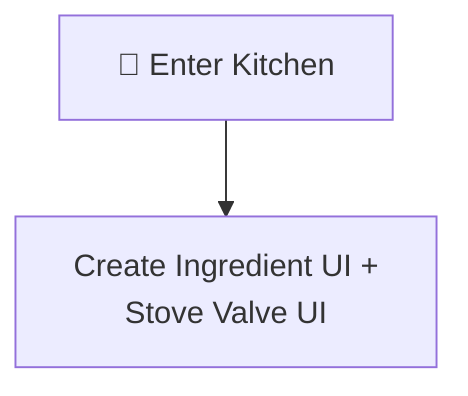

---

## All Interactable Objects

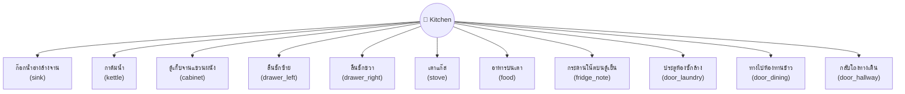

---

## Interactable Details

### 1. ก๊อกน้ำอ่างล้างจาน (sink)

Turn off the running faucet.

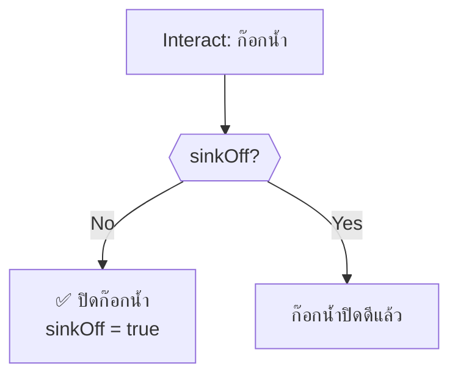

---

### 2. กาต้มน้ำ (kettle)

Remove the boiling kettle from the stove.

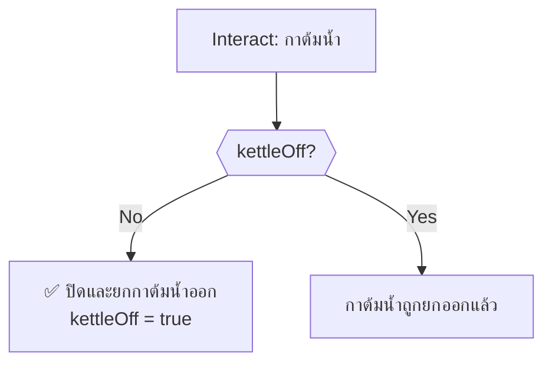

---

### 3. ตู้เก็บจานแขวนผนัง (cabinet)

Close the wall-mounted dish cabinet.

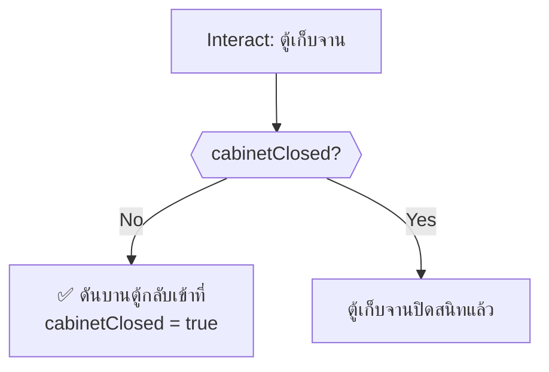

---

### 4. ลิ้นชักซ้าย (drawer_left)

Find the gas valve sequence hint.

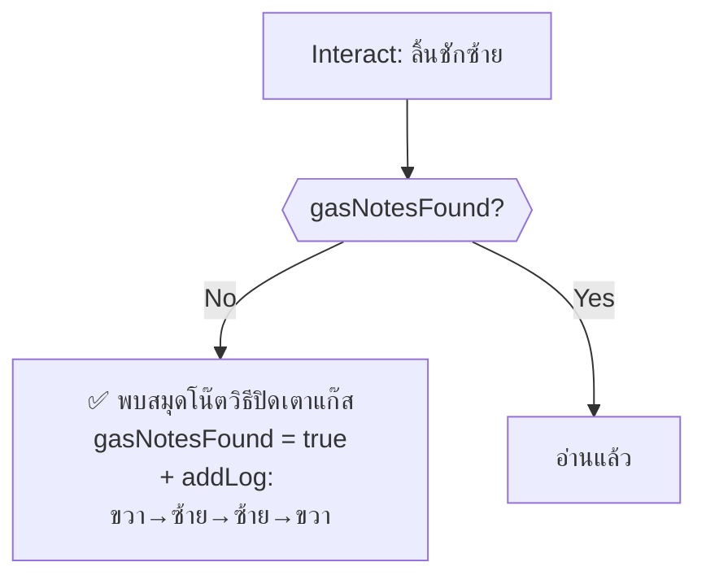

---

### 5. ลิ้นชักขวา (drawer_right)

Trap — always deals damage.

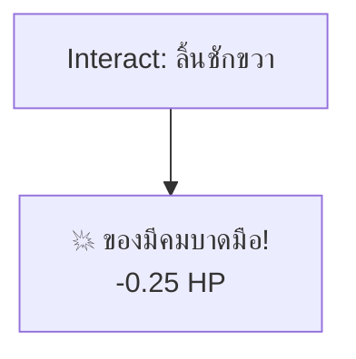

> [!CAUTION]
> This drawer always damages the player. There is nothing useful inside.

---

### 6. เตาแก๊ส (stove)

Turn off gas with a 4-step directional sequence puzzle (R-L-L-R).

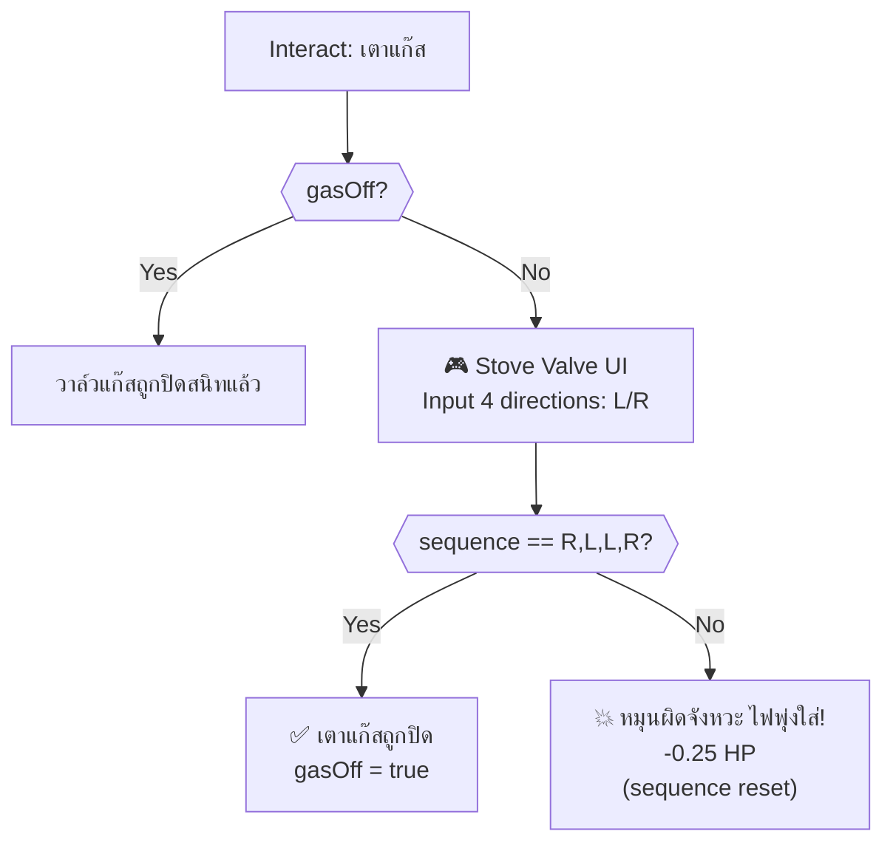

---

### 7. อาหารบนเตา (food)

Taste and season the food. Leads to multi-step cooking puzzle.

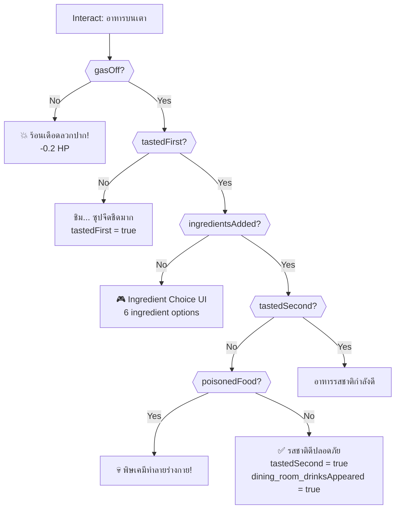

#### Ingredient Selection

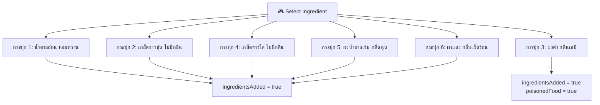

> [!TIP]
> Ingredient 3 (black powder, chemical smell) is poison. All other choices are safe. After adding ingredients, taste again to confirm safety.

---

### 8. กระดานโน๊ตบนตู้เย็น (fridge_note)

Hint object — clue about eating and checking things.

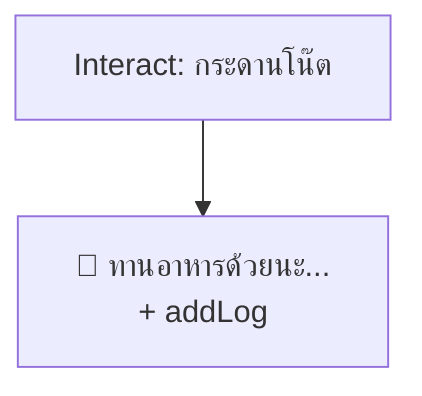

---

### 9. ประตูห้องซักล้าง (door_laundry)

Room exit → `laundry`. Requires `hammer`.

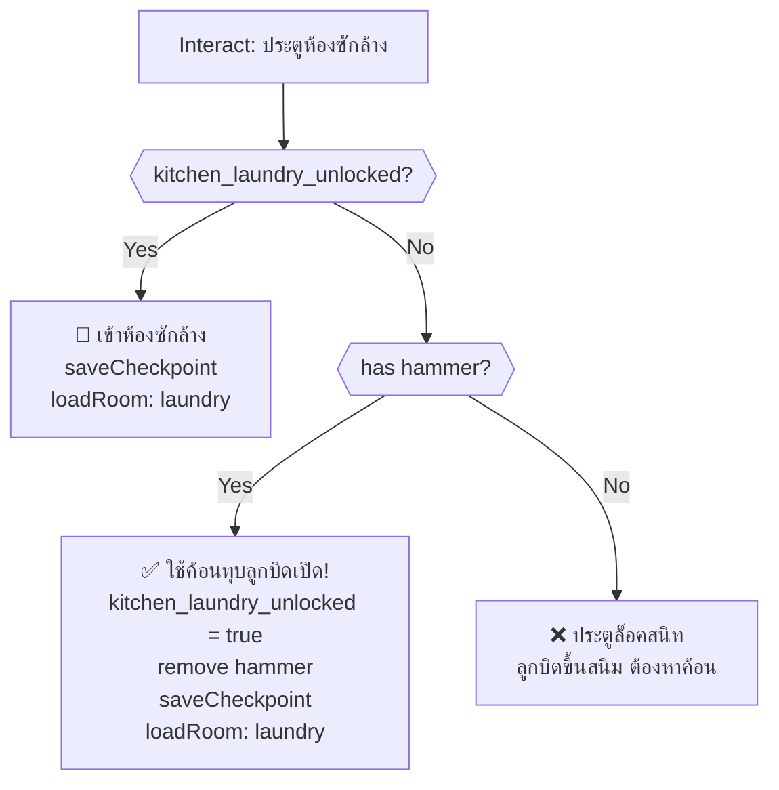

> [!IMPORTANT]
> `hammer` is obtained from the Storage room.

---

### 10. ทางไปห้องทานข้าว (door_dining)

Room exit → `dining_room`. Always accessible.

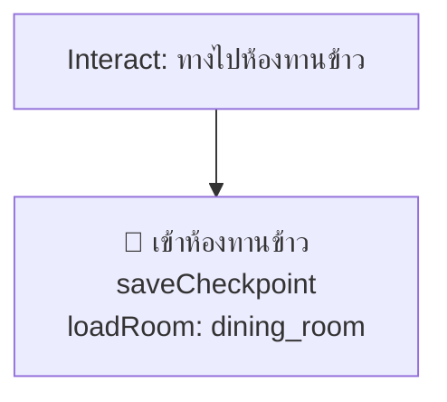

---

### 11. กลับโถงทางเดิน (door_hallway)

Room exit → `hallway_f1`. Always accessible.

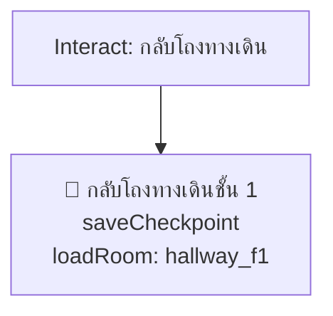

---

## Timed Events (onSecondTimer)

### Sink Water Overflow

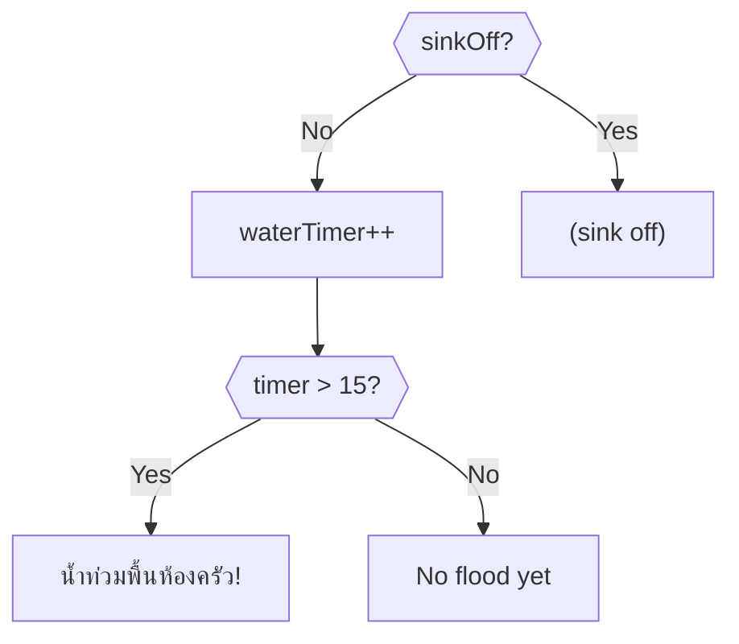

### Kettle Explosion

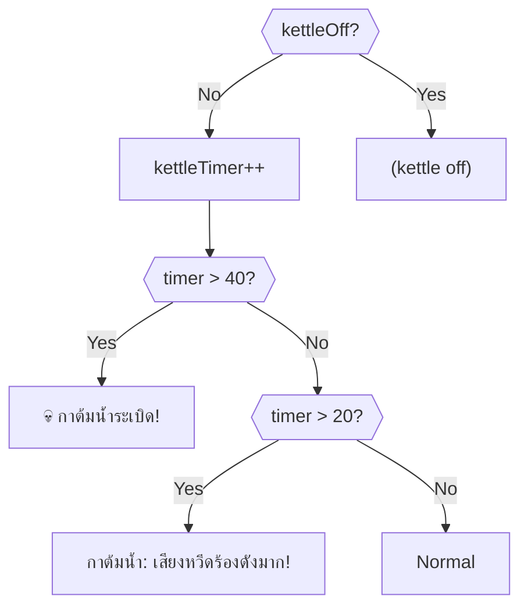

### Gas Smoke Drain

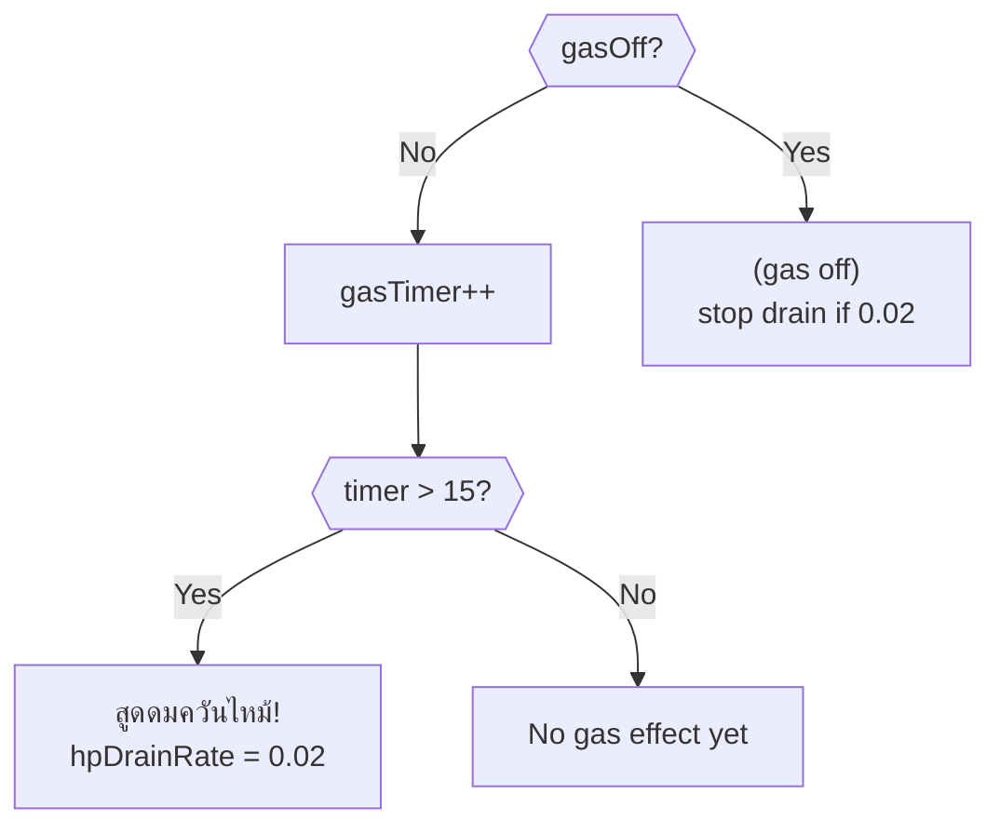

---

## Critical Path (Optimal Solution)

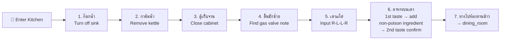

> [!IMPORTANT]
> Return here later with `hammer` (from Storage) to unlock the Laundry room.

---

## Death Summary

| # | Source | Trigger | Death Message |
|---|--------|---------|---------------|
| 1 | onSecondTimer | kettleTimer > 40 | กาต้มน้ำระเบิดใส่อย่างรุนแรง |
| 2 | อาหารบนเตา | poisonedFood + 2nd taste | พิษเคมีทำลายร่างกายนำไปสู่ความตาย |

---

## Damage Sources

| Source | HP Loss | Condition |
|--------|---------|-----------|
| อาหารบนเตา (gas on) | -0.2 | Taste while gas still on |
| ลิ้นชักขวา | -0.25 | Always on interact |
| เตาแก๊ส (wrong sequence) | -0.25 | Incorrect valve sequence |
| Gas smoke | +0.02/s drain | After 15s without turning off gas |

---

## Item Inventory

### Required from Other Rooms

| Item | Usage in This Room |
|------|---------------------|
| `hammer` | Break open laundry room door (obtained from Storage) |

### Obtainable in This Room

*No items obtainable in this room directly.*

> [!NOTE]
> The cooking puzzle triggers `dining_room_drinksAppeared = true`, which makes drinks visible in the Dining Room.
