# Laundry — Player Flow

## Room Overview

The Laundry room is a hazardous room with heat, electrical, and mechanical dangers. The player must **turn on the ventilation fan, manage the iron and washing machine, find items in the laundry basket, climb the ironing board to reach the window, and break out** — all while managing heat drain and fire risks.

- **Entry:** Kitchen (ประตูห้องซักล้าง)
- **Exit:** Front Garden (หน้าต่างบานเกร็ด), Kitchen (กลับห้องครัว)

---

## Flags

| Flag | Default | Description |
|------|---------|-------------|
| `laundry_fan_on` | `false` | Ventilation fan running |
| `laundry_iron_up` | `false` | Iron stood upright |
| `laundry_iron_plugged` | `true` | Iron still plugged in |
| `laundry_washer_has_clothes` | `false` | Clothes loaded into washer |
| `laundry_washer_running` | `false` | Washing machine is running |
| `laundry_floor_wet` | `false` | Floor is wet from washer overflow |
| `laundry_basket_empty` | `false` | Laundry basket emptied |
| `laundry_wheel_taken` | `false` | Basket wheel removed |
| `laundry_on_board` | `false` | Player is on the ironing board |
| `laundry_window_broken` | `false` | Window broken with fire extinguisher |
| `laundry_washer_timer` | `0` | Washer overflow/foam timer |
| `laundry_iron_timer` | `0` | Iron fire timer |

---

## Room Entry (setupUI)

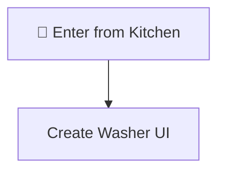

---

## All Interactable Objects

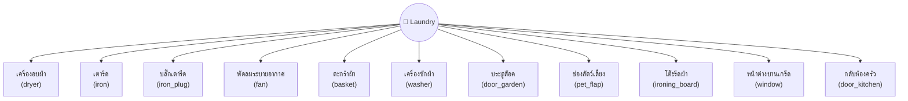

---

## Interactable Details

> [!IMPORTANT]
> **`beforeInteract` guard:** If the player is on the ironing board and interacts with anything OTHER than `window` or `ironing_board`, they fall off and take 0.2 HP damage. The interaction is consumed.

### 1. เครื่องอบผ้า (dryer)

Non-interactive hazard.

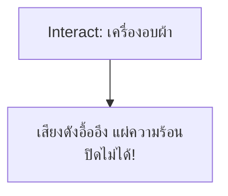

---

### 2. เตารีด (iron)

Stand the iron upright (prerequisite for unplugging).

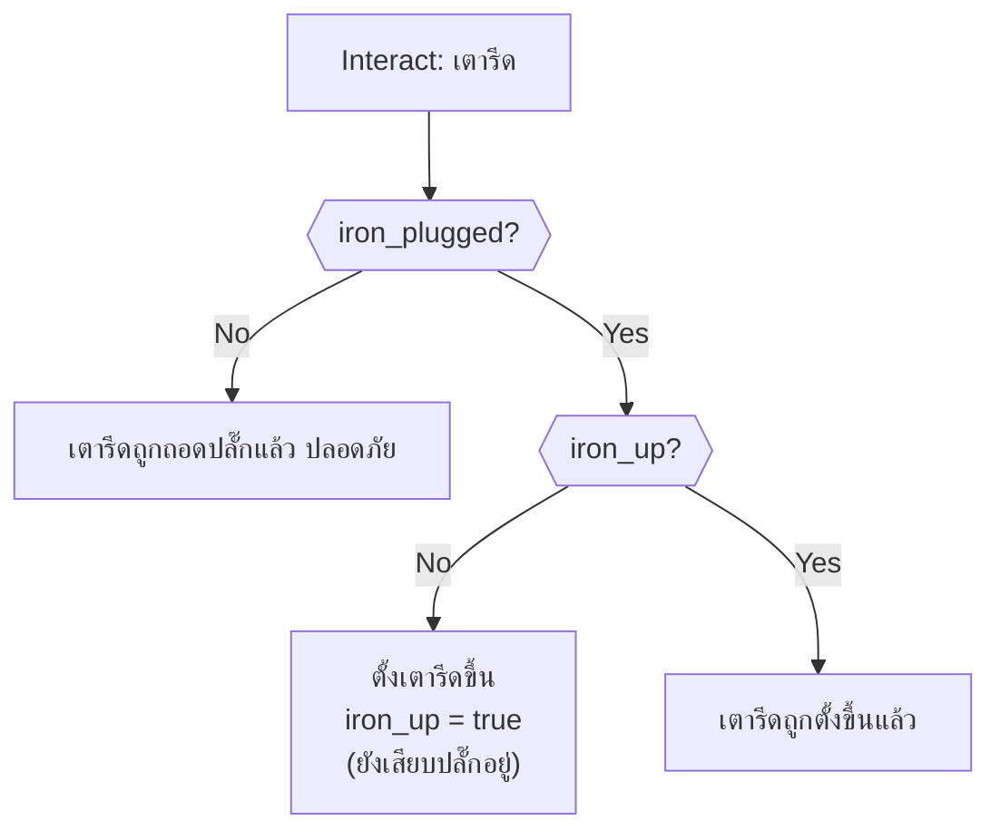

---

### 3. ปลั๊กเตารีด (iron_plug)

Unplug the iron. Must stand iron up first. Wet floor = death.

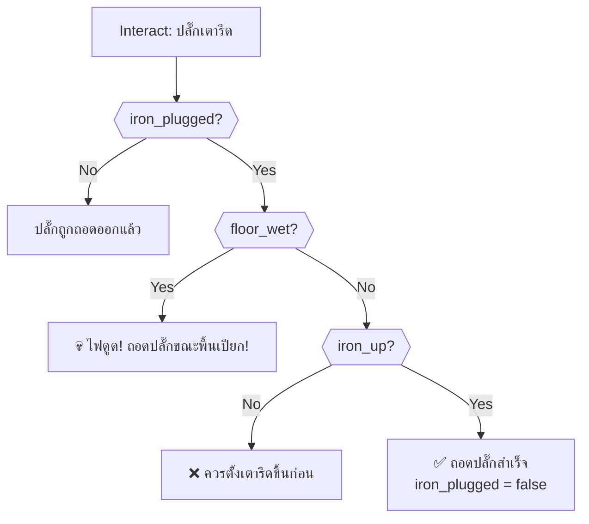

---

### 4. พัดลมระบายอากาศ (fan)

Turn on ventilation to reduce heat HP drain.

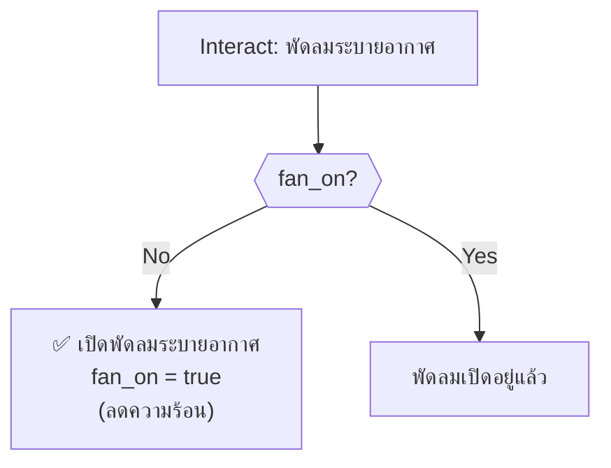

> [!IMPORTANT]
> Without the fan on, HP drains continuously at 0.02/s. Turn it on immediately.

---

### 5. ตะกร้าผ้า (basket)

Two-stage: get dirty clothes → get basket wheel.

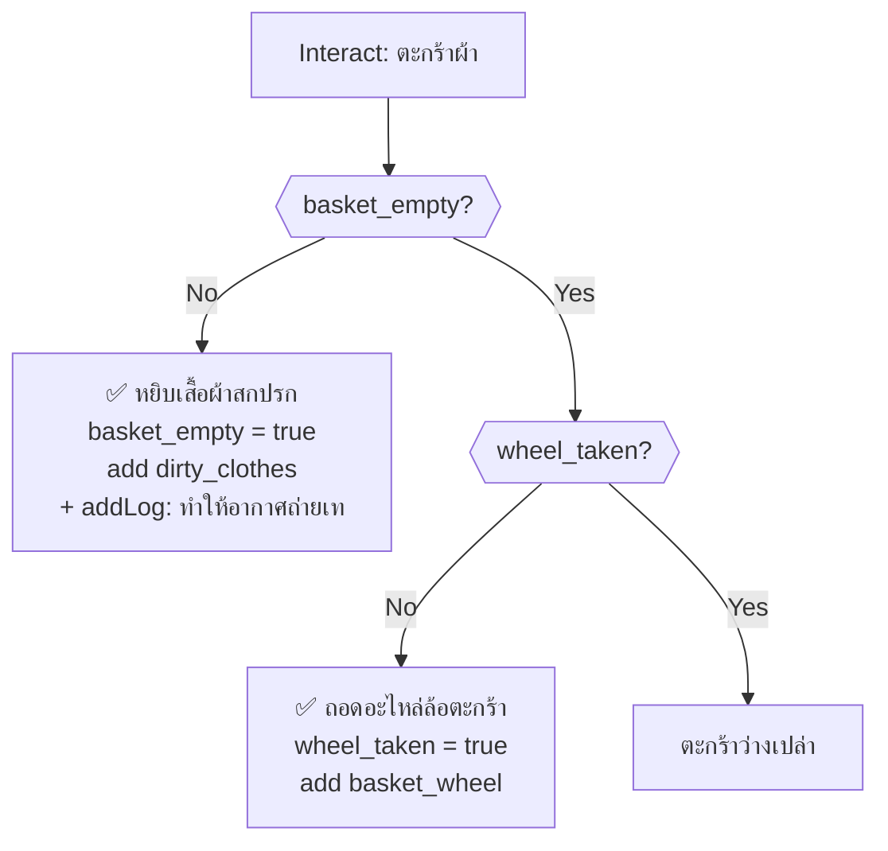

---

### 6. เครื่องซักผ้า (washer)

Interactive washing machine UI — start/stop and load clothes.

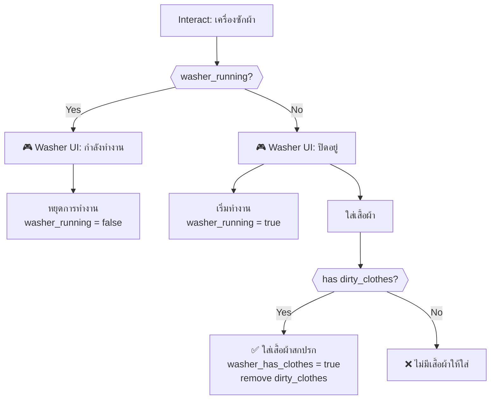

> [!WARNING]
> Starting the washer without clothes causes foam overflow. After 20 seconds, the floor becomes wet (dangerous for unplugging iron). At 60 seconds, foam overflow kills the player.

---

### 7. ประตูล็อค (door_garden)

Locked exit to garden. Cannot be opened.

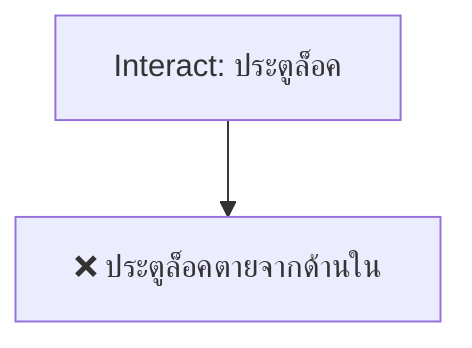

---

### 8. ช่องสัตว์เลี้ยงบนประตู (pet_flap)

Death trap — always lethal.

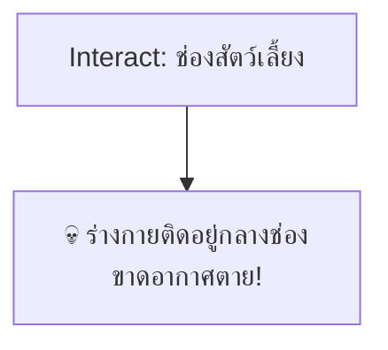

> [!CAUTION]
> Always-lethal. Never try to crawl through the pet flap.

---

### 9. โต๊ะรีดผ้า (ironing_board)

Climb up/down. Hot iron deals heavy damage if still plugged in.

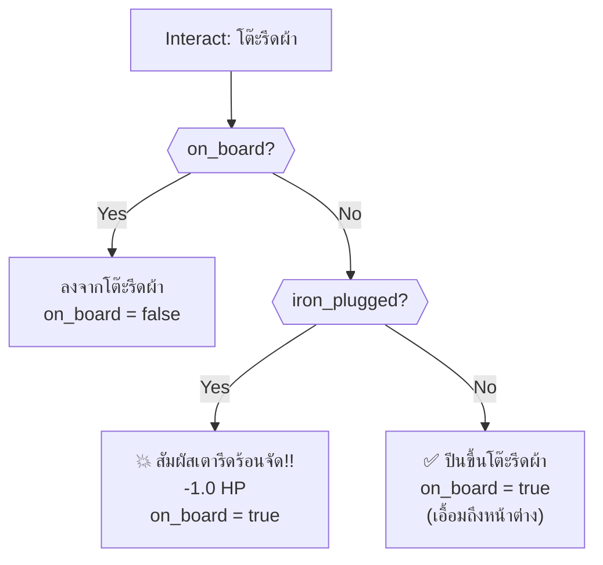

---

### 10. หน้าต่างบานเกร็ด (window)

Break window and escape. Requires being on ironing board + fire extinguisher.

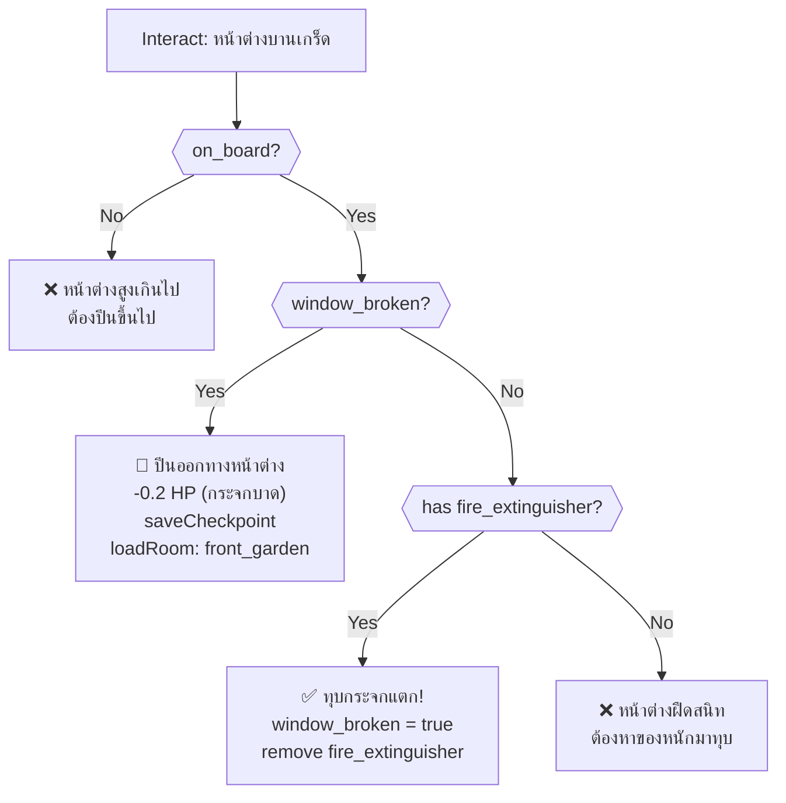

---

### 11. กลับห้องครัว (door_kitchen)

Room exit → `kitchen`. Blocked if on ironing board.

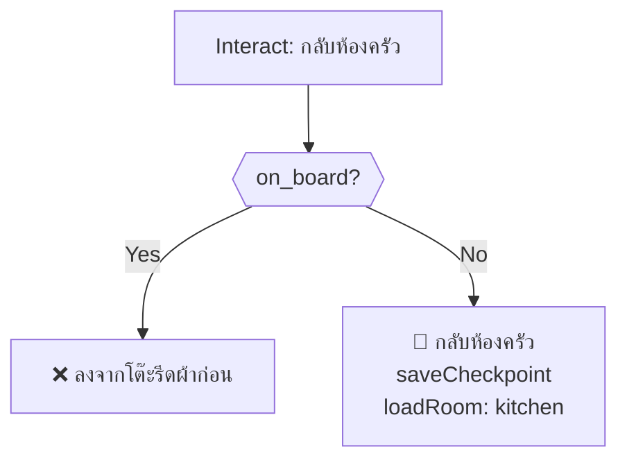

---

## Timed Events (onSecondTimer)

### Heat Drain

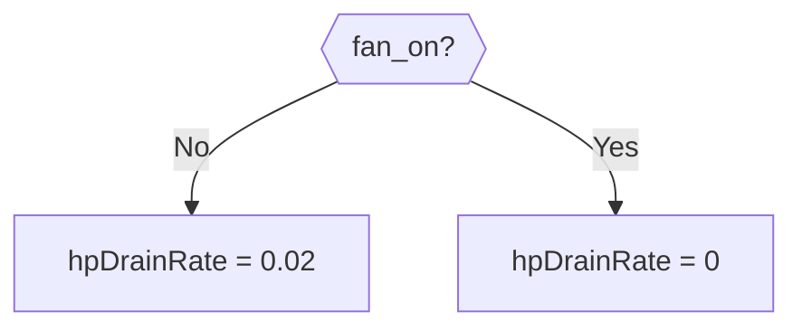

### Washer Foam Overflow

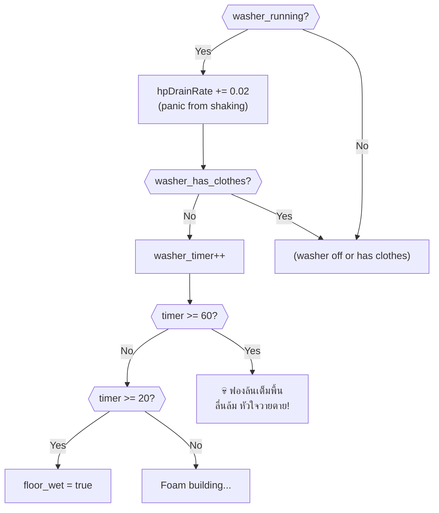

### Iron Fire

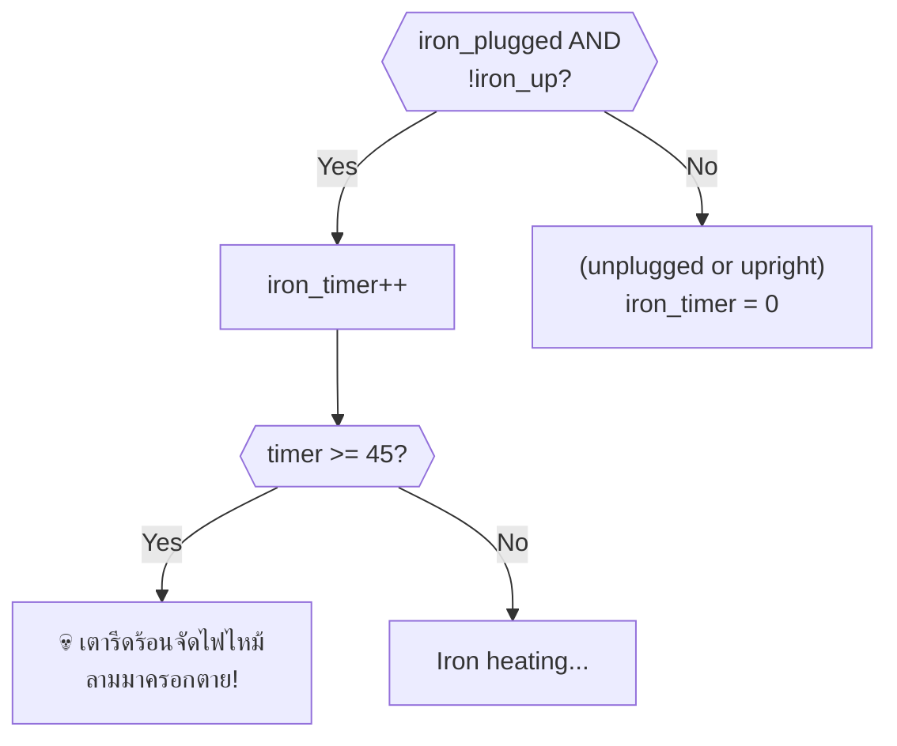

---

## Critical Path (Optimal Solution)

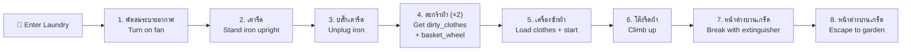

> [!IMPORTANT]
> **Required item from other rooms:** `fire_extinguisher` — obtained from Living Room (behind dining door).
>
> `basket_wheel` is used in the Dining Room to move the pendulum clock. It can be collected on a return trip.

---

## Death Summary

| # | Source | Trigger | Death Message |
|---|--------|---------|---------------|
| 1 | ปลั๊กเตารีด | Unplug while floor wet | ไฟดูด กระแสไฟฟ้าวิ่งผ่านน้ำ |
| 2 | ช่องสัตว์เลี้ยง | Always on interact | ร่างกายติดกลางช่อง ขาดอากาศตาย |
| 3 | onSecondTimer | washer_timer >= 60 (no clothes) | ฟองล้นเต็มพื้น ลื่นล้ม หัวใจวายตาย |
| 4 | onSecondTimer | iron_timer >= 45 (face down + plugged) | เตารีดร้อนจัดไฟไหม้ลามตาย |

---

## Damage Sources

| Source | HP Loss | Condition |
|--------|---------|-----------|
| Heat (no fan) | +0.02/s drain | Fan not turned on |
| Washer panic (running) | +0.02/s drain | Washer machine running |
| โต๊ะรีดผ้า (iron plugged) | -1.0 | Climb with iron still plugged |
| หน้าต่างบานเกร็ด (escape) | -0.2 | Broken glass when escaping |
| Fall from ironing board | -0.2 | Interact with non-window/board while on board |

---

## Item Inventory

### Required from Other Rooms

| Item | Usage in This Room |
|------|---------------------|
| `fire_extinguisher` | Break window glass (from Living Room) |

### Obtainable in This Room

| Item | Source | Usage |
|------|--------|-------|
| `dirty_clothes` | ตะกร้าผ้า (1st) | Load into washing machine |
| `basket_wheel` | ตะกร้าผ้า (2nd) | ✅ Fix clock wheels in Dining Room |
