# Living Room — Player Flow

## Room Overview

The Living Room is a complex multi-hazard room. The player must **answer the phone for a clue, find and use a TV remote, find a door knob to fix the hallway door, discover items hidden in furniture, and collect the fire extinguisher** — all while managing a TV-triggered door-breaking event and phone timing.

- **Entry:** Dining Room (ประตูห้องนั่งเล่น)
- **Exit:** Dining Room (ประตูทางเชื่อมห้องทานข้าว)

---

## Flags

| Flag | Default | Description |
|------|---------|-------------|
| `living_room_tv_on` | `true` | TV is currently on (starts on!) |
| `living_room_phone_timer` | `0` | Seconds since room entry (phone timing) |
| `living_room_phone_missed` | `false` | Phone call missed/answered |
| `living_room_tv_timer` | `0` | Seconds TV has been on (door escalation) |
| `living_room_door_broken` | `false` | Hallway door has been broken open |
| `living_room_door_fixed` | `false` | Hallway door fixed with door knob |
| `living_room_blanket_checked` | `false` | Blanket searched (TV remote) |
| `living_room_dishes_checked` | `false` | Dishes first check (cockroach scare) |
| `living_room_dishes_organized` | `false` | Dishes organized (mailbox key) |
| `living_room_drawer_open` | `false` | TV drawer opened (blue pill found) |
| `living_room_dogbed_check_count` | `0` | Dog bed search count (0→1→2) |
| `living_room_extinguisher_taken` | `false` | Fire extinguisher picked up |
| `living_room_dining_door_closed` | `false` | Dining room door is closed |

---

## Room Entry (setupUI)

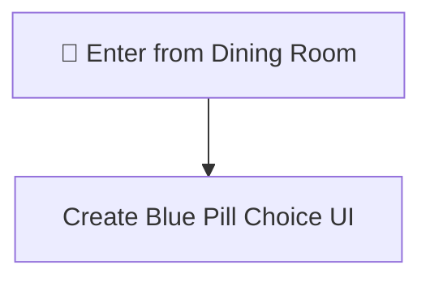

> [!NOTE]
> The TV starts ON. This immediately starts the door-breaking timer. The player should prioritize finding the remote or door knob quickly.

---

## All Interactable Objects

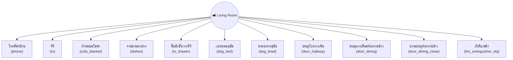

---

## Interactable Details

### 1. โทรศัพท์บ้าน (phone)

Answer the phone for a clue. Time-limited (20 seconds).

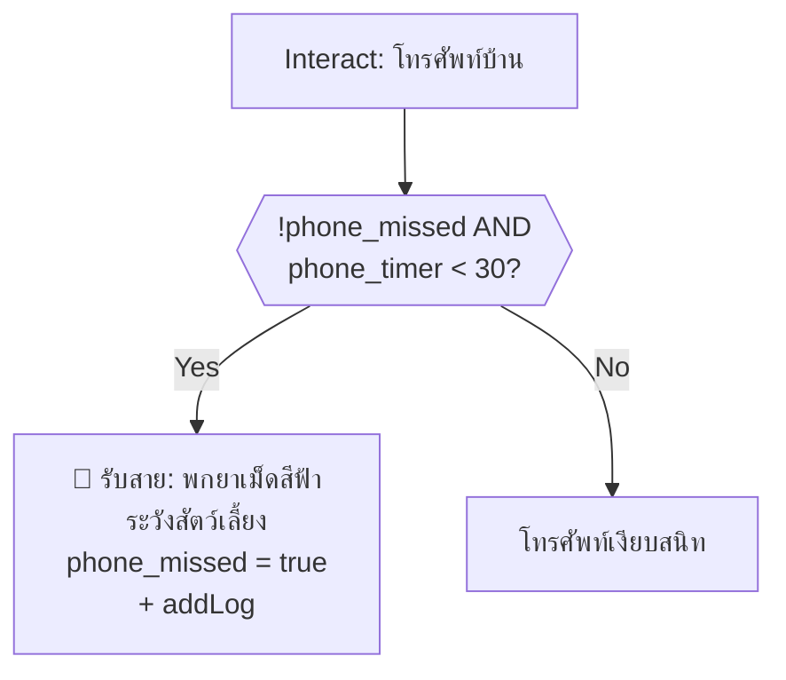

> [!WARNING]
> After 20 seconds, the phone stops ringing automatically. Must answer before then. Rings at t=1 and t=10.

---

### 2. ทีวี (tv)

Toggle TV on/off. Requires remote to turn off properly.

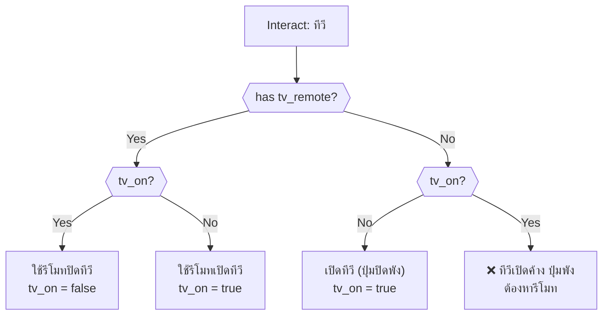

> [!IMPORTANT]
> Turning TV OFF stops the door escalation timer and HP drain. Keeping it on causes increasing door-shaking events leading to death at 60 seconds.

---

### 3. ผ้าห่มบนโซฟา (sofa_blanket)

Find the TV remote.

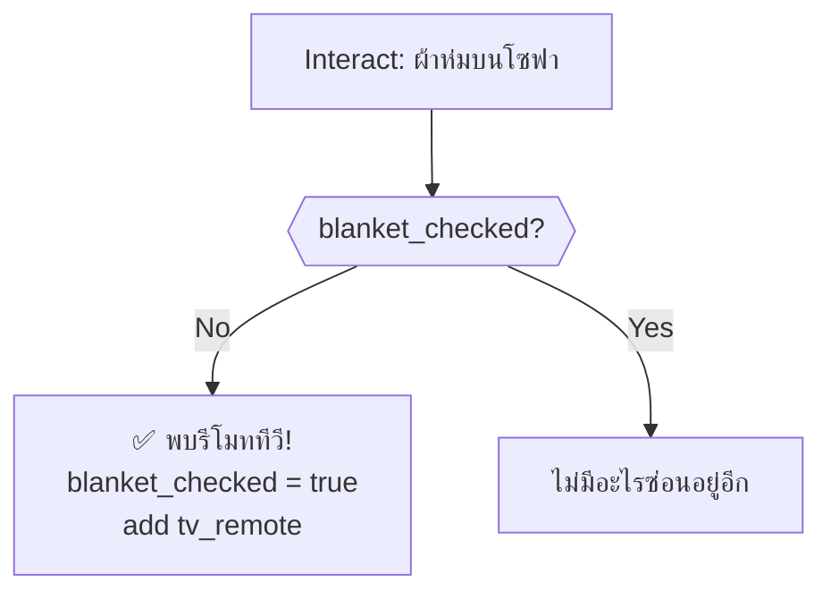

---

### 4. จานชามสกปรก (dishes)

Two-stage search: cockroach scare then mailbox key.

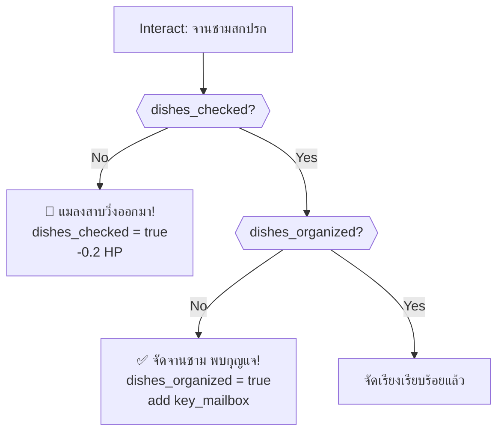

---

### 5. ลิ้นชักชั้นวางทีวี (tv_drawer)

Find blue pills — choose to save or eat (eat = death).

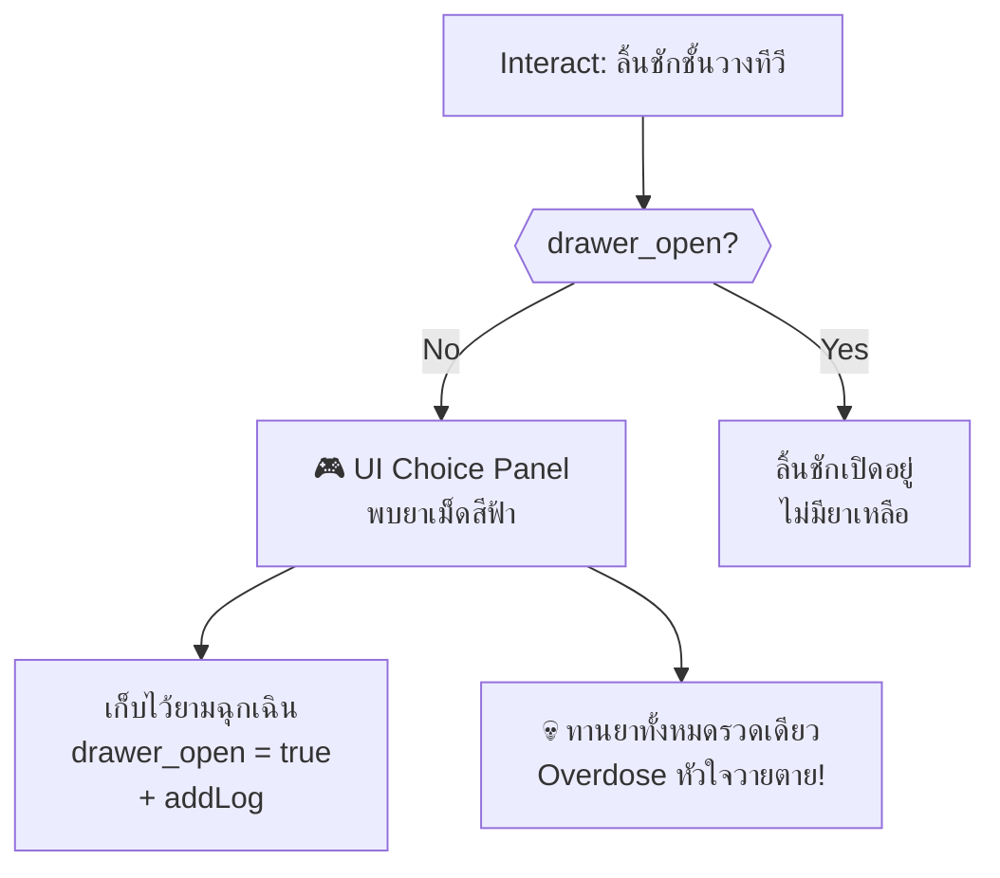

> [!TIP]
> Always choose "เก็บไว้ยามฉุกเฉิน". Eating all pills at once causes instant death.

---

### 6. เบาะนอนสุนัข (dog_bed)

Two-stage search: fence code clue then door knob.

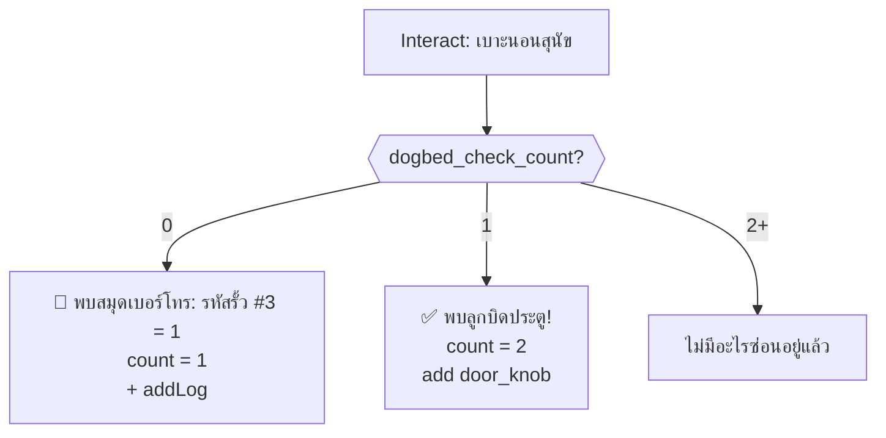

---

### 7. ชามอาหารสุนัข (dog_bowl)

Pick up dog food for the Front Garden puzzle.

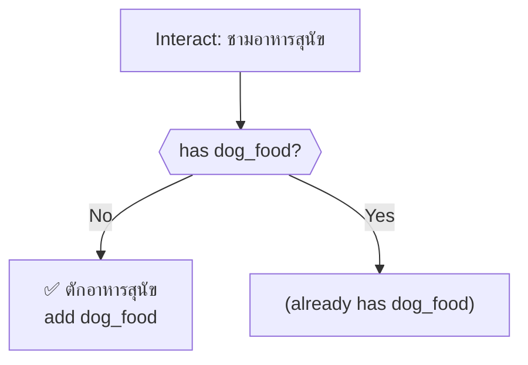

---

### 8. ประตูโถงทางเดิน (door_hallway)

Fix the shaking door with door knob. Opening after broken = death.

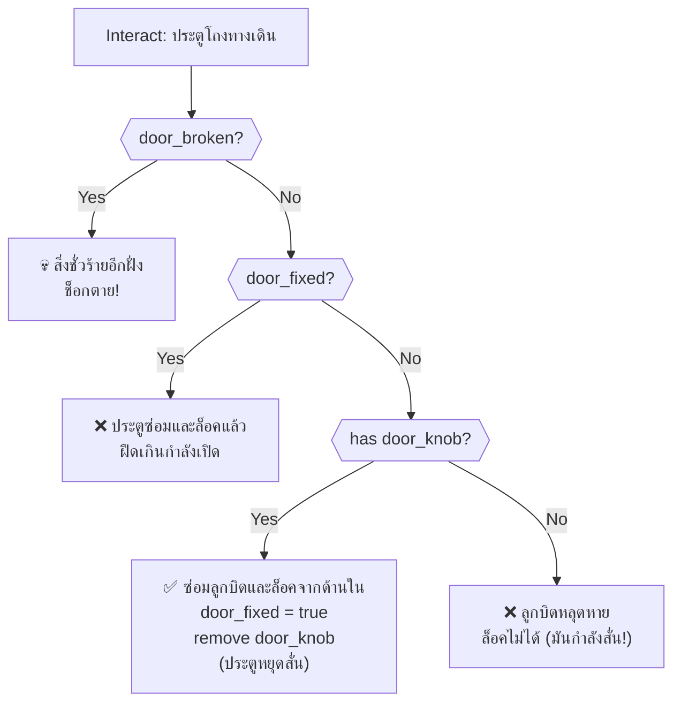

> [!CAUTION]
> Once `door_broken` is true (TV timer >= 60s), interacting with this door is instant death. Fix it before then.

---

### 9. ประตูทางเชื่อมห้องทานข้าว (door_dining)

Room exit → `dining_room`. Toggle open/close.

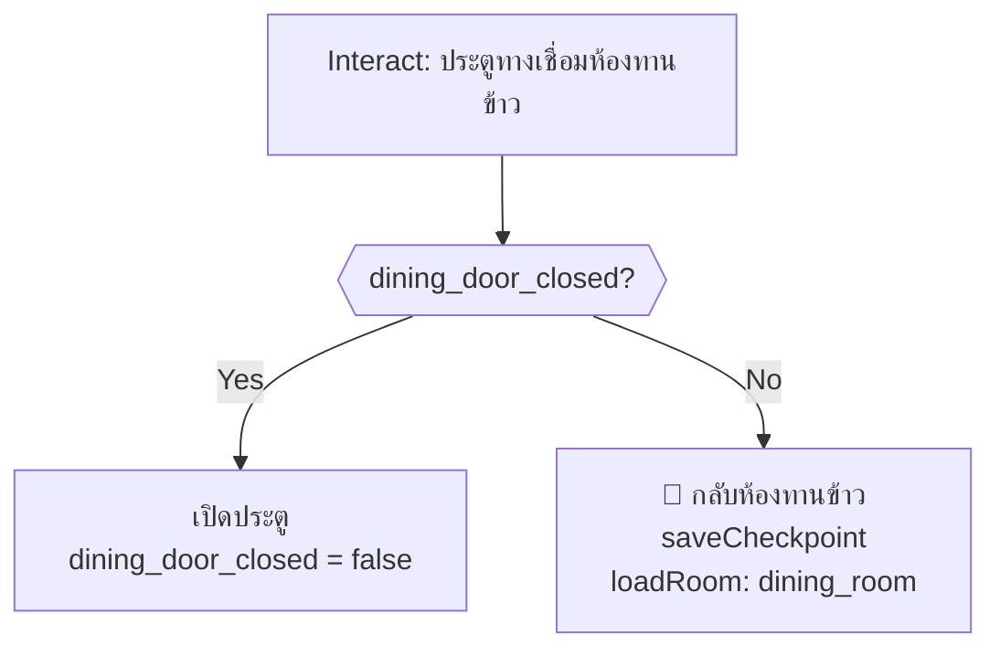

---

### 10. บานประตูห้องทานข้าว (door_dining_close)

Close/open the dining door — reveals fire extinguisher behind it.

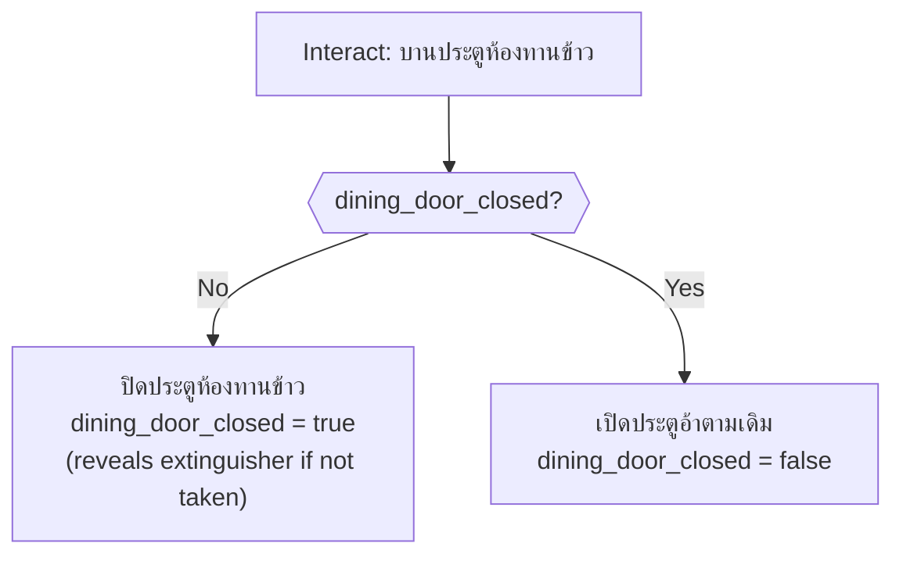

---

### 11. ถังดับเพลิง (fire_extinguisher_obj)

Pick up fire extinguisher (hidden behind dining door).

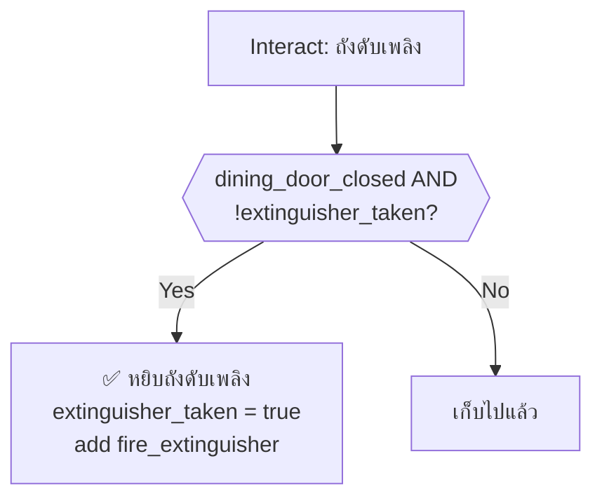

> [!TIP]
> The fire extinguisher is only visible when the dining room door is closed. Close the door first, then pick it up.

---

## Timed Events (onSecondTimer)

### Door Escalation (TV On)

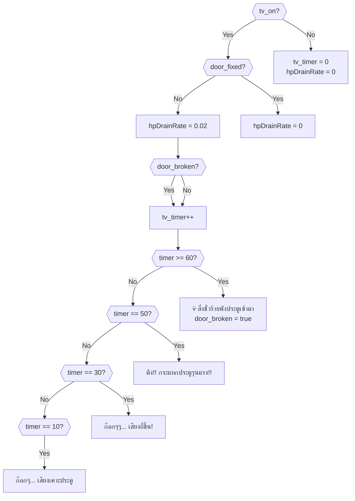

> [!WARNING]
> The door shakes in intervals: 10-15s, 30-35s, 50s+. At 60 seconds with TV on, the door breaks and the player dies. Turning TV off resets the timer to 0.

### Phone Ringing

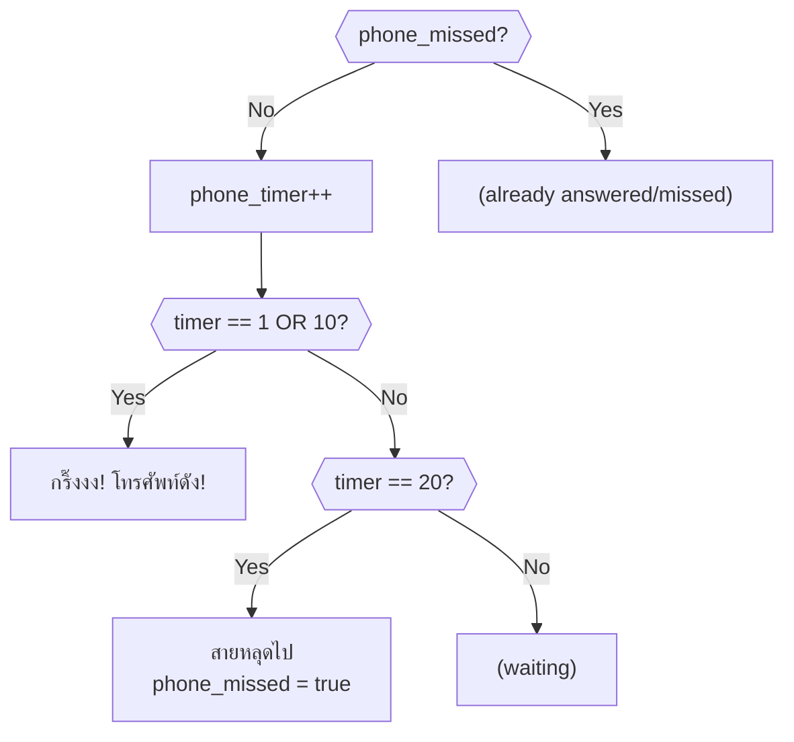

---

## Critical Path (Optimal Solution)

```mermaid
flowchart LR
    S["🚪 Enter Living Room"]
    S1["1. โทรศัพท์บ้าน<br/>Answer phone (fast!)"]
    S2["2. ผ้าห่มบนโซฟา<br/>Find TV remote"]
    S3["3. ทีวี<br/>Turn off TV"]
    S4["4. เบาะนอนสุนัข (×2)<br/>Get fence code #3<br/>+ door_knob"]
    S5["5. ประตูโถงทางเดิน<br/>Fix door with knob"]
    S6["6. จานชามสกปรก (×2)<br/>Cockroach scare<br/>+ key_mailbox"]
    S7["7. ชามอาหารสุนัข<br/>Get dog_food"]
    S8["8. ลิ้นชักชั้นวางทีวี<br/>Save blue pills"]
    S9["9. บานประตู → ถังดับเพลิง<br/>Close door, get extinguisher"]

    S --> S1 --> S2 --> S3 --> S4 --> S5 --> S6 --> S7 --> S8 --> S9
```

---

## Death Summary

| # | Source | Trigger | Death Message |
|---|--------|---------|---------------|
| 1 | onSecondTimer | tv_timer >= 60 (TV on) | สิ่งชั่วร้ายพังประตูเข้ามา |
| 2 | ประตูโถงทางเดิน | door_broken + interact | ช็อกตายจากสิ่งชั่วร้าย |
| 3 | ลิ้นชักชั้นวางทีวี | Choose "ทานตอนนี้" | Overdose หัวใจวายตาย |

---

## Damage Sources

| Source | HP Loss | Condition |
|--------|---------|-----------|
| จานชามสกปรก (first check) | -0.2 | Cockroach scare (first time) |
| TV on + door not fixed | +0.02/s drain | While TV is on and door isn't fixed |

---

## Item Inventory

### Required from Other Rooms

*None required to enter. Items found here are used in other rooms.*

### Obtainable in This Room

| Item | Source | Usage |
|------|--------|-------|
| `tv_remote` | ผ้าห่มบนโซฟา | ✅ Turn off TV (used in this room) |
| `door_knob` | เบาะนอนสุนัข (2nd) | ✅ Fix hallway door (used in this room) |
| `key_mailbox` | จานชามสกปรก (2nd) | ✅ Open mailbox at Fence Gate |
| `dog_food` | ชามอาหารสุนัข | ✅ Lure dog in Front Garden |
| `fire_extinguisher` | ถังดับเพลิง (behind door) | ✅ Break window in Laundry |
