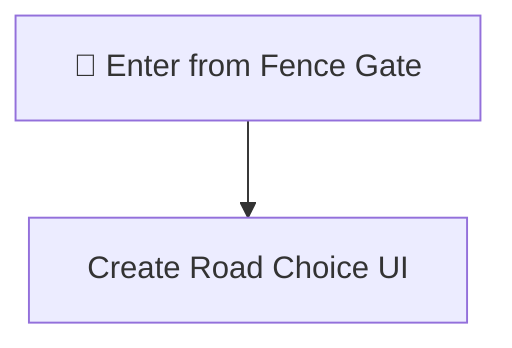
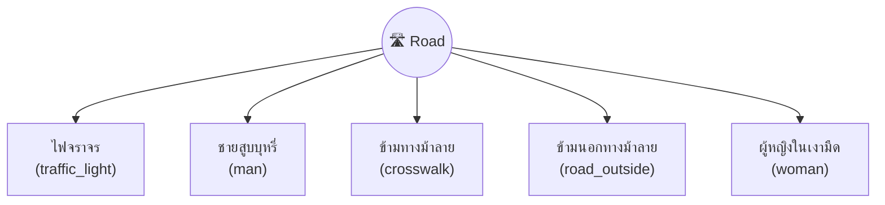
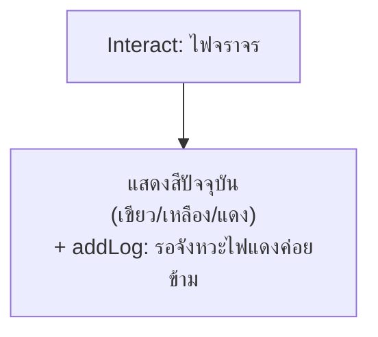
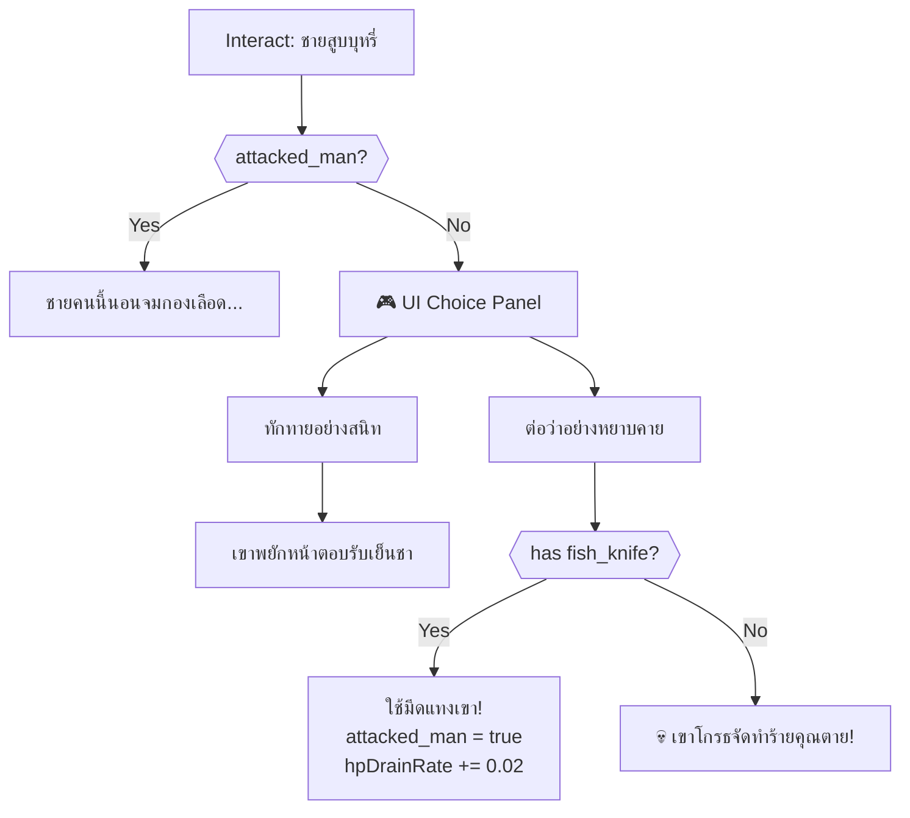
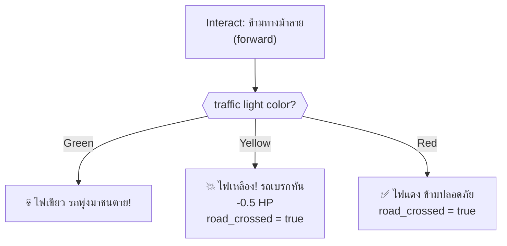
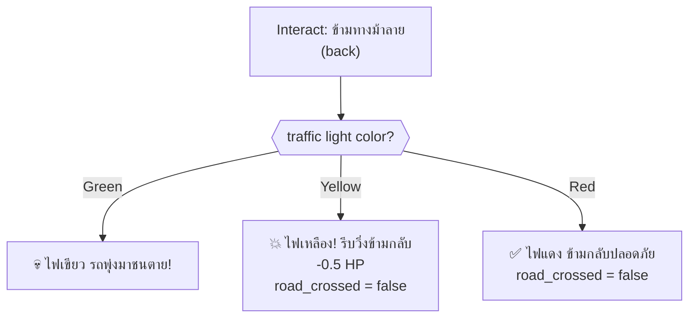
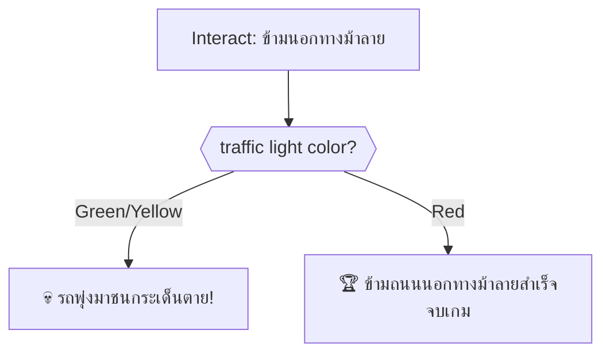
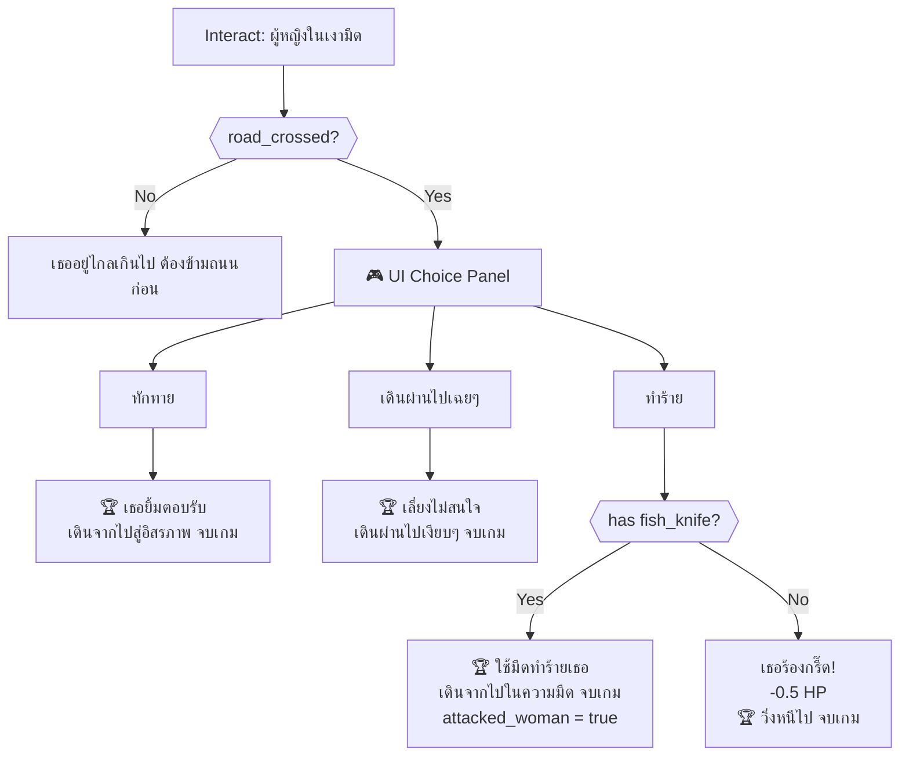
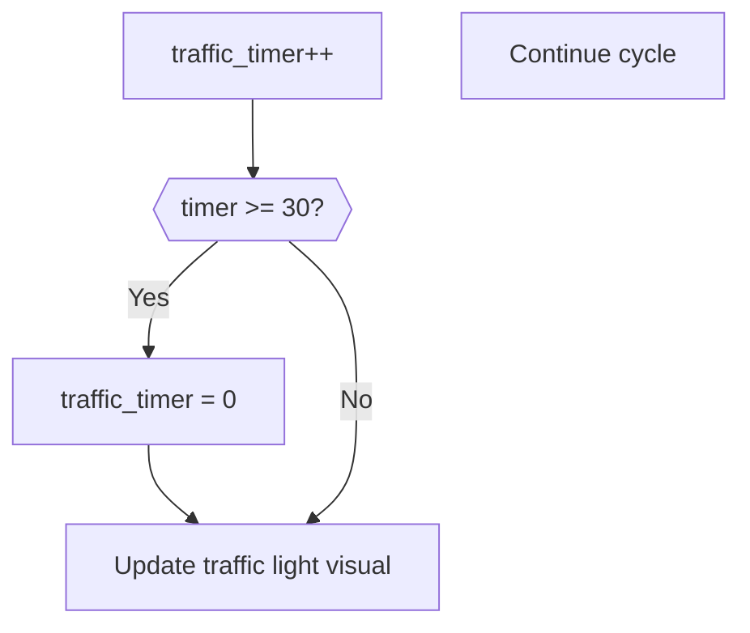
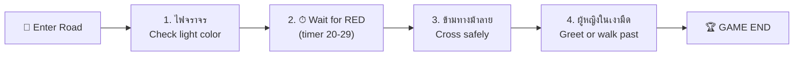

# Road — Player Flow

## Room Overview

The Road is the game's final area. The player must **cross the road safely using the traffic light cycle, interact with an NPC, and reach the woman on the other side** — with different outcomes determining the game's ending. The traffic light cycles every 30 seconds.

- **Entry:** Fence Gate (ประตูรั้วออกสู่ถนน)
- **Exit:** Game End (multiple endings)

---

## Flags

| Flag | Default | Description |
|------|---------|-------------|
| `road_traffic_timer` | `0` | Traffic light cycle timer (0-29) |
| `road_man_interacted` | `false` | (unused in code) |
| `road_attacked_man` | `false` | Player attacked the smoking man |
| `road_attacked_woman` | `false` | Player attacked the woman |
| `road_crossed` | `false` | Player has crossed to the other side |

---

## Room Entry (setupUI)

---

## All Interactable Objects

> [!NOTE]
> After crossing (`road_crossed = true`): `man` and `road_outside` are hidden, `woman` becomes visible. Crossing back reverses this.

---

## Interactable Details

### 1. ไฟจราจร (traffic_light)

Check the current traffic light color.

#### Traffic Light Cycle

| Timer Range | Color | Thai |
|-------------|-------|------|
| 0–14 | 🟢 Green | เขียว |
| 15–19 | 🟡 Yellow | เหลือง |
| 20–29 | 🔴 Red | แดง |

---

### 2. ชายสูบบุหรี่ (man)

NPC encounter. Visible only before crossing.

> [!WARNING]
> Cursing the man without a fish knife = instant death. Having the knife lets you attack him, which affects the ending.

---

### 3. ข้ามทางม้าลาย (crosswalk)

Cross the road at the crosswalk. Traffic light determines safety.

#### Crossing Forward (not yet crossed)

#### Crossing Back (already crossed)

> [!IMPORTANT]
> Always wait for the RED light (timer 20-29) before crossing. Green light is instant death. Yellow is survivable but costly.

---

### 4. ข้ามนอกทางม้าลาย (road_outside)

Cross outside the crosswalk. Visible only before crossing.

---

### 5. ผู้หญิงในเงามืด (woman)

Final NPC encounter. Visible only after crossing.

---

## Timed Events (onSecondTimer)

### Traffic Light Cycle

---

## Critical Path (Optimal Solution)

> [!IMPORTANT]
> **Game Endings are determined by flags:**
> - `fence_house_door_opened` — killed entity in house
> - `road_attacked_man` — attacked the smoking man
> - `road_attacked_woman` — attacked the woman

---

## Game Endings

| # | Ending Name | Condition | Description |
|---|-------------|-----------|-------------|
| 1 | หลุดพ้นจากความรู้สึก | House kill, no road attacks | Liberated — killed only the house entity |
| 2 | ศัตรูอยู่รอบตัว | Any road attack | Frenzied — attacked people on the road |
| 3 | ออกจากบ้านอย่างปลอดภัย | No kills | Safe — escaped peacefully |

---

## Death Summary

| # | Source | Trigger | Death Message |
|---|--------|---------|---------------|
| 1 | ข้ามทางม้าลาย | Green light | รถพุ่งมาชนตาย |
| 2 | ข้ามทางม้าลาย (back) | Green light | รถพุ่งมาชนตาย |
| 3 | ข้ามนอกทางม้าลาย | Green/Yellow light | รถพุ่งมาชนกระเด็นตาย |
| 4 | ชายสูบบุหรี่ → ต่อว่า | No fish_knife | เขาทำร้ายคุณตาย |

---

## Damage Sources

| Source | HP Loss | Condition |
|--------|---------|-----------|
| ข้ามทางม้าลาย (yellow) | -0.5 | Cross during yellow light |
| ข้ามทางม้าลายกลับ (yellow) | -0.5 | Cross back during yellow light |
| ชายสูบบุหรี่ → ทำร้าย | +0.02/s drain | Attacked with knife (panic) |
| ผู้หญิง → ทำร้าย (no knife) | -0.5 | Scream scare damage |

---

## Item Inventory

### Required from Other Rooms

| Item | Usage in This Room |
|------|---------------------|
| `fish_knife` | Attack man/woman (affects ending), survive man confrontation |

### Obtainable in This Room

*No items obtainable. This is the final room.*
