# Storage — Player Flow

## Room Overview

The Storage room is a dark, claustrophobic puzzle room. The player must **use their smartphone flashlight to navigate, find items in boxes, wedge the folding door open, and retrieve a hammer from a locked toolbox** — all while managing battery drain and a door that slowly closes on a 30-second timer.

- **Entry:** Hallway F1 (ประตูห้องเก็บของ)
- **Exit:** Hallway F1 (ประตูบานพับ)

---

## Flags

| Flag | Default | Description |
|------|---------|-------------|
| `storage_flashLightOn` | `false` | Smartphone flashlight is on |
| `storage_doorWedged` | `false` | Door wedged open with wood stick |
| `storage_doorClosed` | `false` | Door has fully closed (trapped) |
| `storage_woodStickAcquired` | `false` | Wood stick picked up |
| `storage_foundNote` | `false` | Warning note found |
| `storage_foundKey` | `false` | Toolbox key found |
| `storage_foundPowerbank` | `false` | Powerbank found |
| `storage_boxOpened` | `false` | Closed box opened (rat scare) |
| `storage_gotHammer` | `false` | Hammer obtained from toolbox |
| `storage_doorTimerStarted` | `false` | (unused in code) |
| `storage_doorSmallOpenedCount` | `0` | Small door interaction count |
| `storage_boxSearchView` | `0` | Open box search progress (0→1→2→3) |
| `storage_doorTimer` | `0` | Door closing countdown |
| `storage_panicTimer` | `0` | Panic escalation timer |

---

## Room Entry (setupUI)

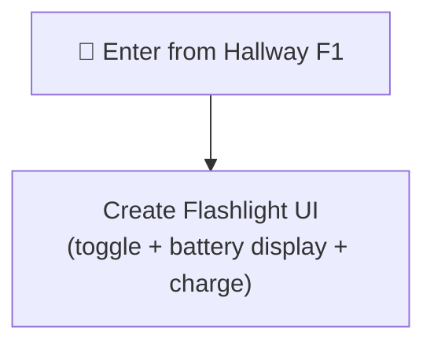

> [!NOTE]
> The room starts in near-total darkness. The flashlight UI is always visible. Interactive objects are hidden until flashlight is on.

---

## All Interactable Objects

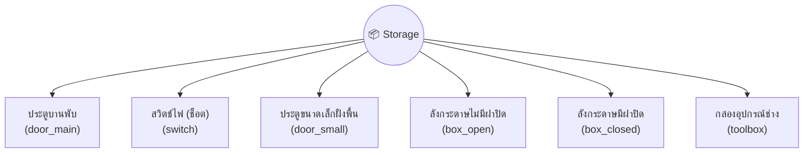

---

## Interactable Details

### 1. ประตูบานพับ (door_main)

Exit or wedge the folding door. Door slowly closes over 30 seconds.

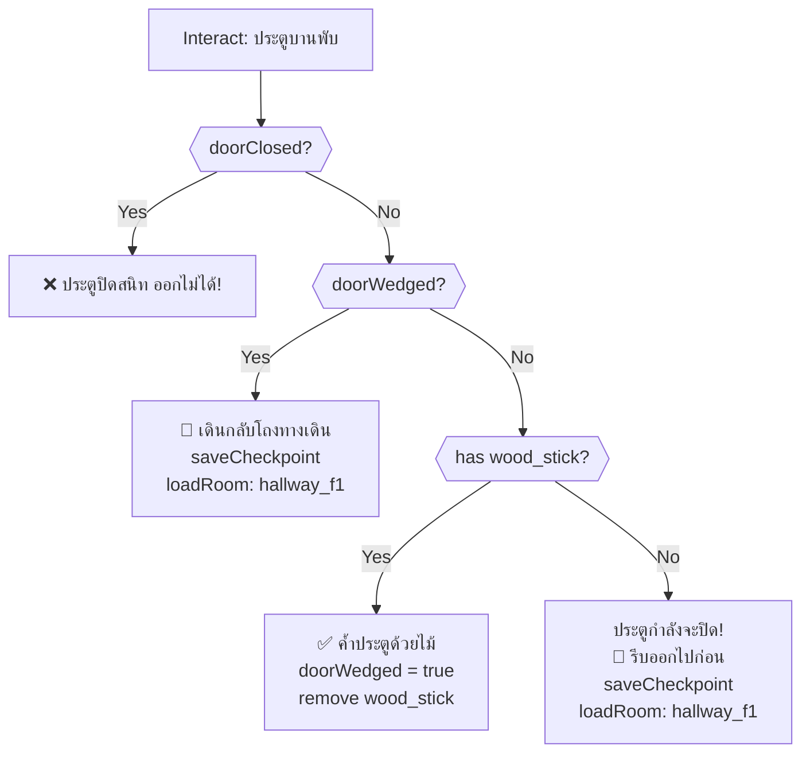

> [!WARNING]
> Without the wood stick, interacting with the door always exits the room (saving you from being trapped). But you won't have completed the puzzle. You must find the wood stick from the small door first.

---

### 2. สวิตช์ไฟ (switch)

Instant death trap — broken electrical switch.

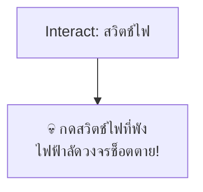

> [!CAUTION]
> Always-lethal. Never interact with this object.

---

### 3. ประตูขนาดเล็กฝั่งพื้น (door_small)

Three-stage interaction: discover → get wood stick → death trap.

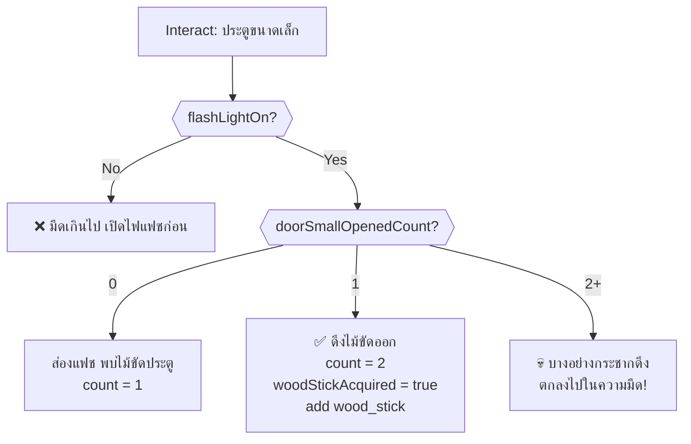

> [!CAUTION]
> After getting the wood stick, do NOT interact with this door again. Third interaction is instant death.

---

### 4. ลังกระดาษไม่มีฝาปิด (box_open)

Three-stage search: note → toolbox key → powerbank.

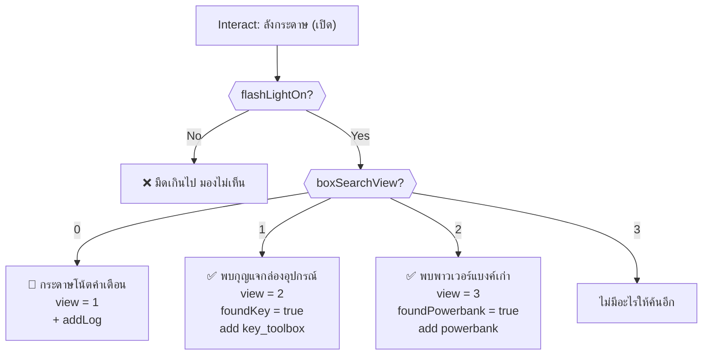

---

### 5. ลังกระดาษมีฝาปิด (box_closed)

Rat scare with damage.

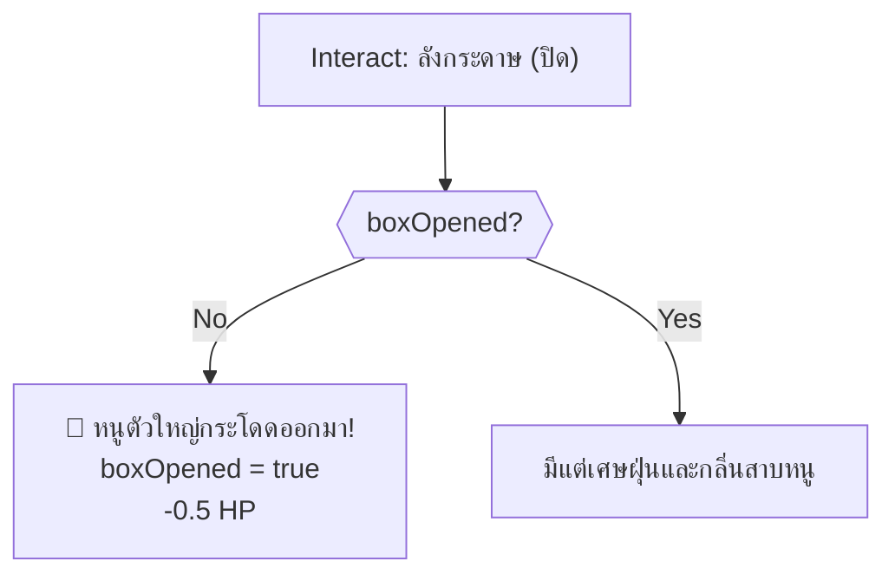

---

### 6. กล่องอุปกรณ์ช่าง (toolbox)

Unlock with key to get hammer.

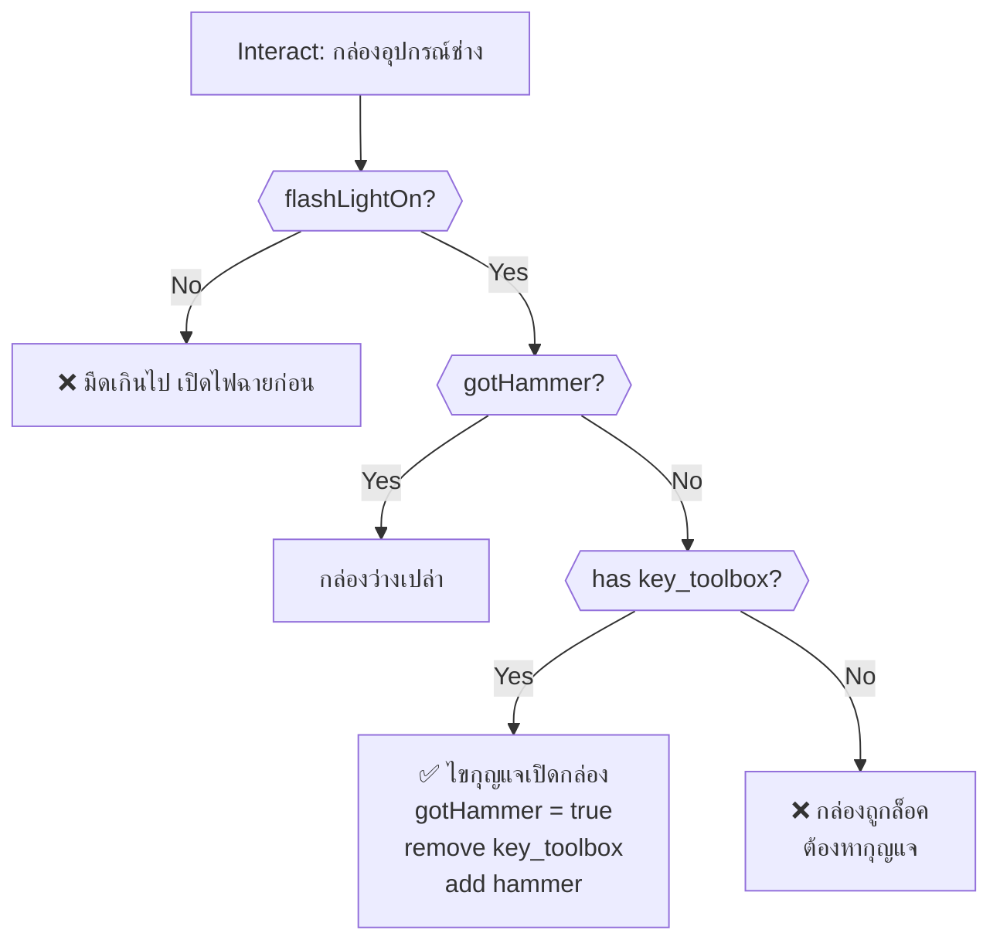

---

## Timed Events (onSecondTimer)

### Battery Drain

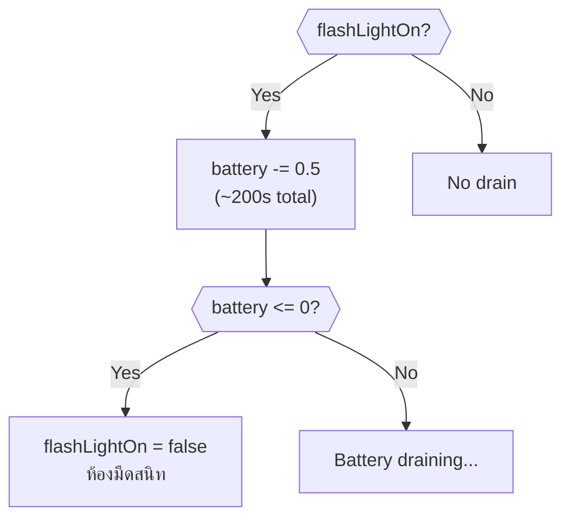

### Door Closing Timer

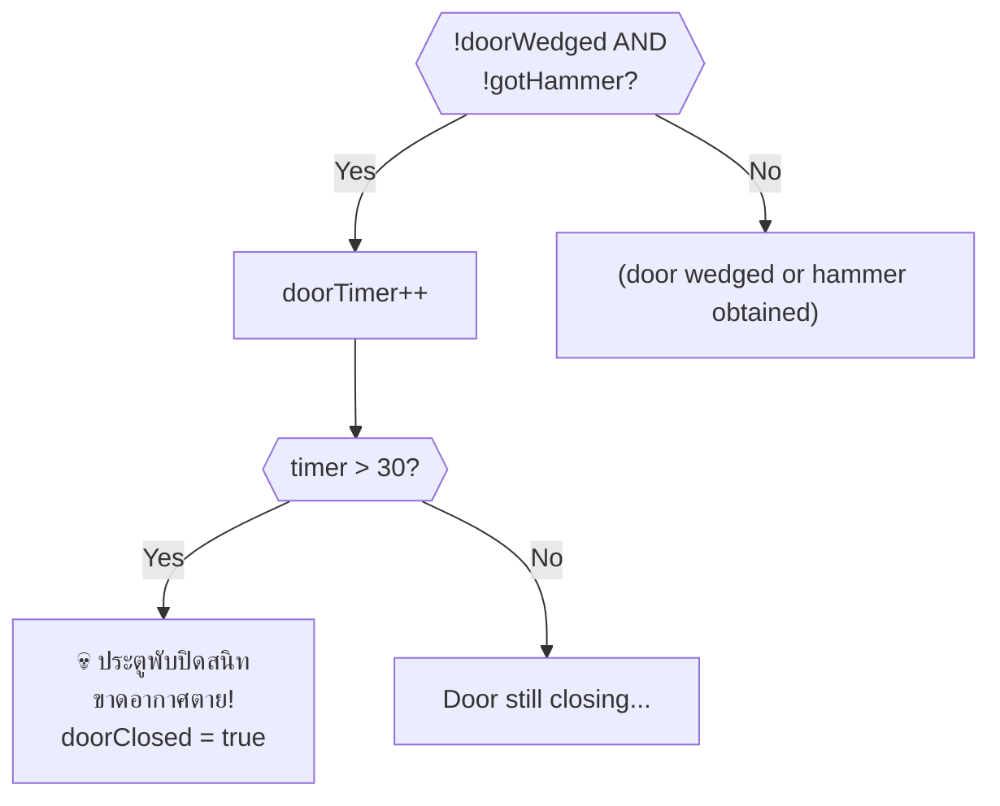

### Panic Escalation

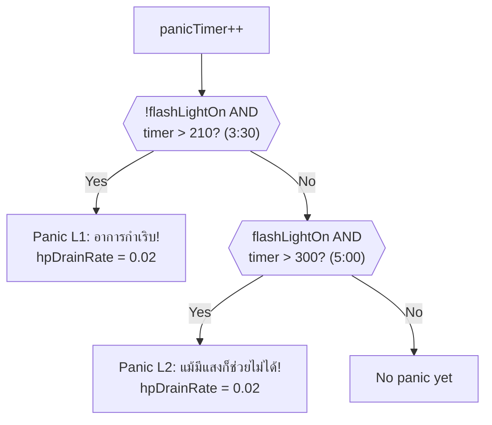

### Auto-Death (No Resources)

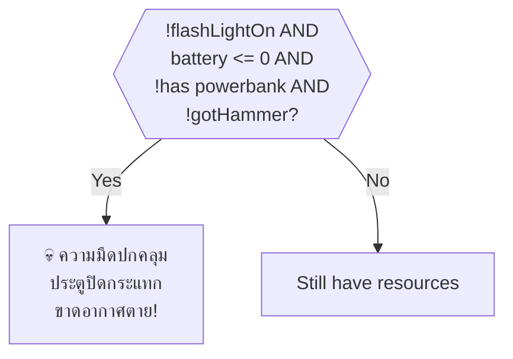

---

## Critical Path (Optimal Solution)

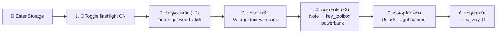

> [!IMPORTANT]
> **Required item from other rooms:** `smartphone` — obtained from Hallway F1 backpack. The smartphone flashlight is the only light source.

---

## Death Summary

| # | Source | Trigger | Death Message |
|---|--------|---------|---------------|
| 1 | สวิตช์ไฟ | Always on interact | ไฟฟ้าลัดวงจรช็อตตาย |
| 2 | ประตูขนาดเล็ก | 3rd interaction | ถูกกระชากลงไปในความมืด |
| 3 | onSecondTimer | doorTimer > 30 | ประตูบานพับปิดสนิท ขาดอากาศตาย |
| 4 | onSecondTimer | Battery dead + no powerbank + no hammer | ประตูปิดกระแทก ขาดอากาศตาย |

---

## Damage Sources

| Source | HP Loss | Condition |
|--------|---------|-----------|
| ลังกระดาษมีฝาปิด (first open) | -0.5 | Rat scare (first time) |
| Panic L1 (dark room) | +0.02/s drain | After 3:30 in darkness |
| Panic L2 (long stay) | +0.02/s drain | After 5:00 even with light |

---

## Item Inventory

### Required from Other Rooms

| Item | Usage in This Room |
|------|---------------------|
| `smartphone` | Flashlight (obtained from Hallway F1) |

### Obtainable in This Room

| Item | Source | Usage |
|------|--------|-------|
| `wood_stick` | ประตูขนาดเล็ก (2nd) | ✅ Wedge main door open (consumed) |
| `key_toolbox` | ลังกระดาษเปิด (2nd) | ✅ Unlock toolbox (consumed) |
| `powerbank` | ลังกระดาษเปิด (3rd) | ✅ Recharge phone battery +20% (consumed) |
| `hammer` | กล่องอุปกรณ์ช่าง | ✅ Break open laundry room door in Kitchen |
