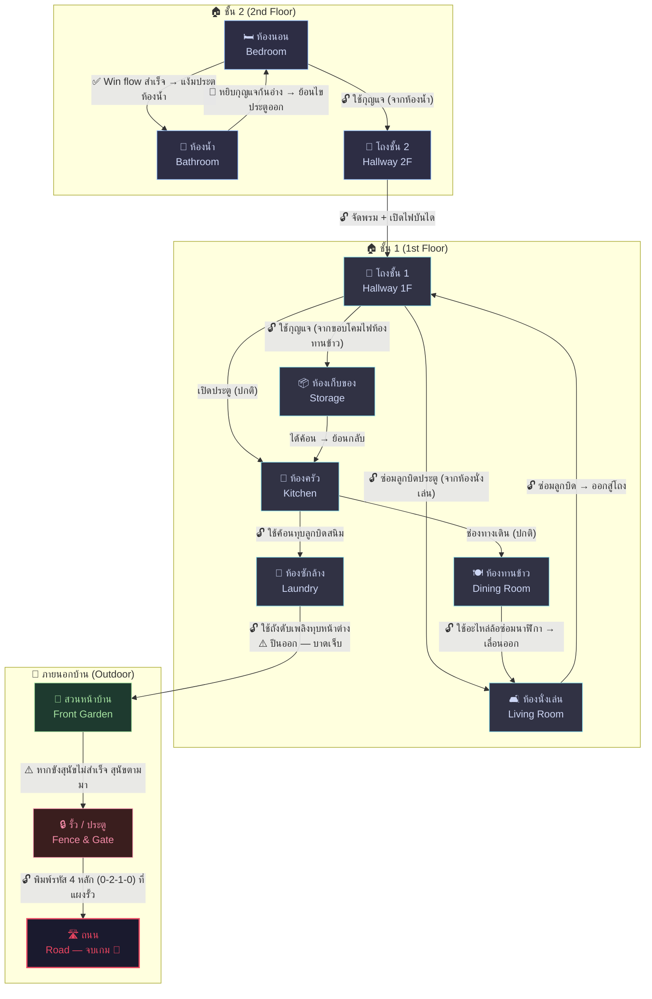

# Panic : Home Episode — แผนผังห้องและการเชื่อมต่อ

## แผนผังหลัก (Mermaid)



---

## ตารางการเชื่อมต่อ

| ห้อง | เชื่อมต่อกับ | เงื่อนไขการเข้า |
|------|------------|----------------|
| ห้องนอน | ห้องน้ำ, โถงทางเดินชั้น 2 | เริ่มต้นที่นี่ — ไม่มีเงื่อนไข |
| ห้องน้ำ | ห้องนอน | ปลดล็อคหลังทำ win flow ห้องนอนสำเร็จ (หยิบผ้าเช็ดตัว → ประตูห้องน้ำแง้มเปิดอัตโนมัติ) |
| โถงชั้น 2 | ห้องนอน, โถงชั้น 1 | 🔓 ต้องมีกุญแจ (จากห้องน้ำ) |
| โถงชั้น 1 | โถงชั้น 2, ห้องครัว, ห้องนั่งเล่น, ห้องเก็บของ | 🔓 จัดพรมและเปิดไฟจากบันไดชั้น 2 สำเร็จ |
| ห้องครัว | โถงชั้น 1, ห้องทานข้าว, ห้องซักล้าง | ประตูเชื่อมจากโถงชั้น 1 |
| ห้องทานข้าว | ห้องครัว, ห้องนั่งเล่น | ผ่านช่องทางเดินจากครัว |
| ห้องนั่งเล่น | โถงชั้น 1, ห้องทานข้าว | 🔓 ต้องเลื่อนนาฬิกาลูกตุ้มที่ขวางประตู (จากห้องทานข้าว) หรือจากประตูฝั่งโถงชั้น 1 (ต้องซ่อมด้วยลูกบิดประตู) |
| ห้องเก็บของ | โถงชั้น 1 | 🔓 ต้องมีกุญแจ (ซ่อนอยู่บนขอบโคมไฟเพดาน จากห้องทานข้าว) |
| ห้องซักล้าง | ห้องครัว, สวนหน้าบ้าน | 🔓 ต้องมีค้อนเพื่อนำมาทุบประตูลูกบิดที่ขึ้นสนิม (ค้อนหาได้จากห้องเก็บของ และไม่ต้องใช้กุญแจ) |
| สวนหน้าบ้าน | ห้องซักล้าง, รั้ว | 🔓 ต้องใช้ถังดับเพลิงทุบหน้าต่างบานเกร็ด (จากห้องซักล้าง) ⚠️ ปีนเข้าออกจะโดนกระจกบาด หนีออกไปเจอสุนัข |
| รั้ว / ประตู | สวนหน้าบ้าน | ทางเดินในสวน ⚠️ (หากขังสุนัขไม่สมบูรณ์ในรอบก่อน สุนัขจะทะลุมาเมื่อเดินสำรวจกลไกหน้าบ้าน) |
| ถนน | รั้ว / ประตู | 🔓 ต้องพิมพ์รหัส 4 หลักที่แผงประตูรั้ว จากนั้นต้องรอสัญญาณไฟแดงและข้ามถนน |

---

## แผนผัง Backtracking (การย้อนกลับ)

ปริศนาที่ต้องกลับไปห้องเดิม:

```mermaid
graph LR
    subgraph "🔄 Cross-Room Dependencies"
        BED_FLOW["Win Flow ห้องนอน\n(หยิบผ้าเช็ดตัว)"]
        BATH_DOOR["ประตูห้องน้ำ\n(ล็อค → แง้มเปิดอัตโนมัติ)"]
        BED_FLOW -->|"ทำ win flow สำเร็จ\nประตูแง้มเปิดเอง"| BATH_DOOR

        KIT_FOOD["ชิมอาหาร\nห้องครัว"]
        DIN_TEA["ชุดเครื่องดื่ม\nห้องทานข้าว"]
        KIT_FOOD -->|"สำเร็จแล้วเป็นทริกเกอร์\nให้ชุดเครื่องดื่มปรากฏ"| DIN_TEA

        DIN_CABINET["นาฬิกาลูกตุ้มขวางประตู\nห้องทานข้าว → นั่งเล่น"]
        LAU_ITEM["อะไหล่ล้อตะกร้าผ้า\nจากห้องซักล้าง"]
        LAU_ITEM -->|"ต้องซ่อมล้อ\nเลื่อนนาฬิกาลูกตุ้มก่อนเข้า"| DIN_CABINET

        LAU_DOOR["ประตูห้องซักล้าง\n(ลูกบิดฝืดด้วยสนิม)"]
        STO_HAMMER["ค้อนจากห้องเก็บของ"]
        STO_HAMMER -->|"ต้องหาค้อนมาทุบ\nประตูลูกบิดที่ขึ้นสนิม"| LAU_DOOR

        STO_DOOR["ประตูห้องเก็บของ\n(ล็อค)"]
        DIN_KEY["กุญแจห้องเก็บของบนขอบโคมไฟ\nในห้องทานข้าว"]
        DIN_KEY -->|"ต้องปีนโต๊ะ\nหยิบกุญแจในห้องทานข้าว"| STO_DOOR

        GAR_WINDOW["หน้าต่างออกสวน\n(ปิดตาย)"]
        LAU_SMASH["ใช้ถังดับเพลิงทุบ\nจากห้องซักล้าง"]
        LAU_SMASH -->|"กระแทกหน้าต่างบานเกร็ด\nหนีออกสวน ⚠️ บาดเจ็บ"| GAR_WINDOW

        LAU_WINDOW2["หน้าต่างบานเกร็ด\nห้องซักล้าง"]
        LIV_EXTINGUISHER["ถังดับเพลิง\nจากห้องนั่งเล่น"]
        LIV_EXTINGUISHER -->|"ต้องนำถังดับเพลิงมาทุบ\nหน้าต่างห้องซักล้าง"| LAU_WINDOW2

        GAR_DOG["สุนัขเฝ้าบ้าน\nสวนหน้าบ้าน"]
        LIV_DOGFOOD["อาหารสุนัข (เก็บซ้ำได้)\nจากห้องนั่งเล่น"]
        LIV_DOGFOOD -->|"ใช้อาหารสุนัขหลอกล่อเข้ากรง\nเพื่อผูกเชือกขัง (หากขังไม่ดี สุนัขจะตามไปถึงรั้วหน้าบ้าน)"| GAR_DOG

        GATE_MAILBOX["ตู้จดหมาย\nรั้วหน้าบ้าน"]
        LIV_MAILKEY["กุญแจตู้จดหมาย\nจากห้องนั่งเล่น"]
        LIV_MAILKEY -->|"ใช้กุญแจเปิด\nหารหัสหลักที่ 4"| GATE_MAILBOX

        GATE_FOUNTAIN["บ่อน้ำพุ\nรั้วหน้าบ้าน"]
        GATE_NET["กระชอนตักใบไม้\nข้างถังขยะ (ใช้แล้วพัง)"]
        GATE_NET -->|"ใช้ด้ามกระชอนเขี่ยจากก้นบ่อน้ำพุ\nได้กุญแจประตูบ้าน"| GATE_FOUNTAIN

        GATE_DOOR["ประตูบ้าน (กับดัก)\nรั้วหน้าบ้าน"]
        GATE_KNIFE["มีดแล่ปลา\nจากถังขยะขวา (รั้วหน้าบ้าน)"]
        GATE_KNIFE -->|"ใช้ป้องกันตัวเมื่อไขเปิดประตูบ้าน\n(⚠️ พบสิ่งชั่วร้าย ลด HP ต่อเนื่อง)"| GATE_DOOR

        ROAD_PEOPLE["ชายสูบบุหรี่ & ผู้หญิง\nถนน"]
        GATE_KNIFE -->|"สามารถนำมีดแล่ปลาข้ามฉาก\nมาทำร้ายบุคคลบนถนนได้"| ROAD_PEOPLE

        BATH_KEY["กุญแจที่ก้นอ่าง\nห้องน้ำ"]
        BED_DOOR["ประตูออกสู่โถง\nห้องนอน"]
        BATH_KEY -->|"ต้องเดินย้อนจากห้องน้ำ\nมาไขประตูสู่โถงที่ห้องนอน"| BED_DOOR
    end
```



---

## สถานะห้อง (Room States)

แต่ละห้องมีได้หลายสถานะ ขึ้นกับความคืบหน้า:

| สัญลักษณ์ | ความหมาย |
|-----------|----------|
| 🔒 | ยังเข้าไม่ได้ |
| 🔓 | ปลดล็อคแล้ว เข้าได้ |
| ✅ | ทำปริศนาหลักครบแล้ว |
| 🔄 | มีไอเทม/เบาะแสใหม่ปรากฏ (เมื่อกลับมา) |
| ⚠️ | อันตราย — ต้องระวัง |

---

## ลำดับเหตุการณ์โดยรวม (High-Level Flow)

```text
[START] ตื่นในห้องนอน
  │
  ├─ ลุก → ปิดนาฬิกา → ปิดหน้าต่าง → ลอดพัดลม → ปิดตู้ → หยิบผ้าเช็ดตัว
  │     └─ ประตูห้องน้ำแง้มเปิด → 🔓 ห้องน้ำ
  │
  ├─ 🔓 ห้องน้ำ → รีบเก็บขวดสบู่ → ทานยาสีชมพู → ถอดปลั๊ก/เก็บไดร์เข้าตู้ → เปิดก๊อกน้ำและคุมอุณหภูมิไม่ให้เกิน 80% → ปิดน้ำเมื่อ 100% → แช่น้ำและเช็ดตัว → ดึงจุกระบายน้ำ → หากุญแจที่ก้นอ่าง
  │
  ├─ 🔄 ย้อนกลับเข้าห้องนอน → นำกุญแจมาไขประตูออกสู่โถง → 🔓 โถงทางเดินชั้น 2
  │     └─ ปิดผ้าม่าน → จัดพรม → เปิดไฟขั้นบันได → 🔓 โถงทางเดินชั้น 1 (ลงบันได)
  │
  ├─ 🔓 โถงทางเดินชั้น 1 → 🔎 ค้นกระเป๋า (ได้บัตรรหัสที่ 1 & สมาร์ทโฟน) → 🔓 ห้องครัว
  │
  ├─ ห้องครัว → ปิดก๊อก/กาต้มน้ำ/ตู้ → ปิดเตา → เลือกเครื่องปรุงปลอดภัย → ชิมอาหาร (สำเร็จ)
  │     └─ (เสียงกุกกัก) ทริกเกอร์ให้ชุดเครื่องดื่มปรากฏในห้องทานข้าว
  │
  ├─ เดินทะลุเข้า 🔓 ห้องทานข้าว → อ่านหนังสือพิมพ์ (ได้รหัสที่ 2)
  │     └─ ดื่มชามิ้นต์ → ปิดไฟให้มืดสนิท → ปีนโต๊ะหยิบกุญแจห้องเก็บของจากขอบโคมไฟ
  │
  ├─ 🔄 ย้อนไปทางโถงชั้น 1 → 🔓 ห้องเก็บของ → (ใช้สมาร์ทโฟนส่องแสง) แก้ปริศนาห้องเก็บของ → ได้ค้อน
  │
  ├─ 🔄 ย้อนกลับไปห้องครัว → ใช้ค้อนทุบลูกบิดที่ขึ้นสนิม → 🔓 ห้องซักล้าง
  │     └─ แก้ปริศนาห้องซักล้าง → ได้อะไหล่ล้อตะกร้าผ้า
  │
  ├─ 🔄 ย้อนกลับไปห้องทานข้าว → นำอะไหล่ล้อตะกร้าผ้ามาซ่อมล้อนาฬิกาลูกตุ้มและเลื่อนออก
  │
  ├─ 🔓 ห้องนั่งเล่น → ปิดทีวี + หาลูกบิดประตูมาซ่อมทางออกโถง + หาถังดับเพลิง/อาหารสุนัข/กุญแจตู้จดหมาย + เก็บรหัสรั้ว
  │
  ├─ 🔄 ย้อนกลับไปห้องซักล้าง → ใช้ถังดับเพลิงทุบหน้าต่างบานเกร็ดเพื่อหนีออกสวน
  │
  ├─ 🔓 สวนหน้าบ้าน → ใช้อาหารสุนัขหลอกล่อเข้ากรง → พยายามปิดกรงให้สนิทและผูกเชือกให้สำเร็จ
  │
  ├─ 🔓 รั้ว → (⚠️ สุนัขจะตามมากัดหากขังไว้ไม่สำเร็จ) 
  │     ├─ (ทางเลือก) หากระชอนตักกุญแจจากน้ำพุ / หามีดแล่ปลาที่ถังขยะ / ไขตู้จดหมาย 
  │     └─ พิมพ์รหัส 4 หลัก (0-2-1-0) ที่แผงประตูรั้ว
  │
  └─ 🔓 ถนน → สังเกตไฟจราจรเพื่อรอจังหวะไฟแดงอันปลอดภัย
        ├─ (ทางเลือก) ปฏิสัมพันธ์หรือใช้มีดทำร้ายบุคคลแปลกหน้า
        └─ ข้ามทางม้าลายได้สำเร็จ → [END] หลบหนีสำเร็จ
```
