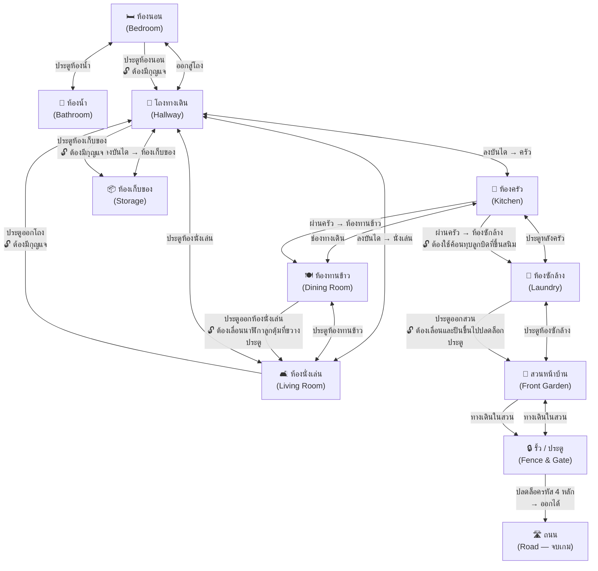
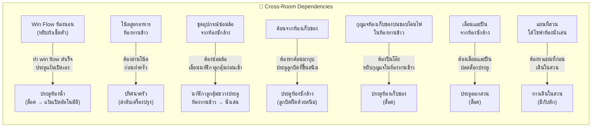

# Panic : Home Episode — แผนผังห้องและการเชื่อมต่อ

## แผนผังหลัก (Mermaid)



---

## ตารางการเชื่อมต่อ

| ห้อง | เชื่อมต่อกับ | เงื่อนไขการเข้า |
|------|------------|----------------|
| ห้องนอน | ห้องน้ำ, โถงทางเดิน | เริ่มต้นที่นี่ — ไม่มีเงื่อนไข |
| ห้องน้ำ | ห้องนอน | ปลดล็อคหลังทำ win flow ห้องนอนสำเร็จ (หยิบผ้าเช็ดตัว → ประตูห้องน้ำแง้มเปิดอัตโนมัติ) |
| โถงทางเดิน | ห้องนอน, ห้องครัว, ห้องนั่งเล่น, ห้องเก็บของ | 🔓 ต้องมีกุญแจ (จากห้องนอน) |
| ห้องครัว | โถงทางเดิน, ห้องทานข้าว, ห้องซักล้าง | ลงบันไดจากโถง |
| ห้องทานข้าว | ห้องครัว, ห้องนั่งเล่น | ผ่านช่องทางเดินจากครัว |
| ห้องนั่งเล่น | โถงทางเดิน, ห้องทานข้าว | 🔓 ต้องเลื่อนนาฬิกาลูกตุ้มที่ขวางประตู (จากห้องทานข้าว) หรือจากประตูฝั่งโถงทางเดิน (ต้องใช้กุญแจจากห้องนั่งเล่น) |
| ห้องเก็บของ | โถงทางเดิน | 🔓 ต้องมีกุญแจ (ซ่อนอยู่บนขอบโคมไฟเพดาน จากห้องทานข้าว) |
| ห้องซักล้าง | ห้องครัว, สวนหน้าบ้าน | 🔓 ต้องมีค้อนเพื่อนำมาทุบประตูลูกบิดที่ขึ้นสนิม (ค้อนหาได้จากห้องเก็บของ และไม่ต้องใช้กุญแจ) |
| สวนหน้าบ้าน | ห้องซักล้าง, รั้ว | 🔓 ต้องเลื่อนและปีนขึ้นไปปลดล็อกประตู (จากห้องซักล้าง) |
| รั้ว / ประตู | สวนหน้าบ้าน | ทางเดินในสวน |
| ถนน | รั้ว / ประตู | 🔓 ปลดล็อครหัส 4 หลัก |

---

## แผนผัง Backtracking (การย้อนกลับ)

ปริศนาที่ต้องกลับไปห้องเดิม:



---

## สถานะห้อง (Room States)

แต่ละห้องมีได้หลายสถานะ ขึ้นกับความคืบหน้า:

| สัญลักษณ์ | ความหมาย |
|-----------|----------|
| 🔒 | ยังเข้าไม่ได้ |
| 🔓 | ปลดล็อคแล้ว เข้าได้ |
| ✅ | ทำปริศนาหลักครบแล้ว |
| 🔄 | มีไอเทม/เบาะแสใหม่ปรากฏ (เมื่อกลับมา) |
| ⚠️ | อันตราย — ต้องระวัง |

---

## ลำดับเหตุการณ์โดยรวม (High-Level Flow)

```
[START] ตื่นในห้องนอน
  │
  ├─ ลุก → ปิดนาฬิกา → ปิดหน้าต่าง → ลอดพัดลม → ปิดตู้ → หยิบผ้าเช็ดตัว
  │     └─ ประตูห้องน้ำแง้มเปิด → 🔓 ห้องน้ำ → หากุญแจห้องนอนที่ก้นอ่าง
  │
  ├─ นำกุญแจมาไขประตูห้องนอนออกสู่โถง → 🔓 โถงทางเดิน
  │     └─ ลงบันได → 🔓 ห้องครัว
  │
  ├─ ห้องครัว ←→ ห้องทานข้าว (เปิดจากครัว) → อ่านโน้ตสูตร
  │     └─ 🔄 กลับห้องครัว → ทำปริศนาเตา
  │
  ├─ 🔓 ห้องนั่งเล่น → ดู TV + หาแผนที่สวน + อ่านคู่มือ
  │
  ├─ 🔓 ห้องเก็บของ → แก้ปริศนาห้องเก็บของ
  │
  ├─ 🔓 ห้องซักล้าง → หากุญแจประตูออกสวน
  │     └─ (ต้องใช้เครื่องมือจากห้องเก็บของ)
  │
  ├─ 🔓 สวนหน้าบ้าน → เดินตามแผนที่ → ตู้ไปรษณีย์ (รหัสหลัก 4)
  │
  └─ 🔓 รั้ว → ใส่รหัส 4 หลัก → 🔓 ถนน → [END] หลบหนีสำเร็จ
```
