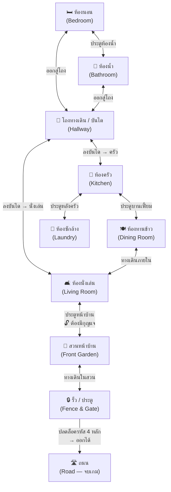
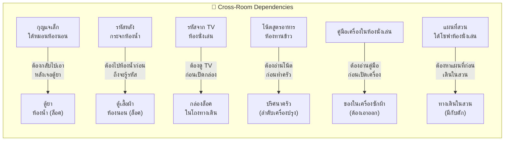

# WAKE — แผนผังห้องและการเชื่อมต่อ

## แผนผังหลัก (Mermaid)



---

## ตารางการเชื่อมต่อ

| ห้อง | เชื่อมต่อกับ | เงื่อนไขการเข้า |
|------|------------|----------------|
| ห้องนอน | ห้องน้ำ, โถงทางเดิน | เริ่มต้นที่นี่ — ไม่มีเงื่อนไข |
| ห้องน้ำ | ห้องนอน, โถงทางเดิน | ปลดล็อคหลังหาลูกบิดในห้องนอน |
| โถงทางเดิน | ห้องนอน, ห้องน้ำ, ห้องครัว, ห้องนั่งเล่น | ปลดล็อคหลังทำปริศนากระจกห้องน้ำ |
| ห้องครัว | โถง, ห้องทานข้าว, ห้องซักล้าง | ปลดล็อคหลังหาไฟฉายจากโถง |
| ห้องทานข้าว | ห้องครัว, ห้องนั่งเล่น | เปิดได้ทันทีเมื่อเข้าครัวได้ |
| ห้องซักล้าง | ห้องครัว | ต้องมีกุญแจจากลิ้นชักครัว |
| ห้องนั่งเล่น | โถง, ห้องทานข้าว, สวนหน้าบ้าน | เปิดได้ทันทีเมื่อลงบันไดได้ |
| สวนหน้าบ้าน | ห้องนั่งเล่น, รั้ว | ต้องมีกุญแจประตูหน้าบ้านจากห้องซักล้าง |
| รั้ว / ประตู | สวนหน้าบ้าน | ต้องมีรหัส 4 หลัก |
| ถนน | รั้ว / ประตู | ปลดล็อคหลังเปิดรั้วได้ |

---

## แผนผัง Backtracking (การย้อนกลับ)

ปริศนาที่ต้องกลับไปห้องเดิม:



---

## สถานะห้อง (Room States)

แต่ละห้องมีได้หลายสถานะ ขึ้นกับความคืบหน้า:

| สัญลักษณ์ | ความหมาย |
|-----------|----------|
| 🔒 | ยังเข้าไม่ได้ |
| 🔓 | ปลดล็อคแล้ว เข้าได้ |
| ✅ | ทำปริศนาหลักครบแล้ว |
| 🔄 | มีไอเทม/เบาะแสใหม่ปรากฏ (เมื่อกลับมา) |
| ⚠️ | อันตราย — ต้องระวัง |

---

## ลำดับเหตุการณ์โดยรวม (High-Level Flow)

```
[START] ตื่นในห้องนอน
  │
  ├─ หาลูกบิดห้องน้ำ → 🔓 ห้องน้ำ
  │     └─ แก้ปริศนากระจก → รหัสตู้เสื้อผ้า
  │           └─ 🔄 กลับห้องนอน → เปิดตู้ → ได้ไฟฉาย
  │
  ├─ ใช้ไฟฉาย → 🔓 โถงทางเดิน
  │     └─ แก้ปริศนาบันได → 🔓 ห้องครัว + ห้องนั่งเล่น
  │
  ├─ ห้องทานข้าว (เปิดจากครัว) → อ่านโน้ตสูตร
  │     └─ 🔄 กลับห้องครัว → ทำปริศนาเตา → ได้กุญแจห้องซักล้าง
  │
  ├─ 🔓 ห้องซักล้าง → หากุญแจประตูหน้าบ้าน
  │     └─ (ต้องอ่านคู่มือจากห้องนั่งเล่นก่อน)
  │
  ├─ ห้องนั่งเล่น → ดู TV (รหัส) + หาแผนที่สวน
  │     └─ 🔄 กลับโถง → เปิดกล่องลับ → ได้เบาะแสสุดท้าย
  │
  ├─ 🔓 สวนหน้าบ้าน → เดินตามแผนที่ → ตู้ไปรษณีย์ (รหัสหลัก 4)
  │
  └─ 🔓 รั้ว → ใส่รหัส 4 หลัก → 🔓 ถนน → [END] หลบหนีสำเร็จ
```
